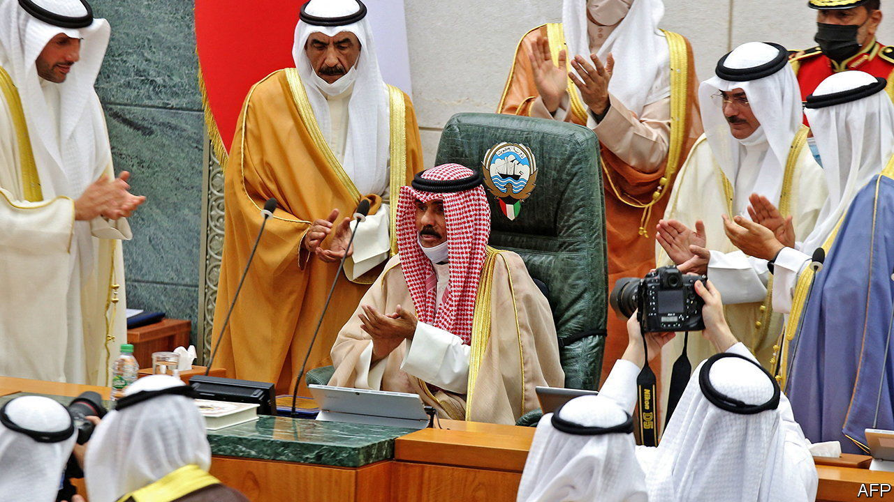

###### Eighty and waity

# The world’s oldest crown prince nears the throne of Kuwait 

##### Gerontocracy is holding the emirate back 

 

> Aug 25th 2022 

It has arguably the Arabian peninsula’s fastest-growing economy and a sovereign wealth fund worth $750bn to share among its 1.8m citizens. Parliament is freely elected—and boisterous. Prime ministers, appointed by the emir, are routinely ejected. Yet a crucial element of Kuwaiti society is sedate bordering on comatose.

The emir, Nawaf al-Sabah, is 85 and in severe decline. Other Gulf states have chucked the baton to a younger generation. But the al-Sabah still pass it tremulously along from one octogenarian brother to another. The last time the emir was seen in public, in June, he stumbled through a brief speech, struggling for breath. His designated successor and half-brother, Mishal, is 81. Other rival princes sue each other in European courts. “Each sheikh has his own gang,” laments a Kuwaiti academic.

Alone in the Gulf, Kuwaitis can publicly criticise their rulers. Parliament can veto laws, grill ministers and topple governments with votes of confidence. But the emir can dissolve parliament and rule by decree. The system is a volatile mix of monarchy and democracy. The result is indecision and paralysis. Since the previous emir died two years ago, Kuwait has had four changes of government. A new one took office this month. An election looms. 

Some young Kuwaitis look enviously at Saudi Arabia’s dynamic, if ruthless, crown prince. Kuwait’s frail counterpart threatens “forceful measures”, a euphemism for martial law, if the elections fail to buck up the state. 

This is taking a toll. Half a century ago Kuwait was the Gulf’s front-runner. It had skyscrapers when Dubai was just desert. Its emir mediated between Gulf monarchs. But in diplomacy and business it now lags. It is a dull place. In the vacuum, princes and bankers plunder pensions and other funds. Megaprojects suffocate in red tape. “The government is a grave for all projects,” says Ghanim al-Najjar, who runs a think-tank. Blackouts are common. 

It is also losing its reputation for relative modernity. Islamists hold back social progress. Graduates are still guaranteed cushy government jobs, requiring minimal work. “We’re animals at the trough,” says Hadeel Buqrais, a playwright. “Fatted and sedated, we have lost our will.”

