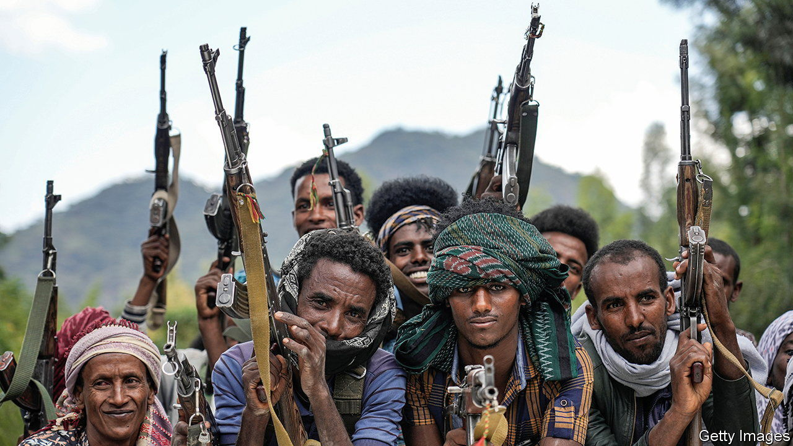
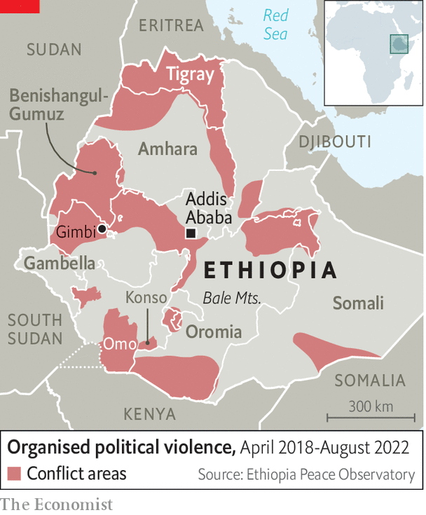

###### Falling apart

# Two ethnic revolts rack Ethiopia at the same time 

##### A country of 120m people is fraying 

 

> Aug 25th 2022 

After a brief stalemate, the civil war in Ethiopia may be poised to get even bloodier. A humanitarian truce to let food be brought to the besieged region of Tigray was broken on August 24th, raising fears of a return to all-out war in the north (see map). At the same time, rebellions around the western and southern edges of Ethiopia threaten to fragment the entire country. In particular, the Oromo Liberation Army (ola), a rebel group which says it is fighting for the self-determination of Ethiopia’s largest ethnic group, has been weakening the grip of the federal government which sits in Addis Ababa, the capital.

 


Last year on December 1st 14 traditional leaders were taken to the woods in south-eastern Ethiopia and shot in the head. The government blamed the ola. In fact, says the state-appointed Ethiopian Human Rights Commission, the perpetrators were almost certainly state security forces. The killings may have been in retribution for those of 11 policemen the day before. 

In the months afterwards, local cattle-herders known as the were subjected to a reign of terror by the security forces, who arrested and beat residents, vandalising their homes. Villagers fled in panic, abandoning their livestock. Young men and even children were shot dead. Bulga Boru was killed as he was putting up fences for his cattle. “The government forces announced they had killed members of the ola,” says a cousin of his. “But he was married and had a family.” 

Such tales have become routine in Ethiopia. The Armed Conflict Location &amp; Event Data Project (acled), a body founded in America that collects information worldwide, recorded ten attacks against civilians by government forces in just one region, Oromia, in the last week of July. Since Abiy Ahmed became Ethiopia’s prime minister in 2018, acled has identified more than 3,000 incidents of “organised violence” and more than 8,000 civilian deaths across the country. The true figure is probably several times higher.

Nobody knows how many have died through murder, ethnic cleansing and famine in the dreadful war in Tigray since it broke out in 2020. Some researchers reckon the death toll could be half a million. The Internal Displacement Monitoring Centre, founded by the Norwegian Refugee Council, thinks that more than 5m Ethiopians were forcibly displaced by the end of last year, one of the highest figures for a single country. Plainly unrest is rife across Ethiopia, far beyond Tigray.

When Abiy came to power he was a young reformer from Oromia, the largest of Ethiopia’s 11 ethnically based regions by area. Years of protests had weakened local government and left a security vacuum. But after Abiy had ousted the unpopular and authoritarian Tigrayan People’s Liberation Front (tplf) from the helm of the coalition that had ruled Ethiopia for three decades, he pledged a new era of national unity, democracy and stability. Ethiopia, he argued, did not have to choose between liberty and order. “The only way to hold the country together,” he wrote in  in September 2020, a year after winning the Nobel peace prize, was to build an “inclusive, multinational, democratic and prosperous Ethiopia”.

Two months later, however, he went to war with the tplf. He accused it of defying the federal constitution and inciting the ethnic violence that had swept across the country after 2018. The tplf, he alleged, had been arming and training opposition groups, including the ola.

Abiy assured sceptics that the war would be quick. The aim was simply to arrest the tplf’s leaders and bring the renegade region to heel. Because the tplf had attacked federal military bases in the region, albeit claiming self-defence, many Ethiopians backed Abiy. They believed that a defeat for the tplf, a well-armed ethnic-based movement, would bolster the central state and stop Africa’s second-most-populous country, which has about 120m people, from fragmenting.

Yet, while the tplf is still undefeated, fighting elsewhere has expanded, especially in Oromia, Abiy’s home region. “The country appears to be fracturing,” says an Ethiopian diplomat. Early this year, just as it agreed to the recently broken truce with the tplf, the government launched a new offensive against the ola, with which the Tigrayan rebel front had signed an alliance a year ago. Thousands of federal troops were supported from the air by drone strikes. They were also backed by militias and volunteers known as the from the neighbouring Amhara region, home to the second-largest ethnic group.

By May, large-scale fighting, including numerous atrocities, had reached within 100km of Addis Ababa. The Oromia Support Group, an ngo, says it has identified 695 Oromo civilians killed by government forces or militiamen since January. “They don’t even ask questions,” says a farmer in Gimbi, 430km west of Addis Ababa. He says his father was shot in the neck by government troops. “They answer any kind of query with a bullet.” The un reports that half a million people may have fled. Schools have closed, health clinics have been looted. Roads in the far west are too dangerous to travel along. 

In June the ola hit back with a string of attacks on towns in western Oromia, including Gimbi. It was soon routed, but only after it had overrun government offices, grabbed arms and freed hundreds of prisoners. It also mounted a surprise raid, together with local rebels, on the capital of Gambella region next door. “[We] did those operations to falsify the government’s claims of victory,” says an ola leader. The state human-rights commission reported that the security forces had then summarily executed many Oromo residents.

Sharing blame for bloodshed

 The ola has itself been accused of atrocities. The Amhara Association of America, another rights group, counted more than 1,600 Amhara civilians murdered and wounded last year by the ola. This year in June the government blamed the ola for killing more than 200 Amhara civilians in a village near Gimbi; the ola says the government framed it. 

The prospect of peace talks with the ola, as well as the tplf, has diminished. The government calls both groups “terrorists”. It also accuses the ola of conniving with al-Shabab, a jihadist group linked to al-Qaeda that ravages neighbouring Somalia. On July 23rd Ethiopian intelligence claimed to have foiled attacks in Addis Ababa by al-Shabab and the ola.

Collaboration between the ola and al-Shabab is unproven. But the jihadists would certainly wish to exploit the Ethiopian government’s distraction in Oromia and elsewhere. In July several hundred al-Shabab fighters crossed into Ethiopia, apparently heading for the Bale mountains. It was al-Shabab’s biggest incursion since it was formed 15 years ago. The Ethiopians say they annihilated the invaders. 

Even so, the attack suggests that Ethiopia is vulnerable on its fringes. “​​There was no [federal] army anywhere near,” admits Mohammed Gurey, a local security chief. Local rebellions have also erupted in the south and south-west, for instance in Konso and South Omo.

Faced with growing disorder in its borderlands, the government has arrested more than 4,000 people allegedly linked to rebel groups or jihadists in the past two months. A crackdown on the in the Amhara region has forced most of them to give up their guns or go into hiding. In Benishangul-Gumuz, a lawless region near Sudan, the government says it has chased out local rebels. But little has been done to tackle the root causes of conflict, such as disputes over land and the representation of minorities. 

Abiy plays down fears of Ethiopia’s fragmentation. Historically the central government often had little control of the country’s periphery, he recently told some of his top brass. In days of yore there were no social media to criticise the government, he added. Moreover, predictions of Ethiopia’s break-up had always proved false.

But the latest wave of rebellion, in the west and deep south as well as the north, is fraying the country. “​​It may seem patriotic to window-dress the general situation,” a retired Ethiopian official warns. “But the longer we keep on engaging in self-deception, the more serious it becomes.”■

