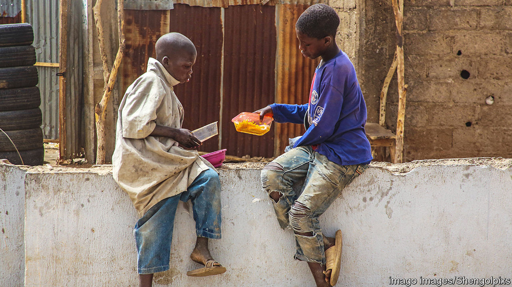

###### Alms and the boys

# Why so many religious students in Nigeria beg in the streets 

##### Many Koranic teachers keep children out of formal schools 

 

> Aug 25th 2022 

Shoppers heading for the posh malls of Abuja, Nigeria’s capital, are often accosted in car parks by boys in ripped kaftans with begging bowls. The kids sing mellifluous laments in Hausa, the main language of northern Nigeria. Auwal Musa begs for food and cash to pay for his weekly religious studies. He is only eight, has never been to a state school and hasn’t seen his parents since he was five. He is one of an estimated 13m unschooled children in Nigeria.

Auwal, like 10m of them, is an , Arabic for an emigrant, implying a searcher for religious knowledge or freedom. Yet the boys’ lack of formal education limits their life chances. When riots break out for political or religious reasons, Nigerians often accuse such boys of being thugs for hire.

Many of them have been handed over as small children to a travelling teacher in handsome robes who has prayer beads in one hand and a whip in the other. He is meant to train them to memorise all 114 chapters of the Koran. The boys sleep on floor mats, learn their lessons from wooden slates and when they are not studying are sent into the streets to beg. 

Governments have long pondered what to do with them. Suggestions that they should be inducted into formal education have been swatted aside by the religious orders. The imams consider the to be beneficiaries of an honoured way of life dating back centuries. In 2014 the government allocated 15bn naira ($35m) to build 157 modern schools that would integrate the young Koran-memorisers into the modern education system. This would also keep the begging boys off the streets. But many of the religious teachers in charge of them refused to co-operate and the new schools are barely functioning.

When covid-19 broke out in 2020, Nigeria’s state governments herded thousands of the boys onto buses and lorries, which criss-crossed the country to take the boys back home, if they could remember where they came from. After the lockdown was lifted most of them found their way back to their old streets. On paper the  practice has been abolished. Yet boys proffering bowls still swarm the streets of northern Nigeria.

“It is what my parents have chosen for me,” says Auwal, tucking a 100-naira note gleefully into his pocket. It may keep the pangs of hunger or the lashes of his teacher at bay for a day. But it is hardly likely to help him fulfil his dream of becoming a doctor. 

