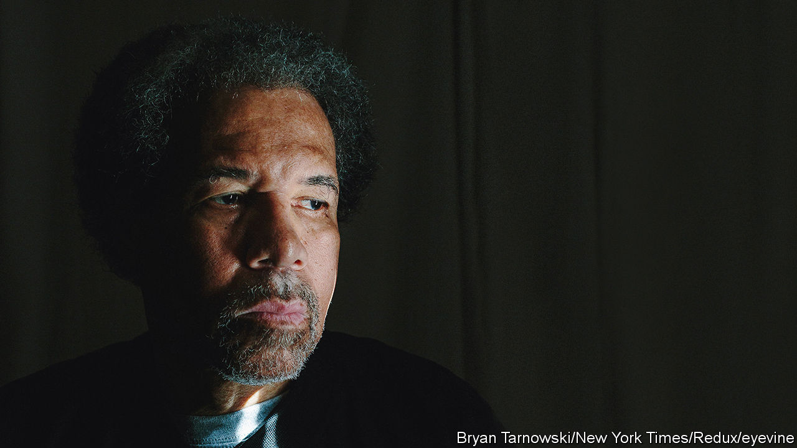

###### What freedom means

# Albert Woodfox found his true self in prison 

##### The man who endured the longest period of solitary confinement in American prison history died on August 5th, aged 75 

 

> Aug 25th 2022 

“I feel my soul as vast as the world, truly a soul as deep as the deepest of rivers; my chest has the power to expand to infin-ity. I was made to give.” 

 When Albert Woodfox first read those words of Frantz Fanon, he was sitting on the floor of a nine-by-six cell. Or on his concrete bunk, the only furniture apart from a metal toilet and a metal sink. There were bars on the door, and a tiny window that let in a sliver of sky. His ankles were shackled, and a leather strap bound his wrists to his waist. In these he would shuffle alone for an hour a day round a larger concrete space, ringed with barbed wire, which was laughably called the exercise yard. The other 23 hours he spent in his cell in the Louisiana State Penitentiary. He was there for almost 44 years, or 16,000 days, probably the longest spell of solitary for any man in the history of American prisons. 

The place was known as Angola. It had once been a slave plantation, holding mostly Angolans and growing mostly sugarcane on 18,000 acres. Cutting cane was now done by prisoners, labouring in gangs supervised by white guards who rode alongside with shotguns on their laps. The task was so brutal that men would pay to have limbs broken to avoid it. He had cut cane during his first stint there, before he was locked up alone. He was not nostalgic for it, not even for the company. 

In summer his cell was torment. Mosquitoes ate him alive, and he sweated so much that his constant pacing left a wet stripe on the floor. But in any season at any time the worst things, the panic and claustrophobia, could hit him. Soaking sweat would tighten his floppy prison jumpsuit, and the walls would move towards him. The air and the ceiling would descend to smother him. He would leap up then, pacing and pacing, to send the horror away. Each morning on waking he asked himself whether this was the day he would at last lose his sanity. 

He was there for a murder he had not committed, the stabbing of a guard called Brent Miller in 1972. Not a shred of evidence linked him to that crime, but he had picked up radical thinking in prison. That was enough to frame him. After three indictments and two trials he was found guilty, but the witnesses were unreliable and the us Court of Appeals in 2014 overturned his conviction, mostly citing racism. The next year he was released after pleading “No Contest” to lesser charges: as good as innocent, to his mind. Almost all the time between he was in solitary, occasionally in the Red Hat block, where the walls were an arm-span apart, rats ran through the darkness and the only food was bread. 

Of course he was no angel, but a hardened criminal. From boyhood, growing up ragged and poor in the Sixth Ward in New Orleans, he stole canned goods from shops and pastries from delivery vans. His mother tried to keep him straight but, arrogant, he wouldn’t listen. Older, he stole cars, stereos, tvs, and turned to armed robbery to support a heroin habit. He hurt his own people, black folk who had nothing, and didn’t care. His street name was Fox, but he chose to be a Wolf, who won any fight and who saw incarceration, especially in Angola, as a badge of honour. The only real freedom he knew in those years came when he and his gang would steal the tourist buggy-horses from their stable and race them at night in a park until their mouths foamed. 

In Angola, though, he began to change. Conditions there were so bad that he cobbled together a moral code for himself. Sexual slavery was rife, but when he watched a new inmate weeping after being raped he determined to stamp it out. He and a fellow prisoner, Herman Wallace, set up a chapter of the radical Black Panthers—whose methods he had first observed in Tombs prison in Manhattan—to protest against the cane-cutting, and curbed stealing in their cell-tier by organising the share-out of food. They argued for black autonomy, dignity and self-esteem, free minds. When he was put in solitary, supposedly for the Miller murder but really for these ideas, Wallace and another Black Panther, Robert King, were locked in solitary too. Together they pledged that they would not only survive, but come out stronger. 

So it happened. His own tiny cell now became a university, full of law books borrowed from the prison library. Armed with case law, read 40 or 50 times if need be, he won small privileges for all the solitary prisoners: fans, radios, magazine subscriptions and an end to unnecessary strip-searches. For two hours a day he would read about the troubles of the outside world, which not only took him mentally out of his cell but expanded his sympathy with the whole of suffering humanity. He did not care much now if, when he complained about his toilet blocking up, tear gas was sprayed in his face. Far worse was happening elsewhere. 

A lot of noise went on too, but of a good sort. The ringing bars became a communication system on which prisoners could send maths tests to each other, or invent quizzes. They would play chess by shouting out their moves. His own greatest achievement, he felt, was to have taught a prisoner called Goldy to read. On his hour out, he would stand in front of Goldy’s cell and they would go through the dictionary together. After that, he encouraged his pupil to call him any time of the day or night if he still couldn’t understand. One glorious day Goldy found sounds and words knitting together, and the world opened up to him. 

In all these ways, Fox’s solitary cell became the opposite of what his captors intended. It grew to contain the world. And when at last he was released, in February 2016 on his 69th birthday, the real world seemed in many ways no freer. He moved there, still, as though he felt his shackles. He avoided eye contact with others, and feared crowds because an attack might come from any side. In the security of his cell he had dived and soared. Outside, at first, he shrank again. It took a while for him to grow into a fierce campaigner for an end to the evil of solitary confinement, but when he did he discovered afresh the truth he had learned in that nine-by-six cell: that his soul was as vast as the world, as deep as the deepest river, as wide as infinity, and as free. ■

