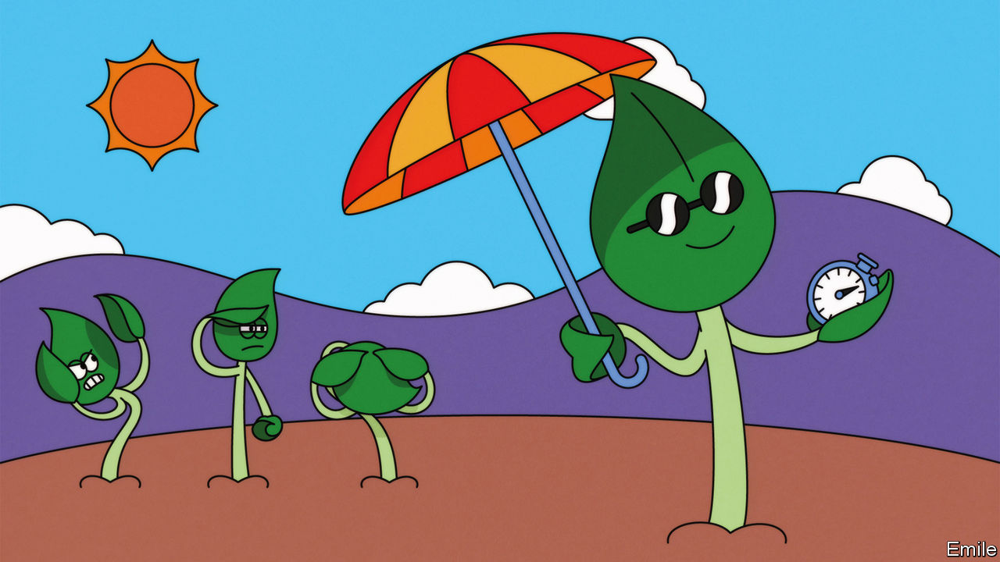
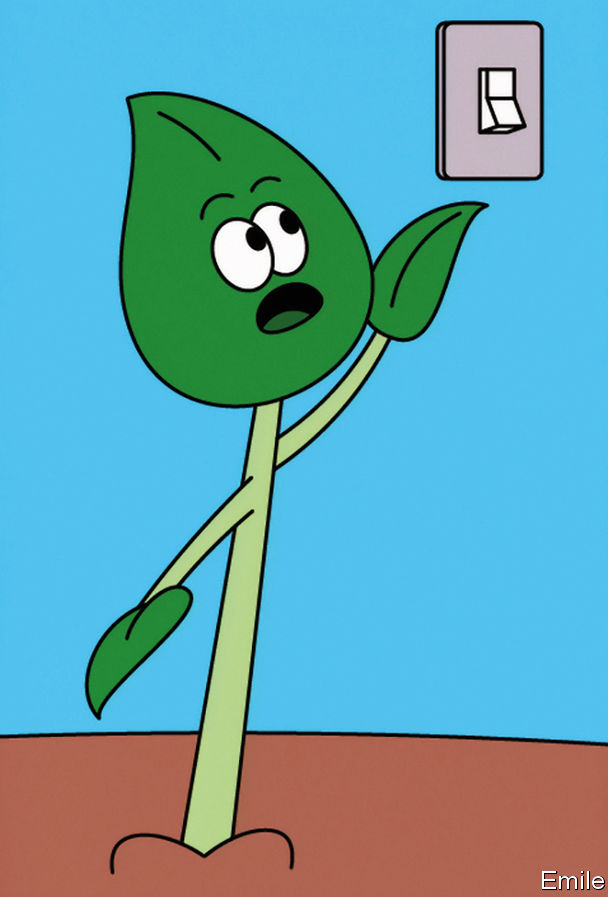

###### GM soya and photosynthesis

# A genetic tweak that makes soya plants 20% more productive 

##### It improves their ability to photosynthesise 

 

> Aug 24th 2022 

Plants are layabouts, and as such easily underestimated. They seem simply to sit there, growing or dying according to the roll of the meteorological dice, the appetites of herbivores, the caprice of pests and the skill (if they are cultivars) of their attendant farmers and gardeners. But their passivity is superficial. On the inside, plants are endlessly active. Their sedentary way of life requires it. They must continually adapt in their biochemical processes to changes from which animals can simply run, swim, slither or fly away. 

Understanding how plants do this is scientifically fascinating. It also offers the possibility of changing not just the look and size of members of the vegetable kingdom, as humans have been doing for ten millennia, but also their inner workings. The potential such change offers is demonstrated spectacularly by a study published recently in  by Stephen Long of the University of Illinois Urbana-Champaign and his colleagues.

Dr Long’s team used genetic modification to improve the way soya plants deal with fluctuating illumination, thereby increasing yields dramatically. They did this, moreover, not in a laboratory, but in a field. Plant breeders get excited by yield increases of one or two percent. Most of Dr Long’s strains saw augmentations of more than 20%, and one improved by a third. Those sorts of numbers could make a big difference in a world with a growing population and which is at risk of losing significant amounts of farmland to climate change.

Soyabean maverick

That plants have something to fear from fluctuating sun and shade might sound surprising. Solar cells—which, like leaves, work by energising electrons using sunshine—produce more energy in bright light, and less when shaded, without any fuss. But biological photosynthesis is far more sensitive than the photovoltaic response of semiconducting silicon. When a shaded leaf is suddenly exposed to the sun the photosynthetic machinery within it risks blowing a fuse. And as the sun traverses the sky, and the wind blows, such transitions from shade to sun and back again are the norm, not the exception. 

Plants have therefore evolved various safety valves to remove energy from their photosynthetic apparatus and dissipate it as heat. But, clever as they are, these valves are a bit slow to respond. In soya plants it takes minutes for them to ramp up after a leaf finds itself in full sunlight, and longer still for them to turn themselves off when shade returns. When they turn on too slowly, the light they receive in the interim has time to overexcite and damage the photosynthetic machinery. When they are too slow to turn off, diffuse illumination that a shaded leaf might put to good use gets wasted as heat instead.

Dr Long and his numerous lab-mates have long worked on improving the safety valves involved. Their main idea is to get the relevant valves to turn off more quickly. The longer the protective effects persist after a leaf has been shaded, the less photosynthesis it ends up doing. In 2016 they reported putting extra copies of three genes identified as crucial to this process into tobacco plants, which are easier to modify than most crops. The leaves of the modified specimens returned to peak efficiency much more quickly in the shade than did normal tobacco leaves. The modified plants also grew a good bit more strongly than unmodified controls. But there were doubts as to quite why that was, and whether similarly modified seed crops would invest their photosynthetic gains into growing more or bigger seeds. 

The latest experiments with soya were designed to put those worries to rest. Dr Long and his colleagues took the genetic troika from their tobacco experiments and inserted it into Maverick, a soya cultivar that is reasonably easy to manipulate genetically. The vagaries of such manipulation mean that the same genes added to the same plant do not always give the same result, so the researchers created a range of strains. In 2020 they planted eight of them on the university’s farm. 

Come harvest, they found that five of the eight had significantly higher yields than unmodified plants used as controls, while three showed no improvement. The average increase in yield across the five successes was 24.5%. The best performing strain went up by 33%. 

The following year they performed the same experiment and saw no improvement—but this proved to be one of those rare cases where the notion of an exception proving the rule actually applies. The 2020 crop had higher yields because it produced more seeds. At the point when the 2021 crop was about to produce its seeds the look of the seed-pods made it appear that the same was about to happen again. But then a storm knocked the plants flat. 

In their new, recumbent pose the plants’ leaves were piled on top of each other, rather than waving free. Those above got more light all the time; those below, less. None saw much by way of variation. 

The obvious prediction in these circumstances would be that gene modifications designed to allow leaves to handle variations in light would make no difference. And that prediction was borne out. Having prepared pods with space for a bumper crop of seeds the plants filled them with just the normal number. 

Thomas Sinclair of the University of North Carolina, who is sceptical about the whole idea of improving yields by increasing photosynthesis, points out that this was one small plot in one place, and that almost all of the modified plants seem to have been examined, rather than a subset, as might be more normal. Agronomists, he says, need much bigger experiments in a number of environments to be convinced. Dr Long, who put the experiment together with his colleagues Amanda De Souza and Steven Burgess, says the team is working on larger trials in more places. His lab is also working on editing, rather than adding to, the genome to achieve similar effects, and on endowing crops with other ways of increasing photosynthesis that they have found to work in tobacco. 

 


Such efforts are not restricted to soya. Rice and wheat (a crop in which yield increases provided by other means have slowed over past decades) are other possibilities. Work aimed at putting the technology into seeds of these crops and others, which can then be provided to farmers—in particular, poor farmers—will be taken on by Gates Ag One, a company owned by the Bill &amp; Melinda Gates Foundation, which helps fund Dr Long’s lab.

This is not quite the first time that ramping up photosynthesis has seemed to increase a crop’s yield: Dr Long points to an increase in rice yield from plants that produced more rubisco, the protein which uses the energy of photosynthesis to store carbon as organic molecules, reported in 2020 by Makino Amane of Tohoku University and his colleagues. But the field is oddly empty, given that photosynthesis is basic to turning sunshine into calories. 

This is in part because most approaches to breeding plants have no way of tackling photosynthesis directly. Breeders look for practical improvements in yield and other beneficial traits. They worry less about underlying mechanisms. Most increases come from making plants better at getting the nutrients they need from the soil. Nor has this practical approach had the accidental effect of improving photosynthesis. A study published in 2016 of soya cultivars put on the market between 1923 and 2007 showed no consistent trend in photosynthetic capacity. Indeed some researchers, like Dr Sinclair, see increasing photosynthetic productivity as a red herring. 

No one argues that photosynthesis is as good as it could possible be. Evolution has no interest in perfecting a single process—it simply blesses the organisms best able to survive and reproduce. Plants make endless trade-offs to those ends: how much effort to put into roots versus stalks versus leaves; how much to feed helpful fungi and bacteria in the soil; how much toxin to put into tissues to deter those who would munch on them; and so on. They have no overwhelming incentive to maximise photosynthesis simply because it underlies all the rest.

That is why almost every textbook on the subject tells its readers that photosynthesis is inefficient. For a healthy wild plant to maximise the amount of sunshine it eats is simply a suboptimal strategy. But the same is not true for crops. “Crops are not healthy plants,” observes Alexander Ruban, a biophysicist at Queen Mary, University of London, who works on the mechanisms Dr Long and his colleagues exploit, any more than domesticated animals are healthy animals that would flourish outside a farm. 

Whether animal or vegetable, farmed organisms are geared to fulfil a particular, limited purpose, not to live a full and rounded life (something which is more easily accepted of a plant than, say, a pig). Increases in photosynthetic capacity which would be irrational for a wild plant make perfect sense in a crop, because crops live for people, not themselves. And if better photosynthesis means that they can live for, and feed the lives of, more people than before, that is to the good. ■


