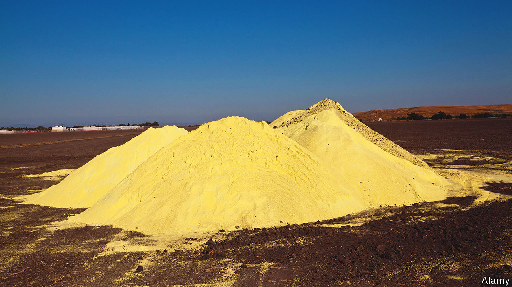

###### Sulphur and oil

# In the world of greenery, no good deed goes unpunished 

##### Reducing oil consumption may make sulphur production more polluting 

 

> Aug 24th 2022 

Bright yellow though it be, sulphur is, from one point of view, a pretty green product as well. Its principal source, providing more than 80% of the total made, is compounds derived from refining oil and gas, which would otherwise go to waste. Left , these would gum up catalysts and also burn to form sulphur dioxide, a notorious pollutant that causes acid rain. Instead, their sulphurous contents are used in the vulcanisation of rubber, to make preservatives for foods and as ingredients of soap. They are also turned into sulphuric acid, a chemical of great industrial importance that is used, among other things, in the manufacture of fertiliser.

The irony of all this, pointed out in a paper just published in the  by Mark Maslin and his colleagues at University College, London, is that, as demand for oil and gas drops in response to the climate-change-induced energy shift currently going on, sulphur produced this way will become less available. Yet this is happening at a moment when demand for the element is increasing.

Partly, that demand growth reflects a need for more fertiliser as human populations expand. But it is also a consequence of the role of sulphuric acid in the production of metals like lithium and nickel that go into electronic devices (including electric cars) and the batteries that power them. These elements are often extracted from their ores by leaching them out of the rock with acid. And the acid preferred for this is sulphuric.

Dr Maslin and his colleagues used past trends, industry forecasts and various paths to decarbonisation described by the International Energy Agency and bp, a fossil-fuel company, to map out plausible future supply and demand pathways for sulphur. They found that demand could rise from 246m tonnes today to as much as 400m tonnes by 2040. Matched against predicted supply, this would cause an annual shortage of between 100m and 320m tonnes, equivalent to 40-130% of current production—assuming no other response was made. 

Of course, some sort of response would be made—just not a particularly green one. There is no global shortage of sulphur. Before its extraction as a by-product of oil and gas refining, it was won from the Earth’s crust by the Frasch process, use of which could easily be expanded. The Frasch process, however, involves injecting pressurised superheated water into rocks that contain elemental sulphur. This generates sulphuric acid as a by-product and also liberates toxic heavy metals from the rock in question, causing serious pollution. Some days, you just can’t win. ■


