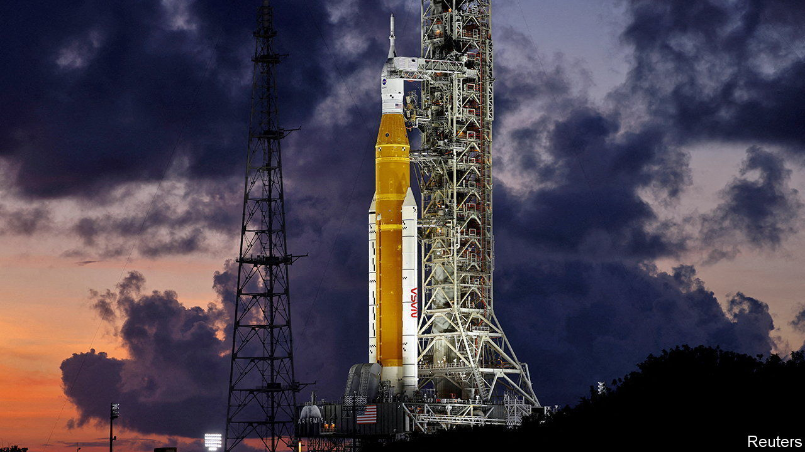

###### The Space Launch System

# NASA’s Space Launch System is yesterday’s rocket 

##### It is powered by yesterday’s technology and brought about by yesterday’s thinking 

 

> Aug 24th 2022 

On december 14th 1972 Eugene Cernan, commander of Apollo 17, took a last look around the Taurus-Littrow valley, climbed his lunar module’s ladder and blasted off for home. His were the final footprints so far pressed into the Moon’s surface. Indeed, no human being since then has ventured more than a few hundred kilometres from Earth.

Nor will that change on August 29th, the current scheduled lift off, from the Kennedy Space Centre in Florida, of the first flight of nasa’s Space Launch System (sls), heir to the mighty Saturn Vs that carried the Apollo project to the Moon, and putative workhorse of the Artemis programme, Apollo’s tardy follow-up, which has its eyes first on the Moon and then on Mars. Instead, the sls will send a capsule called Orion, carrying three mannequins wired with radiation sensors, to the Moon’s vicinity. This will arrive, if all goes well, on September 3rd. And if it continues to go well, people (four of them) will follow the dummies into lunar orbit in 2024, and a further two will make new footprints, perhaps at the Moon’s south pole, in 2025. 

Back to the future

It all sounds terribly futuristic. It isn’t. Artemis, named after Apollo’s twin sister, who was goddess of the Moon as he was god of the Sun, is a mishmash, built on top of previous, abandoned plans to return to the Moon. And the sls, in particular, looks like an attempt to relive the 1960s using the technology of the 1970s. It is not merely an  to the Saturn V (though not quite as powerful). Much of it is built from re-used and repurposed components from the Space Shuttle, an experimental spaceplane that first flew in 1981, just eight years after the last Saturn V went up.

The sls’s distinctive orange body, for instance, is a stretched version of the Shuttle’s external fuel tank. Attached to the bottom are four of the same rs-25 engines that powered the Shuttle itself (each of the engines on the rocket currently on the launch pad has been into space several times before). Strapped either side are a pair of solid-rocket boosters, likewise stretched, that are also derived from those that helped the Shuttle into orbit.

Building on old technology was not nasa’s idea. The sls was created by Congress, and foisted on an unwilling Barack Obama in an effort to protect manufacturing jobs, particularly in Alabama, where much of the Shuttle was built. Critics have dubbed it the “Senate Launch System”.

Despite being made from recycled material, which was supposed to save money, the sls is both late and expensive. It was originally scheduled to take off in 2016. Its development cost is $23bn and climbing. The cost per launch depends on how many launches eventually happen, but one official estimate puts it at more than $2bn.

Many observers, including, on one occasion, a serving boss of nasa in the shape of Jim Bridenstine (he ran the agency from 2018 to 2021), have questioned whether the sls is even needed, for it is not the only giant rocket under construction. Over the past couple of decades nasa has acted as midwife to an innovative, private-sector “New Space” industry, the most famous member of which is SpaceX, founded in 2002 by Elon Musk, a serial entrepreneur. 

SpaceX has already undercut the rest of the industry with its cheap, reusable Falcon rockets, and regularly flies both cargo and astronauts to the International Space Station. The firm is now working on Starship, a rocket that overtops even the Saturn V in both size and power. Starship is designed to fulfil Mr Musk’s quixotic vision of setting up a colony on Mars. It would be more than up to the task of taking a handful of astronauts to the Moon.

It would be orders of magnitude cheaper, too. Though the Shuttle was partly reusable, the sls is not. After each launch every part of it except the Orion capsule that is its payload will be ditched in the ocean or abandoned in space. Both of a Starship’s stages, by contrast, are designed to return to Earth under their own power, so that they can be refuelled and flown again. Mr Musk hopes to drive launch costs down to $10m a pop. But even if they were double that, they would still be just 1% of the cost of an sls launch.

On paper, then, SpaceX’s rockets look an obvious alternative to the sls, for Artemis or any other nasa endeavour that involves heavy lifting. But the agency has had its hands tied. When Mr Bridenstine suggested in 2019 that America could return to the Moon using SpaceX’s existing largest rocket, the Falcon Heavy, which, depending on where in space it is going, has about two-thirds of the sls’s lift capacity, he provoked a row with Richard Selby, a senator from Alabama who was then chairman of the Senate appropriations committee (he is now vice-chairman). Welcoming the sls in 2011, Mr Shelby said that nasa’s exploration of space, “has always been and always will be through Marshall Space Flight Centre [in Alabama].”

I come from Alabama...

The New Space industry, though, is already involved in other parts of the Artemis programme. The sls cannot carry enough mass to lunar orbit to enable astronauts to descend directly to the lunar surface. Instead, they will have to rendezvous with a waiting descent vehicle called the Human Landing System (hls). In 2021 nasa awarded the contract for that to SpaceX. Artemis also involves the construction of a space station, the Lunar Gateway, in orbit around the Moon. The first components of this will be carried by Falcon Heavies.

And there is one other matter to consider when assessing the sls’s future. Mr Selby, its shield and defender, is not seeking re-election this year. SpaceX, meanwhile, hopes to launch its first Starship before the year’s end. If that goes well, the question of whether the sls’s first flight should also be its last will grow yet more pertinent. ■


