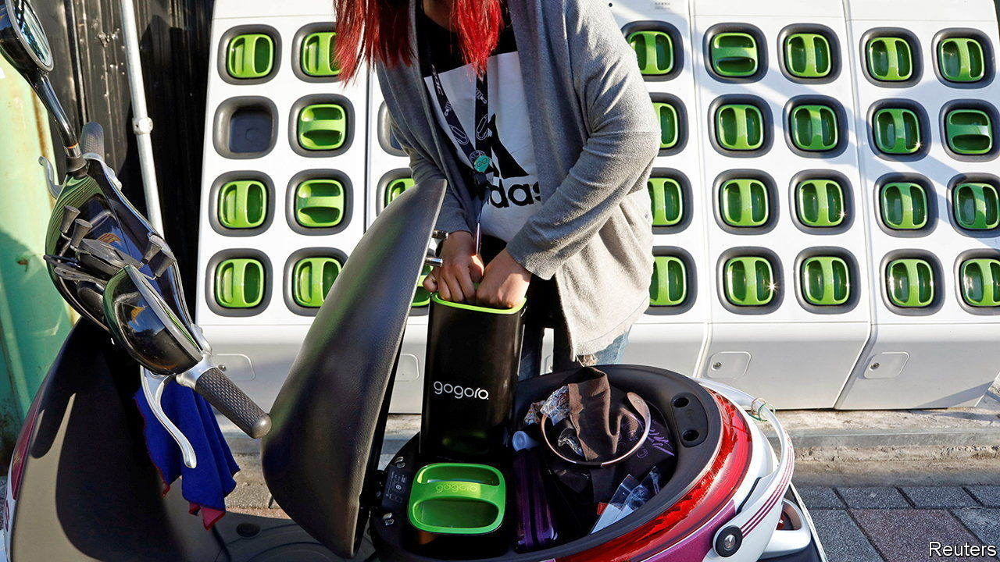

###### Electric vehicles

# Swappable batteries for electric vans and lorries make sense 

##### Car drivers, though, will probably want to keep recharging 

 

> Aug 24th 2022 

One of the most successful battery-swapping schemes for electric vehicles (evs) is run by Gogoro, a Taiwanese firm. It has some 500,000 subscribers who, in return for a monthly fee, can quickly exchange depleted batteries from their electric mopeds and scooters for fully charged ones at a network of kiosks around the country. What makes Gogoro’s scheme so popular is that it uses a standardised battery which fits into machines produced by different manufacturers. 

Japan’s giant automakers are now looking at doing something similar with delivery vans and light trucks. A consortium of Daihatsu, Isuzu, Hino, Suzuki and Toyota is exploring the use of easily detached “cartridge” batteries to power such vehicles. These cartridges would be smaller than the fixed batteries of typical evs (though several could be bundled to provide more range) and would be standardised to fit any vehicle adapted to the system. When empty, they could be removed and replaced quickly with fully charged ones at automated drive-in swap stations. Yamato Transport, a big Japanese delivery service, is working with the consortium on ways to set up a network of such stations.

Swapping batteries like this would be a useful way of powering commercial evs that are constantly on the road and therefore require frequent recharging. Conventional fast charging, of the sort a private motorist might employ at a service station, is intended only for occasional use because doing it repeatedly strains a battery, shortening its working life. Swapped-out battery cassettes, by contrast, can be recharged slowly and efficiently, but without keeping a vehicle off the road. The consortium thinks battery swapping might help cut peak electricity demand at businesses as well, by eliminating end-of-shift surges when lots of vehicles return to base and plug in simultaneously. 

The consortium will also have to decide whether to sell cartridge batteries outright and let transport companies do their own swapping, or lease them and rely on third-party swap-stations. If they do come up with a workable scheme, it might encourage producers of commercial evs in other countries to try something similar. But there are a lot of bumps in the road ahead before any of this will happen.

For one thing, it is not just a common specification for the battery that has to be agreed, but also the means by which it is attached and removed. That impinges on how companies design their vehicles, making agreement harder to come by. At present there is little standardisation in the ev business. Batteries come in many shapes and sizes, and chargers work with some vehicles but not others. A lot of batteries are also tricky to remove. Increasingly, indeed, they are designed into vehicles as part of the structure. Manufacturers who once assumed batteries would become commoditised now develop their own, employing them to provide commercial advantages such as increased range, faster acceleration and quicker charging. 

The success of a battery-swapping scheme would thus depend on how its cost compared with charging batteries —though both options would probably be available on any given commercial vehicle. For private cars, where leasing batteries has not been popular, success is less likely. 

Battery-swapping schemes for cars do exist. Nio, a Chinese carmaker, provides swap stations in its home market, where many people live in apartments and so have no access to home charging. But most manufacturers are looking at better batteries and improved charging infrastructure. 

Tesla, America’s biggest ev producer, considered battery swapping but ditched the idea in favour of developing its own Supercharger network. And charging times on most networks are coming down, with some high-voltage systems able to top up batteries from 20% to 80% in under 20 minutes. That still does not overcome the battery-strain problem. But future batteries, particularly the solid-state variety that some companies are developing, promise to be smaller and capable of greater range, so will need charging less often. Most private electric-car drivers will thus still need to keep their charging cables handy. ■


