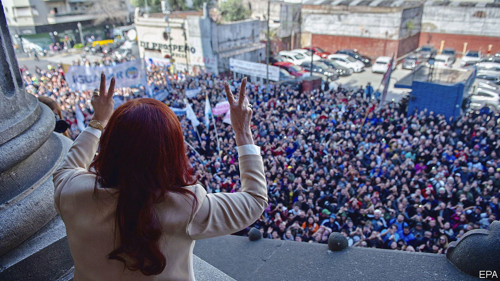

###### Kirchner karma

# Argentina’s vice-president could face 12 years in prison 

##### Cristina Fernández de Kirchner, a former president, is accused of corruption 

 

> Aug 25th 2022 

“Remember that judges are just judges—they are not God,” Cristina Fernández de Kirchner, then the president of Argentina, told her underlings in 2012. “You only have to fear God. And me a little bit, too.” Back then, a judge she disliked was accused of giving his family public-works contracts in a Supreme Court case, and she revelled in his fall. 

A decade on, the tables have turned. On August 22nd a federal prosecutor requested that Ms Fernández, now vice-president, should be jailed for 12 years and barred from holding public office. She is accused of abusing her authority to steer inflated public-works contracts to a friend during her presidency (a scheme thought to have begun under her late husband, Néstor Kirchner, also a former president). Prosecutors allege that the loss to the state is around $1bn. Diego Luciani, the prosecutor, called it “probably the biggest corruption scheme the country has ever seen”.

The friend at the heart of the trial is Lázaro Báez. A bank clerk in Santa Cruz, the remote rural province in Patagonia where both of the Kirchners’ political careers began, Mr Báez became a construction mogul under their successive administrations. Between 2003, when Mr Kirchner assumed office, and 2015, when Ms Fernández stepped down after losing a presidential election, Mr Báez’s companies won 51 public-works contracts in Santa Cruz, almost 80% of all contracts relating to roads in the province over that period. Only 27 were finished; the other 24 were abandoned. Along with Ms Fernández and Mr Báez, another 11 people have been indicted.

Ms Fernández denies all allegations. But this is not the first time she has been investigated. Along with this probe, she has been named in 11 cases of suspected corruption, bribery or money laundering, of which four cases remain active. But this case is the first to move to trial. 

As a result, it has ruffled her feathers. She recently attempted to get Mr Luciani and two other judges on the case removed, but failed. The day after Mr Luciani’s announcement she delivered a live broadcast on YouTube for an hour and a half in which she accused the courts and the country’s biggest newspapers of acting like a “firing squad”. “They are not coming after me, they are coming after the salaries and rights of workers,” she claimed. 

A verdict in the trial is expected within the next few months. If convicted, Ms Fernández will probably appeal. That, and a possible further appeal to the Supreme Court, could take several more years. In the meantime she is free to run in next year’s legislative elections, in which she will hope to retain her current seat in the Senate (Argentine politicians can hold multiple elected offices at once). That, in turn, gives her congressional immunity. She may be free for now, but Ms Fernández may end up having more to fear than God. 

