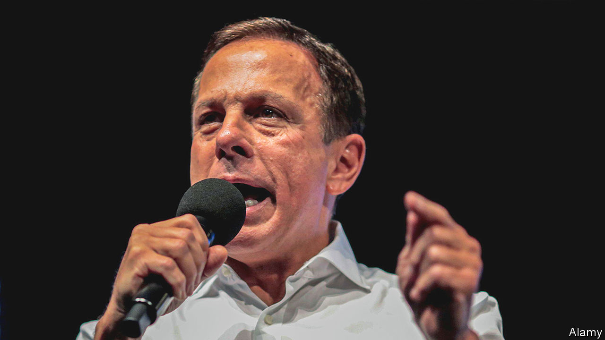

###### Federal offence

# Brazil’s governors have been emboldened under Jair Bolsonaro 

##### But their attempts to move into national politics have worked less well 

 

> Aug 25th 2022 

João doria, who until April was the governor of São Paulo, Brazil’s richest state, is a colourful character. He hosted a Brazilian version of “The Apprentice”, while a sex tape featuring someone who looks like him went viral. But during the primaries last year to become a centre-right party’s presidential candidate, he opted for tameness. “João Doria is boring, but competent,” his campaign video declared. His team hoped it would distinguish him from the two, divisive frontrunners for the election in October: Luiz Inácio Lula da Silva, a leftist former president, and Jair Bolsonaro, the populist incumbent. It did not work. Mr Doria (pictured) secured the nomination, but struggled to attract broader support. When he dropped out of the race in May he was polling at 2%. 

Brazil’s 27 governors have less power than their American counterparts. They have the profile of a ceo, but the responsibilities of a middle manager. Municipalities are in charge of doctors’ surgeries, primary schools and collecting the rubbish; it is their logos that adorn buses and welfare payslips. Governors are limited to doling out funds for road-building, prisons and hospitals. They have little tax-raising power, relying on the federal government for transfers (at least some of which are discretionary). As a result, their work is often overlooked. When voters are asked to rank levels of government by their importance, state politics comes last.

Since Mr Bolsonaro came to power in 2019, however, governors have become more prominent. They often clash with the president, over both mundane matters such as state funding, but also bigger ones such as covid-19 and the environment. 

Such conflict is “a novelty”, notes Oscar Vilhena, the dean of the law school at Fundação Getúlio Vargas. In recent decades, presidents have usually worked in harmony with the states. But from the start of his presidency, Mr Bolsonaro blamed state governors for high fuel prices and unemployment. When he downplayed the danger of covid-19—he once called the virus, which has killed at least 680,000 Brazilians, a “little flu”—governors stepped in to impose lockdowns and mask mandates and to write to the authorities in the United States to ask for vaccines. 

In 2020 the Supreme Court ruled that governors have a power to impose their own policies, such as lockdowns, in response to an emergency like a pandemic. The ruling “re-defined Brazilian federalism”, says Mr Vilhena. Currently 12 governors are fighting to be compensated over a federal cap on fuel taxes, which has cut into their revenues. 

Mr Bolsonaro’s beef is not only with governors. He has railed against mayors and lambasted the judiciary, in particular the Supreme Court. But he appears to have felt most threatened by state autonomy. Governors were “true dictators during the pandemic”, the president declared in May. He accused the state of São Paulo of doing “everything but declar[ing] independence from Brazil”. In 2019, when Mr Doria was its governor, it had opened an office in Shanghai to promote trade, despite Mr Bolsonaro’s frosty relationship with China. In 2020 Mr Doria contracted Sinovac, a Chinese drug company, to make vaccines in his state. Signs on São Paulo’s ring roads welcome visitors to Brazil’s “vaccine capital”. 

Governors have also spoken up about other issues, such as deforestation, which has accelerated under Mr Bolsonaro. At cop26, the un climate conference last year, which the president did not attend, 22 Brazilian states launched a green consortium and presented their own goals. Eduardo Leite, the former governor of Rio Grande do Sul, says that they were concerned about “how much the image of Brazil was being harmed”. Last year the governors of three Amazonian states met Jake Sullivan, America’s national security adviser, to discuss climate change. The meeting took place in Brasília, the capital, but no one from the federal government was there. 

Not all state politicians have taken the same approach. Romeu Zema, governor of Minas Gerais, Brazil’s second-most populous state, rebukes his fellow governors for, as he puts it, “antagonising” Mr Bolsonaro. “My job is to govern the state, not to criticise the president,” he tuts. He supported the fuel-tax cap, even though his state finance minister said it will cost Minas 12bn reais ($2.3bn), or 15% of its total tax revenue, unless the federal government compensates it. (He is, however, a member of the green consortium.)

Going easy on Mr Bolsonaro seems to have paid off. Mr Zema is the most popular governor among the big states, with an approval rating of 47%. The cohort of governors up for re-election this year seems markedly less prone to attack the president than the rest of them.

Governors who have tried to make the leap to national politics, meanwhile, have seen their stars fade. When Mr Doria left office, more  disapproved than approved of him. His exchange of barbs with the president, who frequently made fun of the governor’s tight trousers, do not seem to have done him much good. Mr Leite, who last year came out as the first openly gay governor, also resigned to run for president, only to lose to Mr Doria. 

And although governors are speaking out more, their power remains limited; much of their time over the past few years has been spent mitigating federal policies, rather than implementing them. This could change. Lula, as the ex-president is known, has vowed to be less combative than Mr Bolsonaro. If elected, “the first thing I want to do is bring together the governors-elect,” he wrote on Twitter in August. He is leading the polls. If he wins, the new climate of hostility between the states and the federal government may dissipate as fast as it sprang up. ■

