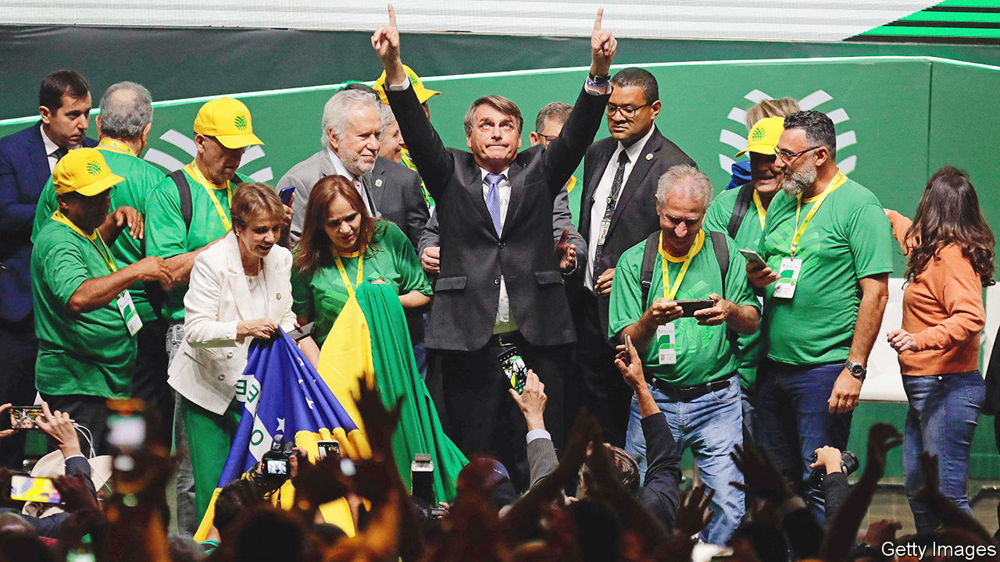
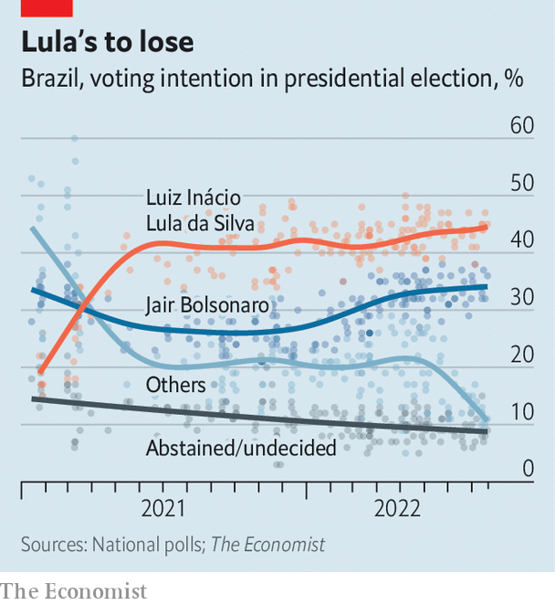

###### Far behind, but gaining

# Brazil’s president, lagging in the polls, turns to God and cash 

##### Weeks before an election, Jair Bolsonaro is 15 points behind his rival Lula 

 

> Aug 25th 2022 

Francisco teixeira, a 47-year-old former construction worker in a favela in São Paulo, has fond memories of the presidency of Luiz Inácio Lula da Silva, Brazil’s leftist leader from 2003 to 2010. He earned a salary and benefits and his relatives in the poor, north-eastern state of Piauí received enough government help that they didn’t have to migrate to São Paulo. Then came a corruption scandal, a recession and the impeachment of Lula’s successor, Dilma Rousseff. Mr Teixeira got laid off and started driving a taxi. In 2018 he voted for a former army captain, Jair Bolsonaro. 

 


Now the fedora-wearing father-of-three has changed his mind again. Disappointed by the right-wing president’s mismanagement of the pandemic and fed up with high inflation and unemployment, he’s planning to vote for Lula, as the ex-president is known, in Brazil’s general election on October 2nd. “No one is a saint, but Lula was a better president,” he explains. With just over a month left in the campaign Lula is polling at 47% while Mr Bolsonaro is at 32%, according to DataFolha, a pollster (see chart). If no candidate receives more than 50% of valid votes, a second round will take place on October 30th. Lula is counting on the support of hard-up Brazilians like Mr Teixera. Mr Bolsonaro wants to win them over. 

The president faces an uphill battle. Among the 52% of Brazilian voters who have a household income less than twice the minimum wage (2,424 reais, or $480 a month) Lula is ahead: polling at 55% compared with 23% for Mr Bolsonaro. To woo more votes, the government is spending 41bn reais on fuel subsidies, handouts for lorry drivers and cabbies, and a boost to monthly cash transfers for 20m of the poorest Brazilians. But while the gap between Lula and Mr Bolsonaro has shrunk from 21 points in May to 15 points now, Mr Bolsonaro has failed to gain much ground among poor people.

Many think fondly of Lula’s presidency. Boosted by a commodities boom in the early 2000s, Lula launched dozens of social programmes, including highly popular monthly cash transfers known as  (Family Fund). Mr Bolsonaro revamped the programme last year and renamed it  (Brazil Aid). “Bolsonaro changed the name and tried to sell it as if it were his idea,” scoffs Mr Teixeira. The poor have no reason to fear that Lula would cut the 600-reais benefit after it expires in December, says Maria Hermínia Tavares of the University of São Paulo. They may think him more likely to extend it. “People don’t vote out of gratitude, they vote thinking about the future,” she says. 

The election in 2018 was dominated by anger about graft. This time the economy matters most. Mr Bolsonaro’s efforts to reform pensions and slash bureaucracy were overshadowed by his delay in procuring vaccines during covid-19 and his decision to cut aid to the poor as unemployment and inflation soared. But his stimulus spending, along with an upswing spurred by a record harvest and high commodity prices, might translate into last-minute support. After months of rising inflation, prices fell by 0.7% in July. In August the imf increased its forecast for gdp growth this year to 1.7%, from 0.8% in April. 

The polls are expected to tighten as the candidates start flooding Brazilian television with adverts and social media campaigns ramp up. During the campaign Lula has played up the rosier aspects of his time in office. “I like to talk about the past because the past was much better than the present,” Lula told a room of businessmen on August 9th, describing his presidency as “a state of collective joy because the country was growing”. Mr Bolsonaro, by contrast, wants to remind voters of the events of 2014 to 2016, when Lula’s Workers’ Party was rocked by a corruption scandal and a recession. One thing Mr Bolsonaro is likely to mention often in the coming weeks is Lula’s time in prison, on convictions for corruption which were later annulled by the Supreme Court. 

Indeed the president has already sought to exploit the fact that nearly as many voters say they are afraid of another Lula government as one led by Mr Bolsonaro. “Each morning I pray that Brazil never has to experience the horrors of communism,” he told a rapt crowd at a “March for Jesus” parade in Rio de Janeiro on August 13th, as his wife, Michelle, who is evangelical, danced enthusiastically to gospel music. “And I pray that all of you make the right decisions.” Mr Bolsonaro has increased his advantage among evangelicals (who make up nearly a third of Brazilians) from three to 17 percentage points in three months; 49% of them say they intend to vote for him, versus 32% for Lula.

Mr Bolsonaro also retains a lead among rich Brazilians. Lula has attempted to calm nerves by toning down his left-wing rhetoric and recruiting the centre-right former governor of São Paulo, Geraldo Alckmin, as his running-mate. But many are put off by his plans, such as taxing wealth and renegotiating a pro-business labour reform. 

Even so, Mr Bolsonaro’s time to catch up is running out. In 2018 an unprecedented number of voters were undecided in the months before the election; 13% still hadn’t decided three days before the vote. But this year the number of undecided voters is historically low, according to a poll aggregator run by Jota, a news site. Since Brazil’s return to democracy in 1985, the candidate who leads polls two months before the election has gone on to win.

Mr Bolsonaro’s supporters shrug this off. In the face of unfavourable numbers from DataFolha, they post videos of the president’s packed rallies and tag them “DataPovo”, or “the People’s Data.” At a mention of poll numbers, a government official crinkles his nose. “Our polls say something different,” he says. The rhetoric recalls that of Donald Trump, who often denounced polls during his unsuccessful re-election campaign in 2020 and then falsely claimed that the ballot was fraudulent. Mr Bolsonaro, too, has hinted that if he loses, he may not accept the result. ■

