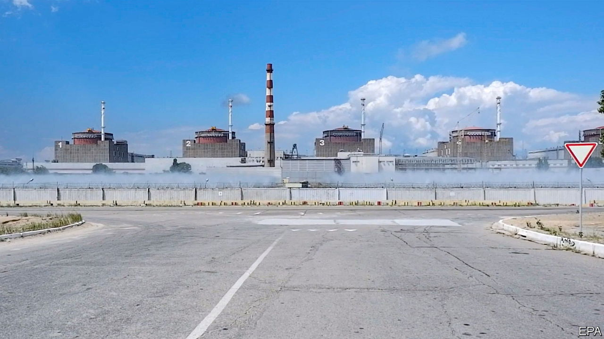
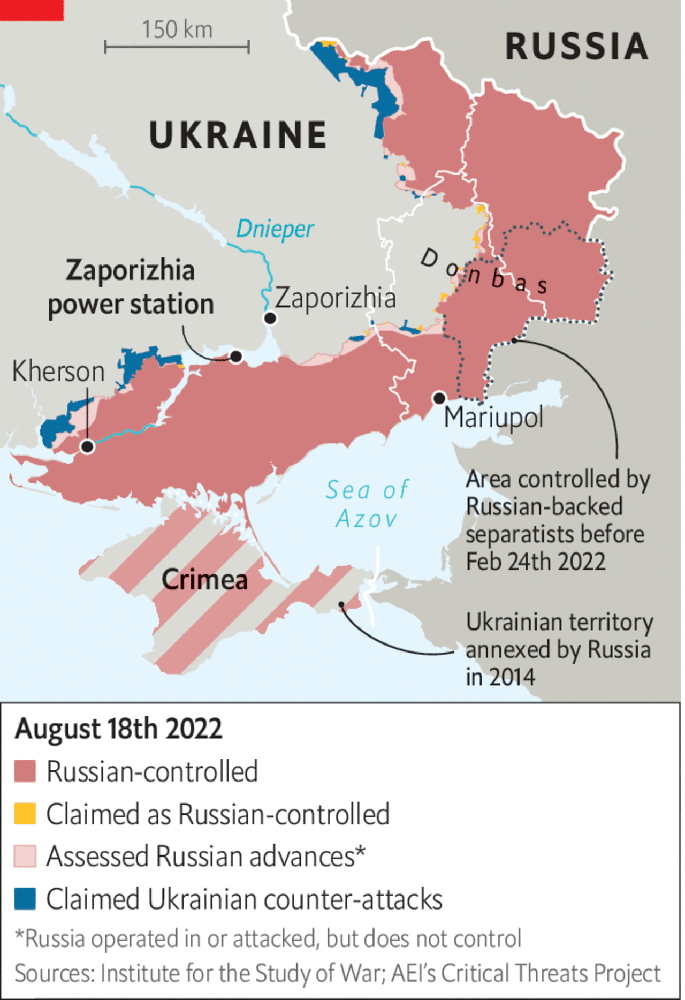

###### The Economist explains

# What is at stake at Ukraine’s Zaporizhia nuclear plant 

##### A disaster on the scale of Chernobyl is unlikely—but radioactive emissions are a possibility 

 

> Aug 19th 2022 


FEW COUNTRIES understand the dangers of a nuclear accident as keenly as Ukraine. On April 26th 1986 reactor number four at the  went out of control during a test. This triggered a series of explosions and the melting of the reactor core. Now, as shelling intensifies around Europe’s largest nuclear plant, in Zaporizhia province in south-eastern Ukraine, the country is calculating the risks of another disaster. The Russian armed forces, which have occupied the plant, claim Ukraine is planning to bomb it and blame Moscow. On August 19th, Russia’s security chief, Nikolai Patrushev, said the responsibility for any future catastrophe would lie squarely with “Washington, London and their accomplices”. Is there anything in such alarming rhetoric?

 


Russia has concentrated military equipment and vehicles in the Zaporizhia power station since capturing it in fierce fighting in early March. Witnesses say it is now using the station as cover to fire rockets on Ukrainian positions in Nikopol and Marhanets, two cities on the opposite shore of the Dnipro river. Shells are landing in the territory of the plant itself, but away from critical infrastructure. Russia blames Ukraine for the incoming fire. Pyotr Kotin, the head of Enerhoatom, the Ukrainian state nuclear operator, says the shells are in fact coming from Russian-controlled positions near the plant. He also claims the invading army has stationed trucks with explosives near two of the station’s five reactors.

The fog of  from both sides makes it unclear how dangerous a moment this is. The 10,000 or so workers who remain at the plant are trained for all kinds of situations, from earthquakes to a commercial plane crashing at the plant. Zaporizhia’s safety-first design, which includes a containment dome and water cooling systems, should protect it against a Chernobyl-style meltdown. But the plant was not designed to be used as a military base in an active war zone, and there are no protocols for the exhausted staff to follow in the case of sustained artillery strikes. Russian commanders have already signalled their intention to shut down the reactors—supposedly as a precaution against Ukrainian shelling.

Mr Kotin, who used to be in charge of the plant, says that would actually increase the risks by forcing the station to rely on backup power for cooling. Two of four power lines into and out of it have already been destroyed; relying on diesel generators would be risky. If they are taken out by shelling, the plant is about 90 minutes away from releasing radioactive emissions, he says. “You know these generals know nothing about nuclear energy.” The Ukrainian atomic chief believes the Kremlin is engineering a crisis for the benefit of those back home, to justify switching the power station from the Ukrainian to the Russian grid. Workers at the plant have already been given instructions to that effect, he says. Something is afoot: all but the most critical employees were told not to come in on August 19th. ■


