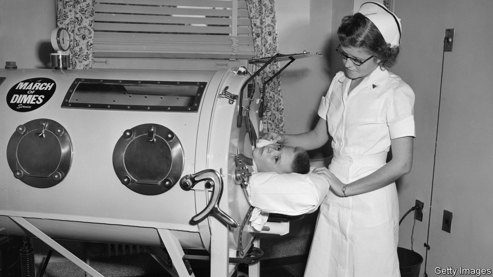

###### The Economist explains

# Why has polio returned to London and New York? 

##### A strain derived from the oral vaccine has gained dangerous mutations 

 

> Aug 19th 2022 

POLIOMYELITIS (OR POLIO, for short) terrorised America and Europe until the 1960s. It paralysed more than 15,000 people a year in America and 8,000 in Britain, mostly children. There is no treatment for  and 5-10% of paralytic cases are fatal. The invention of a vaccine set the world on a path to eradication. The Americas region was declared free of the wild poliovirus in 1994. Europe followed in 2002 and Africa in 2020. But in June a 20-year old man was paralysed by polio in a suburb of New York City. It was America’s first confirmed case of local transmission since 1979. In recent months poliovirus has turned up in wastewater samples in London and New York in quantities that suggest the virus is circulating there. Why has polio returned?

Today, the wild poliovirus is endemic only in pockets of  The type detected in London and New York is a vaccine-derived strain, a rare mutation originating from the oral polio vaccine. Unlike the jab used in Western countries, which is based on an inactivated virus, the oral vaccine contains a weakened strain of the live virus. It is still used in poor countries for several reasons. First, it is cheaper and easier to administer. Second, a person who takes the oral vaccine can transmit immunity through “passive inoculation”: they shed the weakened virus in their stools for a few weeks after vaccination. If an unvaccinated person ingests particles of the virus (which is common in places with poor sanitation) that person becomes inoculated too. 

But this secondary benefit comes with a big risk. If the vaccine-derived virus continues to circulate among unvaccinated people, it gradually mutates into a harmful form that can cause paralysis in about one in a thousand infected people. This process of mutation normally takes a year or so. Outbreaks of vaccine-derived polio are most common in Africa, because of insufficient rates of vaccination. Occasional outbreaks have also occurred in parts of Asia and the eastern Mediterranean. It is from one of those three regions that the poliovirus circulating in London and New York was probably imported. 

Polio is now spreading in the two cities when people ingest particles from the stool of an infected person. If someone who is infected does not wash their hands after using the toilet, or a caregiver fails to do so after changing the nappy of an infected child, they can pass on the virus by touching food or other objects (such as toys that other children put in their mouths) and through handshakes. Both the oral and the inactivated vaccine prevent paralysis. But they are not particularly good at preventing this kind of transmission. The inactivated jab is especially bad at this. The oral vaccine’s protection against transmission is strong at first (so good for outbreaks) but is relatively short lived. America and Europe stopped using it about twenty years ago.

This means that some vaccinated people in London and New York may be part of polio transmission chains, though unvaccinated people are far more likely to pass the disease on because they shed the virus for longer. In London the boroughs where wastewater samples have the most poliovirus are those with some of the lowest polio vaccination rates.

The worry now is that polio will paralyse some unvaccinated children if it continues to circulate at a high rate. The young man paralysed in America had not been vaccinated. Lots of infections are going unnoticed because paralysis is so rare. About 70% of unvaccinated people would have no symptoms and the rest would have only mild flu-like symptoms. Vaccination campaigns, including boosters, were recently launched in London and some New York counties. Doctors in New York City have been asked to contact the parents of children who are not fully vaccinated. 

In 2020 the World Health Organisation approved a new form of the oral polio vaccine. It contains a poliovirus that has been genetically engineered to prevent it from becoming harmful but still has the secondary benefit of passive inoculation. The new vaccine is now being used for mass vaccination campaigns in African and Asian countries with polio outbreaks. As supplies of it increase, it will fully replace the older oral vaccine. That will prevent further emergence of vaccine-derived strains. But those already circulating in New York and London, two of the world’s busiest travel hubs, may be spreading far and wide.■


