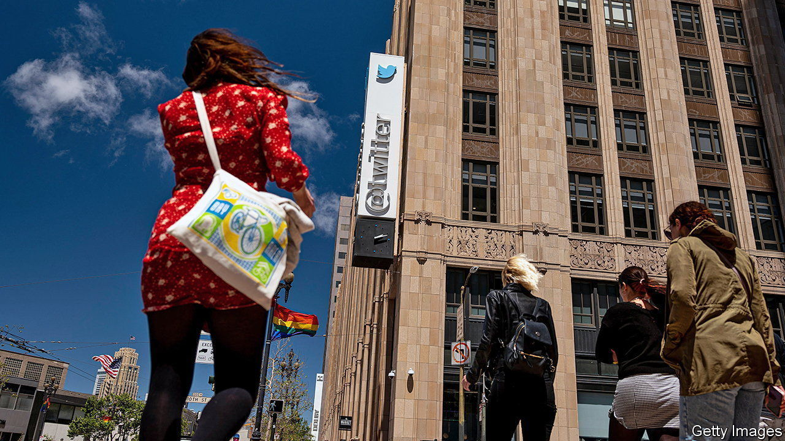
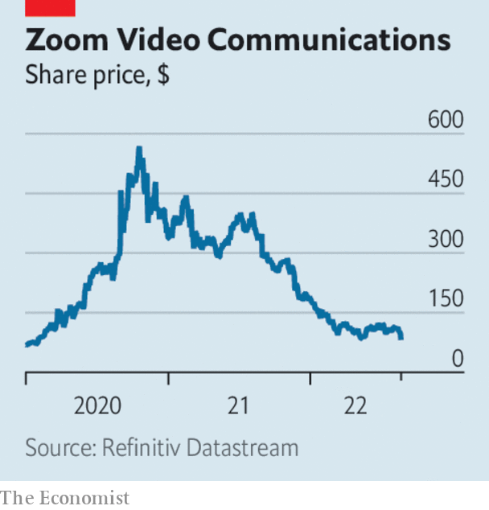

###### The world this week

# Business 

#####  

 

> Aug 25th 2022 

A whistleblower claimed that  had “egregious deficiencies” in data privacy and other sensitive areas, and had misled regulators over its cyber defences. Peiter Zatko was head of security at Twitter from late 2020 until his sacking earlier this year. The company said his allegations were full of “inconsistencies”. Mr Zatko’s claims about the handling of fake accounts parallel  reasons for wanting to . Mr Musk’s lawyer said a subpoena had been issued to Mr Zatko. A subpoena has also been handed to Jack Dorsey, Twitter’s former boss, ahead of a trial that will determine if the deal should go ahead. 

 decided to sell its operations in Hungary to 4ig, a telecoms firm, and a state holding company. Concerns have been raised that the deal will tighten the grip of Viktor Orban, Hungary’s autocratic prime minister, on the country’s telecoms industry. 

In Russia the government strengthened its hold over the internet when , the state-controlled social-media company, agreed to buy the news assets and homepage of , the country’s biggest search engine. Yandex has been criticised for complying with the Kremlin’s line on Ukraine on its news site. It now wants to focus on other aspects of its business. 

, a Chinese financier connected to China’s political elite, was sentenced to 13 years in prison for several corruption crimes, including bribery. Mr Xiao was abducted by Chinese agents from the Four Seasons hotel in Hong Kong in 2017, sending a strong signal to China’s business community at the time about the reach of the authorities. 

 benchmark mortgage lending rate was cut for the third time this year. Coming on top of other easing measures, the government is walking a fine line of trying to shore up demand, notably in the housing market, while not stoking inflation. It has also announced 300bn yuan ($44bn) of infrastructure stimulus. 

The  fell below parity with the dollar again to its lowest level in two decades. The weaker euro increases the cost of imports, pushing up prices, notably for energy. These are factors that may help tip  into recession over the coming months, according to the country’s Bundesbank. 

I’ll do it my way

 president, Recep Tayyip Erdogan, once again ruled out increasing interest rates, despite annual inflation running at 80%. He spoke after the central bank surprised markets by , to 13%, the latest in a series of unorthodox moves. “Economics theories aren’t valid everywhere”, snorted Mr Erdogan. 

Revised figures showed that the  shrank by 11% in 2020, the largest fall in gdp since 1709. The economy fared worse in the second quarter, the start of the pandemic, than had been thought; the recovery in subsequent months was also weaker. 

A regulator gave Berkshire Hathaway permission to buy up to 50% of . Mr Buffett backed Occidental’s takeover of Anadarko in 2019. This year he has spent around $10bn buying Occidental’s shares, giving his investment company a stake of 20%. 

 


 earnings disappointed investors. Revenue at the videoconference company grew by just 8% in the three months to July 31st, year on year. That is down from 54% in the same period of 2021 and the first time it has reported single-digit growth. It has lowered its profit forecast. 

Building on the momentum of the Chips Act, which subsidises American chipmakers,  secured investment from Brookfield Infrastructure Partners to develop a $30bn factory near Phoenix. Intel has also announced plans for a $20bn plant in Ohio and $30bn of investment in Europe as it tries to claw back market share from tsmc in Taiwan and Samsung. 

The end of the rocky road

A federal judge denied a request from  to halt the sale of its business in Israel to a local distributor. Unilever, which owns Ben &amp; Jerry’s, decided to sell up when the ice-cream maker in effect boycotted Israel, believing that its policies in the West Bank are “inconsistent” with the brand’s social values. The judge found that Ben &amp; Jerry’s had failed to prove it would be harmed by the deal. 

 said it was considering bankruptcy protection. The world’s second-biggest cinema chain, which owns the Regal brand in America, has accumulated a mountain of debt. A string of recent blockbusters, such as “Top Gun: Maverick”, one of the highest grossing films of all time, has boosted the industry, though not even the return of Tom Cruise in his fighter-pilot uniform has put enough bums on seats. Box-office sales are still down by a third this year compared with 2019. 

