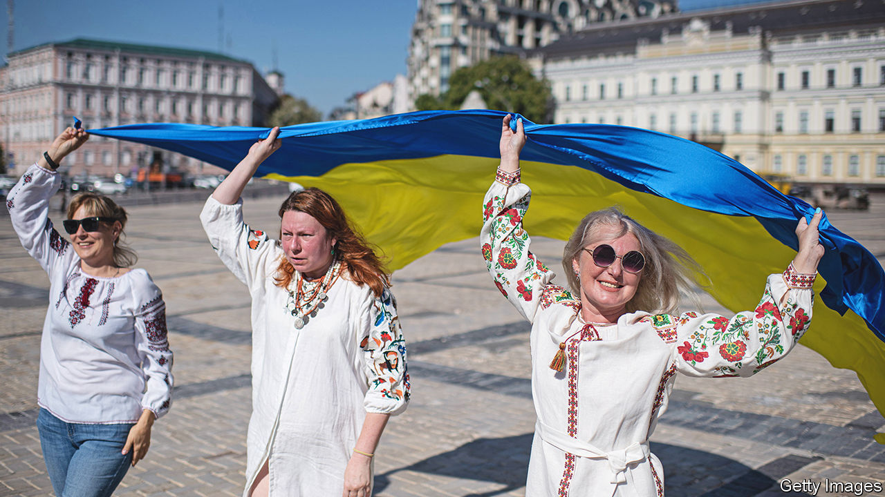
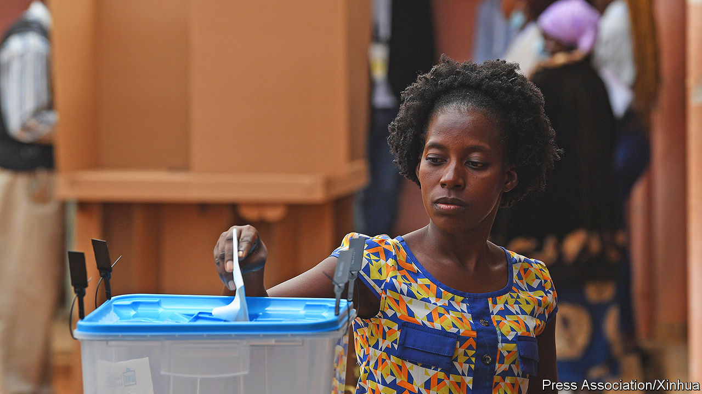

###### The world this week

# Politics 

#####  

 

> Aug 25th 2022 

 , coincidentally on the six-month anniversary of the Russian invasion. Kyiv put on a display of ruined Russian military equipment, to mock Vladimir Putin’s reported plan to hold a victory parade there six months ago. Rumours that Russia would lob missiles at Kyiv this week proved unfounded, but a Russian strike on a train station in Ukraine’s east killed 22 people. Volodymyr Zelensky, Ukraine’s president, pledged to drive Russian forces entirely out of the country, and said that Ukraine had been “reborn” in the conflict. 

Daria Dugina, a fiery nationalist pundit in , was killed by a car bomb. Some speculated that the intended target was her father, Alexander Dugin, another nationalist commentator who is said to influence Mr Putin. Without evidence, Russia accused Ukraine of carrying out the killing. Pro-Kremlin mouthpieces cited it as a reason to escalate the war in Ukraine. 

Inthe government , the rabble-rousing former prime minister, under anti-terrorism laws. Mr Khan is accused of threatening a judge and senior police officers. His supporters accused the state of persecuting him because he is popular. It is unclear whether he will actually be arrested. 

highest court upheld a  against Najib Razak, a former prime minister. He had been convicted of various crimes related to a colossal scam in which $4.5bn was looted from Malaysia’s sovereign wealth fund. Some $700m was found in Mr Najib’s personal account; he insisted it was a political donation from an unnamed Saudi royal. It was Mr Najib’s last appeal; he was  to start a 12-year sentence. 

The Constitutional Court in   from his position as prime minister until a decision is reached as to whether he has breached the eight-year term limit codified in a constitution that was written by a committee favourable to him. Mr Prayuth, a former general, took power in a coup in 2014. His supporters argue that his term only started either in 2017, when the constitution took effect, or in 2019, when he became a civilian head of government. 

Don’t cut the cake just yet

 prime minister said his government would repeal Section 377a of its penal code, which criminalises sex between men. Gay-rights groups have long fought for the provision, which was rarely enforced, to be struck down. However, the government also said it would seek to amend the constitution to give Parliament the right to define marriage. Most Singaporeans oppose gay weddings. 

Raila Odinga asked  Supreme Court to nullify the result of a presidential election on August 9th, which he narrowly lost to William Ruto. The court has two weeks in which to reach a verdict. 

 military government, which has promised to hold elections in 2024, replaced its ailing civilian prime minister with a colonel. Since both president and prime minister are now soldiers, the military’s grip on power looks tighter. 

Al-Shabab, a Somali jihadist group linked to al-Qaeda, stormed a hotel close to the presidential palace in Mogadishu, ’s capital, and held it for 30 hours, leaving at least 20 people dead. The attack was a challenge to the new president, Hassan Sheikh Mohamud, who had recently appointed one of the founders of al-Shabab to his cabinet.

A humanitarian truce between  government and rebels in the northern region of Tigray, enabling food and other aid to reach thousands of famished civilians, . Fighting flared up in Tigray. A separate rebellion intensified in the south and west of the country. 

 


 held what was expected to be its tightest ever presidential election. However, few expect the ruling People’s Movement for the Liberation of Angola (mpla) or the incumbent head of state, João Lourenço, to give the opposition National Union for the Total Independence of Angola (unita) a fair chance of winning. 

Reports circulated that the nuclear deal between  and six major countries, which had been signed in 2015 but aborted by Donald Trump in 2018, might soon be revived. The eu has suggested revisions to the text. America and Iran were said to be demanding last-minute assurances. 

The Democrats won a special election in a highly competitive congressional district in . The Democratic candidate, who took 52% of the vote, talked about abortion during his campaign; his Republican candidate focused on inflation. These themes are likely to feature prominently in the run-up to November’s mid-term elections. 

 said his constitutional rights had been breached by the fbi’s search of his home in Florida, and sought legal protection. He asked a judge to appoint an independent legal officer to review the documents taken from Mar-a-Lago and to stop the Justice Department from assessing them. 

Joe Biden announced a plan to wipe $10,000 from the of Americans who earn up to $125,000, and an extra $10,000 for those who received federal aid to attend college. Economists decried the plan as costly and regressive. Yet it may be popular. 

readied new regulations that will ban the sale of new petrol-powered cars by 2035, giving force to an executive order signed by the governor, Gavin Newsom, in 2020. The state reckons that 16% of cars sold this year have been zero-emission vehicles, up from 8% in 2020.

Almost 1,300 illegal  tried to reach Britain in a day by crossing the Channel, a new record. Over 22,560 have been recorded traversing the busy shipping lane so far this year, compared with 12,500 at the same point in 2021. 

Cristina Fernández de Kirchner, the vice-president of , faced . A federal prosecutor requested that Ms Fernández be jailed for 12 years and barred from holding public office. She is accused of giving public-works contracts to a friend. She denies all charges.

I’ll respect the result, if I win

Jair Bolsonaro, the populist president of , appeared on television and repeated his claim that a presidential election in October, which he , might be rigged. He offered no plausible evidence. He said he would honour the results, but only if they were “clean and transparent”. 

