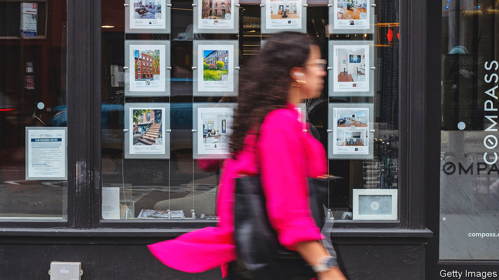
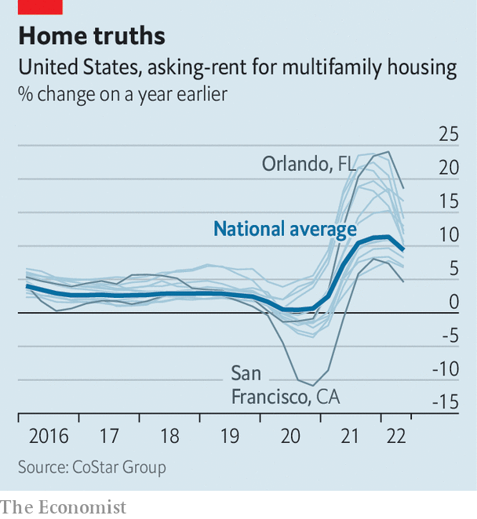

###### Housing policy

# American cities want rent control to rein in housing costs 

##### Economists still think they are a bad idea 

 

> Aug 25th 2022 

When asked about rising rents in St Petersburg, Florida, Karla Correa, a local activist, is resigned. “The crisis keeps getting worse.” Ms Correa speaks from experience. In October the 22-year-old was told that the rent for her two-bedroom apartment in the city’s Historic Old Northeast neighbourhood would be going up by $250, or 23%. Such double-digit increases have become common in St Petersburg and across the Sunshine State, Ms Correa says.

Now some local residents are fighting back with an idea that was banned by the state in 1977: rent control. “We started pushing it here and then other cities in Florida started pushing it too,” Ms Correa says. On August 10th officials in Orange County, Florida, which includes the city of Orlando, voted to put a rent-control measure on the ballot in November limiting rent increases to the change in the consumer-price index. 

 


As rents soar across the country (see chart), more local governments are turning to rent-control measures to help contain housing costs and keep low-income renters in their homes. In June lawmakers in South Portland, Maine, a city of about 26,000, voted to limit annual rent increases to 10%. In July Kingston, some 100 miles (160km) north of Manhattan, became the first city in upstate New York to adopt rent controls. On August 1st lawmakers in Pomona, California, 30 miles east of Los Angeles, voted to cap rent increases at 4%. Several Californian cities, including Pasadena, Richmond and Santa Monica, have put measures on their November ballots tightening existing rent-control laws. 

Enthusiasm for such policies is less partisan today than it was in the past. For years rent-control regulations existed in just five Democratic strongholds: California, Maryland, New Jersey, New York and Washington, dc. In the 1980s and 90s more than 30 states passed laws to prevent local governments from adopting their own rent-control rules. 

However, since 2019 rent-control laws have been enacted in three additional states—Maine, Minnesota and Oregon—and they are being considered in half a dozen more, according to the National Multifamily Housing Council (nmhc), a trade group for landlords and developers. “We’re seeing it pop up in some places where you wouldn’t normally see it,” says Jim Lapides, a vice-president at the nmhc. “There’s a lot more conversation about it than we’ve ever seen before.” 

It is easy to see the appeal. Advocates argue that, by keeping rents below market rates, rent controls allow low-income tenants to stay in their homes, even in rapidly gentrifying areas. “One of the main purposes of rent regulation is to promote housing stability,” says Sophie House of the Furman Centre, a housing-research group at New York University. “Rent regulation does have those stabilising effects.” A paper published in 2019 by economists at Stanford University found that, between 1995 and 2012, tenants of rent-controlled flats in San Francisco were 10-20% more likely than others to remain at their addresses in the medium to long term. 

But economists say such regulations have too many unintended consequences to make them worthwhile. When rents are set artificially low, builders and owners have less incentive to invest in new properties, and greater incentive to convert existing ones to pricey condominiums. This reduces the supply of rental housing and pushes up rents for properties that are not subject to controls. Rent control also tends to benefit rich tenants more than poor ones. “The targeting of the benefits of rent control is completely backwards,” says Rebecca Diamond, one of the authors of the Stanford study. She notes that rent-controlled tenants in San Francisco have higher incomes, on average, than those living in unregulated properties. 

For richer, not for poorer

A working paper by Kenneth Ahern and Marco Giacoletti of the University of Southern California finds that a new rent-control measure in St Paul, Minnesota, has had similarly undesirable results. Using a sample of 150,000 transactions made between January 2018 and January 2022, Messrs Ahern and Giacoletti estimate that the ordinance, which was passed by St Paul voters in November, caused property values in the city to fall by 6-7%. What is more, though the law was intended to help lower-income renters, the benefits went mainly to the rich. 

Why are local lawmakers so keen on rent control? Despite its flaws, experts say, cities have few other tools at their disposal. “Local governments don’t really have control over housing subsidies, they don’t build new public housing, they don’t administer vouchers,” says Ms House of the Furman Centre. Meanwhile the policy tools that they do have, such as zoning laws, are politically unpopular. It is little wonder, then, that rent control is so appealing. “They see something like rent control that doesn’t cost the city anything, and they can say that they’ve done something and helped address the problem, and then that helps them get re-elected,” says Mr Lapides of the nmhc. 

Ms Correa says voters in St Petersburg should have a chance to pass their own law. “You can talk to anyone, any worker, any tenant, and they will support rent control,” she says. “Everyone supports rent control except landlords and developers.” For now, local lawmakers remain unconvinced. Earlier this month the St Petersburg city council agreed to draft a resolution declaring a “housing emergency”, the first step towards putting rent control to voters in November. But on August 11th, following a “sleep in” protest on the steps of City Hall, the resolution was withdrawn. A motion to draft an ordinance to put to voters in 2023 failed by three votes to five. ■


