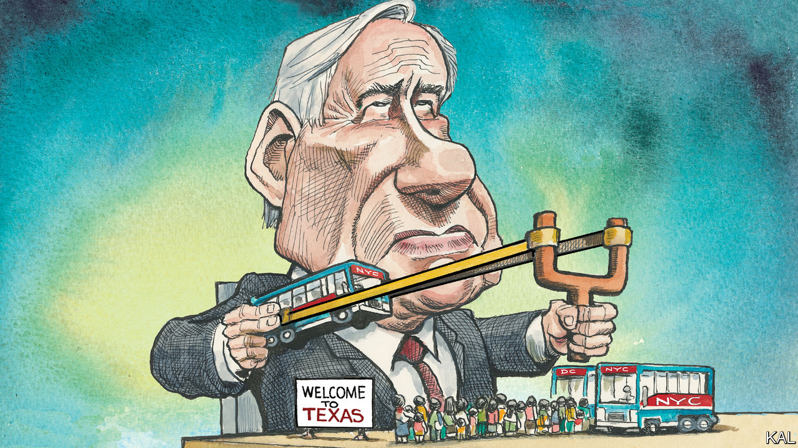

###### A bused people

# America’s border crisis reaches New York, by bus 

##### A cruel ploy makes a fair point: immigration demands national attention 

 

> Aug 25th 2022 

Nothing quite captures the idealism and indifference of Americans, or the cleverness and shortsightedness of their politicians, like the madness that has overtaken the country’s approach to immigration. How else to explain the scene at the Port Authority bus terminal in Manhattan on a recent Friday morning? 

Dozens of migrants from Central and South America clustered behind yellow steel barriers, watched over by New York police. Some picked through plastic bins of new clothes or tried on shoes provided by volunteers. Two children knelt by a metal chair, colouring a blank notebook with yellow and pink pens. A baby slumped on one woman’s shoulder, peacefully asleep, while paramedics wheeled another woman on a stretcher through the barriers and towards Eighth Avenue. With irony or in earnest—take your pick—a backlit glass artwork depicting the Statue of Liberty looked down from one wall on the new arrivals.

They were the latest asylum-seekers dispatched from Texas by its governor, Greg Abbott, who has taken to loading border-crossers onto buses and, with no co-ordination, sending them off on one-way trips, first to Washington, dc, and now to New York as well. The governor of Arizona, Doug Ducey, has got in on the act. The Arizona buses are better equipped, including with medical staff, but immigrants say they have no food or water on the two-day ride from Texas.

Before contending with the politics of this, consider a more uplifting dimension: the response of volunteers. Ilze Thielmann, the leader of the New York affiliate of a group called Grannies Respond, got word from a “confidential source” that Mr Abbot’s first bus to New York was to arrive at 5:30am on August 5th. That day and since, she has helped co-ordinate a loose network of groups that greet the arrivals with food and coffee, with menstrual products for the women and toys for the children, and then get them transport to a shelter or to family and friends in the area. “We’re calling Abbott’s bluff,” Ms Thielmann says. “We’ll do what we need to do. We’re New Yorkers. New Yorkers don’t blink.” 

Not everyone is so generous. One commuter who paused to survey the scene that recent Friday morning wondered aloud what diseases the immigrants might be carrying. “And who’s paying for this?” she asked. “We are.”

As the buses kept arriving, every other day or so, the city government began playing a bigger role. But if the mayor, Eric Adams, isn’t blinking, he is complaining. New York, which earlier this year expanded welfare benefits for non-citizens, by law promises shelter on demand, and the shelters were already straining to accommodate the homeless. The city has rented 1,300 hotel rooms for migrant families and is looking for thousands more rooms. Mr Adams is pressing the Biden administration for help; in Washington, Mayor Muriel Bowser has twice asked the Defence Department for help from the National Guard and been turned down.

Mr Abbott is running for a third term, and he has been gleeful at the mayors’ howls of protest. “Listen, New York is a sanctuary city,” he recently told Fox News. “Mayor Adams said they welcome in illegal immigrants. And now, once they have to deal with the reality of it, they are flummoxed, and they cannot handle it. They are now getting a taste of what we have to deal with.” When Mr Adams threatened to send a busload of New Yorkers to Texas to campaign against Mr Abbott, he was tickled. “There could hardly be anything better to aid my campaign,” he said.

Just because Mr Abbott’s methods are cruel does not mean he is entirely wrong. Americans should not so easily look away from the border, where existing practice is neither wise nor humane. The governors have bused more than 7,000 migrants since April, enough to cause what Ms Bowser calls a “humanitarian crisis”. But more than 6,000 people cross the border illegally every day. They represent a sliver of the 1.82m apprehensions at the border so far this fiscal year, beginning in October, more than the record 1.66m last year. The strength of the American economy, fear and despair south of the border and mixed signals from the Biden administration about the leniency of its policy are all playing a role. 

The White House has been striking deals with other countries to step up their own border enforcement, and it is piloting a programme to speed the processing of asylum cases. But mostly it seems to hope the problem will go away. As president, Mr Biden has not visited the border. The border states are bearing the brunt of the influx. Talking tough on immigration is good politics in Texas. But in New York, it is equally facile to talk tough about those who talk tough about immigration, while basking in one’s own compassion for those trying to enter Texas.

Movement of the people

In a different political reality, the Democratic mayors urging the federal government to do more might team up with the Republican governors who say the same thing, to put pressure on their congressional delegations to act. But Mr Abbott’s approach seems less likely to promote co-operation than to compound division, and with it suffering and chaos. “I understand that Texas is overwhelmed—I really do,” Ms Thielmann says. “But there are better ways to handle this than sending people off in such brutal conditions.” In any event, Mr Abbott probably cannot muster enough buses to create such a crisis that it would break the political deadlock. Many migrants move on quickly, to the homes of relatives or to the city where their asylum hearing is to be held. Others will vanish into a shelter system that somehow muddles through. 

With some 11m jobs unfilled in America, this is a good moment for a long-deferred compromise on immigration, one that would combine stern enforcement of the law with a streamlined asylum process and a path to citizenship. But that outcome would antagonise extremists on both sides, and solve a problem that national politicians would rather campaign on. ■


