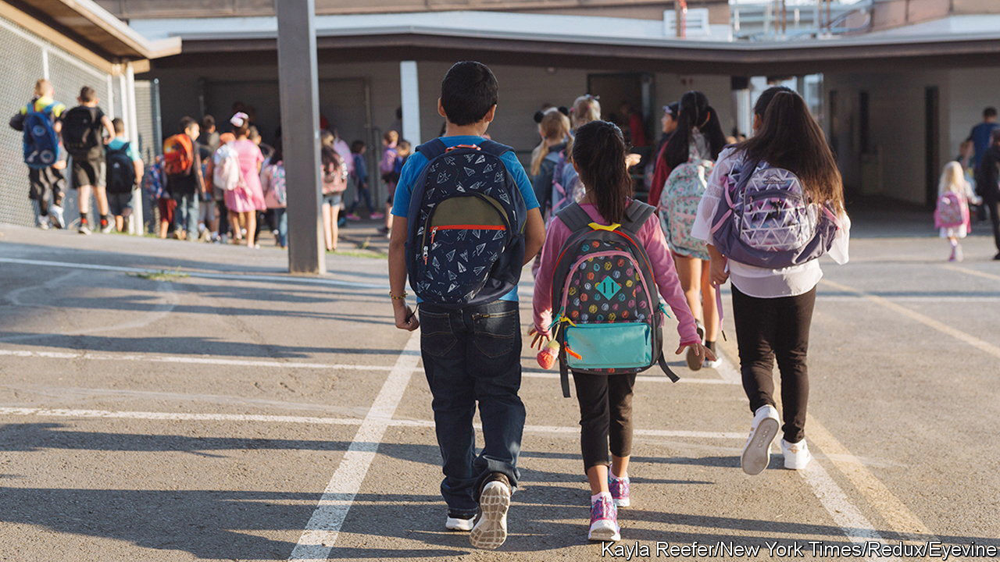

###### The usual suspects

# America’s new “national teacher shortage” is neither new nor national 

##### But it suits both Democrats and Republicans to play it up 

 

> Aug 21st 2022 

The narrative goes as follows. America is suffering from a nationwide teacher shortage. Teachers have been leaving the profession for years, but recent  and the culture war have caused the entire profession to hit a tipping point. Educators are leaving in droves. School leaders are using desperate measures to recruit. Some districts are offering five-figure bonuses. Florida is allowing military veterans without the usually required qualification of a bachelor’s degree to teach while taking college classes. Some rural schools are even resorting to four-day school weeks. 

These stories are true. Some schools and subjects are facing desperate shortages. But the problem is hardly national and certainly not new.

National data on teacher vacancies are hard to come by—the government does not require schools to collect or report them. So researchers from Kansas State University and the University of Illinois at Urbana Champaign gathered information from state education departments and news media. Among the 18 states with vacancy information for the last school year, only three (Alabama, Mississippi and West Virginia) needed to fill 5% or more teaching positions. A shortage of teachers does exist, but it is not nationwide.

States that have historically invested in public education face fewer labour challenges. New Jersey ranks highly on many measures—test scores, per-pupil spending, graduation rates—and the state was fully staffed last year. By contrast Alabama ranks low on achievement (it comes 49th on national maths scores, for example). The state needed to fill over 3,000 vacancies last year, about 7% of its teaching positions. Its troubles have continued into the current school year.

Typically hard-to-staff areas and subjects continue to experience short supply. A government survey in June found that 47% of schools needed to fill a vacancy in special education, compared with only 11% in physical education. Non-white schools and schools in areas of high poverty face more pressure to hire than whiter and richer schools, and  with teacher shortages for decades.

This problem is not new. But for some states it is getting worse. In 2021-22, Mississippi needed to fill 3,036 of its positions (nearly 10% of its staff). Three years before, the state needed 1,063 teachers.

As in previous years, the shortage is largely confined to certain areas and subjects. Yet recently it has been perceived as a national problem. America faces a “catastrophic” teacher shortage, according to the ; schools “across the us” are facing shortages, declared a Fox News banner; it’s “like dog-eat-dog” when scrambling to hire teachers, claimed a headline in the . 

Some of the hysteria might stem from teacher surveys indicating a more widespread issue: 74% of educators were dissatisfied with their jobs in June, according to a survey by the American Federation of Teachers, the country’s second-largest teachers’ union. In February, a survey by the National Education Association, America’s largest labour union, estimated that 55% of teachers were considering leaving. No wonder. The pandemic was a tough time for everyone, but especially for educators who had to switch from in-class learning to remote learning without warning. But there is a difference between intending to leave and actually doing so.

There is no national consensus on how to define a teacher shortage. A school may have enough teachers for each pupil, but is it experiencing a teacher shortage if it cannot find one for a new music course? If an administrator is teaching one class, is that a shortage or is the administrator simply doing her job? Is a district in trouble if it is unable to staff 3% of its positions? How about 1%?

The shortage narrative is politically expedient for education activists on both sides. Democrats, whose supporters favour spending more on public schools than Republicans, point to massive teaching shortages as proof that public schools are underfunded. “The problem is that we don’t invest in our workforce,” says Cecily Myart-Cruz, the president of United Teachers Los Angeles, a labour union. “You have the most educated workforce in the nation. Educators have the most advanced degree, but they cannot have a liveable wage.” 

But conservatives use the nationwide narrative for their own purposes, too. They point to the supposed shortage as proof that the entire state-school system is failing. They push for lowering teaching-certification standards and removing teachers’ unions. And they say privatisation provides an answer. “We need to stop throwing good money after bad and rethink K-12 education,” say Keri Ingraham and Christos Makridis of the Manhattan Institute, a conservative think-tank, in a commentary for the . “With the teacher shortage crisis at hand, there is a timely opportunity to adjust the system.”

In truth, the schools that are struggling to hire teachers are the usual suspects. Nationwide, public schools are doing quite well: most pupils will have a teacher, and overall family satisfaction with their child’s school will probably stay high this year as in past years. The problems remain where the problems tend to exist—in the underfunded schools serving the most disadvantaged pupils. ■


