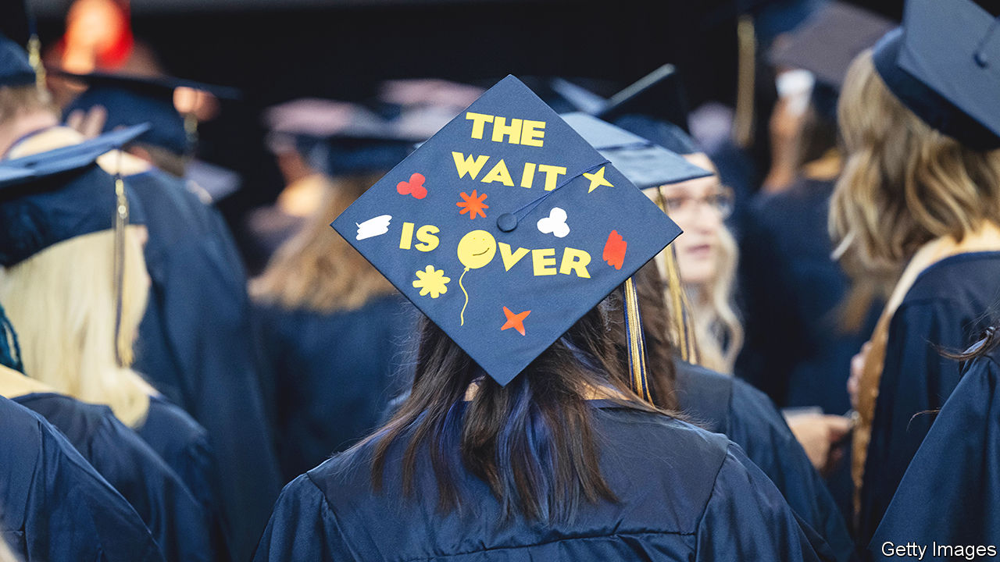

###### Inflation Acceleration Action

# Biden spends hundreds of billions on reducing student-loan debt 

##### Good politics, maybe, but poor policy 

 

> Aug 25th 2022 

Reforming the costly financing of higher education in America would require Congress to agree on a redesign, which would be an arduous and tiresome process. Joe Biden has instead decided to go it alone. On August 24th the president announced a sweeping debt-forgiveness plan through executive order. The federal government will remove up to $10,000 from the balances of individuals earning less than $125,000 a year (as 95% of Americans do), and $20,000 for those who received Pell grants, which are mostly awarded to university students from poor families. Yet despite Mr Biden’s effort to cut the Gordian knot of student debt, America will be tangled up in it again soon enough.

Assuming the inevitable legal challenges fail, there will be many happy immediate beneficiaries. Progressives in the Democratic Party, who had been campaigning for years for either complete cancellation of $1.6trn held in student debt or wiping out as much as $50,000 per borrower, can cheer their victory after months of watching Senator Joe Manchin slowly asphyxiate their dreams. Even Mr Biden’s Solomonic compromise, which he had committed to as a presidential candidate, will completely wipe out existing debt for perhaps half of today’s borrowers.

But all that good will come at a dear price. Calculations are preliminary, but Marc Goldwein of the Committee for a Responsible Federal Budget (crfb), a think-tank, reckons Mr Biden’s pen stroke will cost between $400bn and $600bn. Having just dubbed its recently enacted climate-change and tax plan the Inflation Reduction Act—because it would reduce net federal expenditures by $300bn over the next decade—the White House might as well call this effort the Inflation Acceleration Action. Whereas most pandemic-relief programmes lapsed months ago, everyone holding student loans, rich or poor, has not had to make payments since March 2020. That has cost the federal government an estimated $60bn a year, making it twice as expensive as the mortgage-interest deduction afforded to homeowners (which now costs $30bn annually).

The analogy to the mortgage-interest deduction is apt in another way. It is hardly progressive. Owners of houses have higher incomes and wealth. Those with college and graduate degrees may start their working careers in greater debt, but command significantly higher wages later in life. According to the Bureau of Labour Statistics, the wage premium for a worker with some college education relative to one with just a high-school diploma is 11%; for a completed bachelor’s degree it is 65%; for a professional degree it is 138%.

When researchers at the Penn Wharton Budget Model, an academic costing outfit, evaluated the impact of a blanket forgiveness of $10,000 (even with a qualifying income cap of $125,000), they found that 69% of benefits accrued to those in the top 60% of the income distribution. The extra boost to Pell-grant recipients, which was a surprise, will make the move a bit less regressive. But the final verdict is unlikely to be a coup for the proletariat.

The deeper difficulty, however, is that partial debt cancellation is an expensive kludge atop a broken financing scheme that will not be repaired. Many European welfare states generously fund higher education for all. But in America, pairing universal financing with little cost discipline has created a moral hazard for colleges to increase prices. Despite the largesse displayed, the crfb estimates that aggregate debt loads will return to their present levels in five years. 

“The problem is that the laws that have allowed this crisis to occur—this disaster to unfold—are still on the books,” says Adam Looney, a senior tax-policy adviser in Barack Obama’s administration and a professor at the University of Utah. “Every year, American students borrow $100bn in additional student loans. And they have the same terrible outcomes as borrowers who took out a loan ten years ago.” 

Both parties think the political consequences are in their favour. Progressives hope that the policy will boost enthusiasm among disaffected youths. When Mr Biden, in remarks at the White House, said “this means people can start finally [to] climb out from under that mountain of debt,” he probably hoped that they would also make their way to the polls. (The pause on all student-debt payments was extended again until December, one month after the mid-term elections.) Mitch McConnell, the Republican leader in the Senate, prefers to term it “student-loan socialism”—a large redistribution from the working class to elites, and an inflationary one, to boot. 

It will not be the last fight. One less-noticed change proposed by Mr Biden would reduce the amount directly paid by future borrowers—with the federal government picking up the rest of the tab. The problem’s ugly head will rear again shortly. ■


