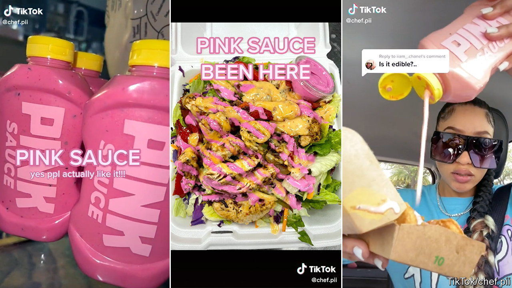

###### Secret sauce

# Pink Sauce and the fashion for homemade food in America 

##### It has become easier to sell food from home. But the rules can be confusing 

 

> Aug 25th 2022 

“Pink sauce” with that? A flamingo-coloured condiment has recently caused a stir on TikTok, a video-sharing app. The sauce’s creator, “Chef Pii”, as she is known on the platform, captured the attention of millions of viewers after she began uploading clips of herself eating the home-made sauce, which lists dragon fruit and chilli among its ingredients. “If you wanna taste it, buy it,” she said in one video. When she announced that she would be shipping orders from her home kitchen in Miami, her intrigued followers bought the lot. Your correspondent missed the chance to sample a $20 bottle. 

That was probably a good thing. To the alarm of her customers, the sauce’s signature shade altered with each batch. Concerns about safety were raised following allegations that the sauce, which contains dairy ingredients, lacked proper preservatives and was exploding in the post. Pictures of misprinted food labels on the bottles started going viral. What went wrong?

It was once forbidden to sell home-made food for profit in America. That has changed, with the gradual adoption of “cottage food” laws. Permitted products and delivery methods (whether food can be sold online, at farmer’s markets or shipped to other states) differ between states. Most producers are now allowed at least to sell “non-potentially hazardous” food products, such as baked goods and jams, within their state and without a permit, if they follow local regulations, though some states require inspections before the launch. Unfortunately for Pink Sauce, condiments are not permitted under Florida’s law. Chef Pii has paused sales and clarified that she will be complying with Food and Drug Administration guidelines to relaunch her business in partnership with Dave’s Gourmet, a commercial sauce producer. 

For those not in the business of selling luminous sauce, the rules have broadened since the pandemic. Last year a record 51 new bills were introduced to expand exemptions across America, according to Harvard Law School’s Food Law and Policy Clinic (flpc). In October New Jersey became the final state to introduce cottage-food laws, and Oklahoma is among those that have recently allowed interstate delivery in some circumstances. Looser rules have encouraged more people to start a cottage-food operation—particularly women, who the flpc reckon make up 83% of the industry. New York state reported that 1,538 new home-producers registered in 2020, up from 986 in 2019. 

Offshoot businesses are sprouting, too. “The Baking Notification Project”, a subscription service based in Tennessee, alerts customers by text to the surplus goods of home bakers in their neighbourhoods. If they want to take part, bakers must agree to follow their local cottage-food laws.

As the Pink Sauce saga shows, getting to grips with all of these rules can be confusing. And although going viral on social media can boost a startup’s sales, it also puts pressure on the seller to meet demand more rapidly than they may be prepared for, given their resources at home. Chloe Sexton says she had to learn how to scale up her cookie business, BluffCakes, to operate outside her state “extremely quickly” after her creations went viral on TikTok. 

Ms Sexton, who now has nearly 2m followers on the platform, believes states could be doing more to educate small-business owners, especially when it comes to food. But she also thinks that the transparency of social media can help small businesses, even when things go wrong: “What sells is the appeal of watching you succeed” and overcoming obstacles. Pink Sauce may not have revealed its true colours just yet.


