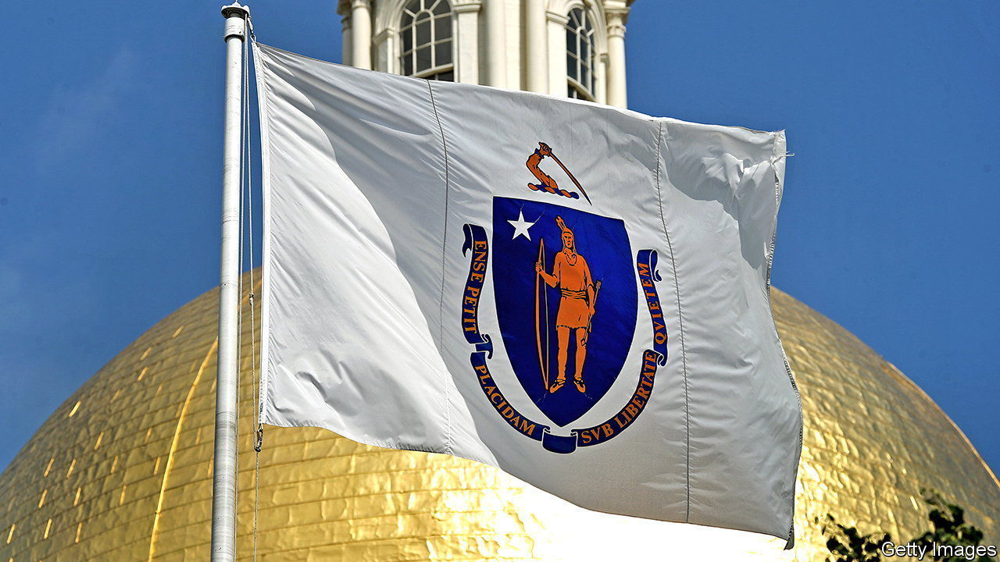
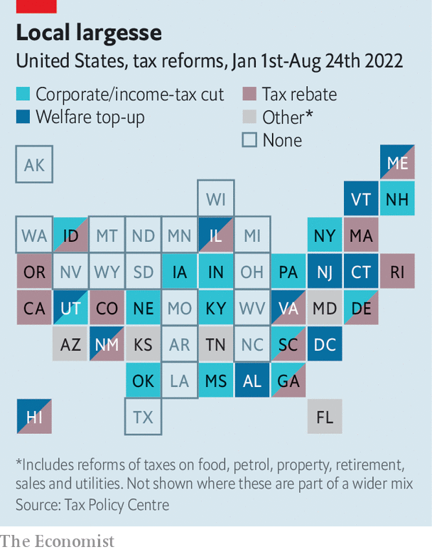

###### State taxes

# States have historic amounts of leftover cash 

##### Some are using it more carefully than others 

 

> Aug 25th 2022 

A quirky law calls on Massachusetts to send back billions of tax dollars this year. Passed in 1986, it orders the state to refund taxpayers when revenue growth outpaces wage growth. For the first time since 1987 it has been triggered. Massachusetts must return up to $3bn, 7% of tax revenue.

Massachusetts is not alone in raking in a surplus. States across the country have smashed revenue records in the past fiscal year. According to the Pew Charitable Trusts, a non-profit outfit, state governments saved $217.1bn in 2021, exceeding the 2019 record by nearly $100bn.

Why the bonanza? An influx of federal dollars during the pandemic spared states from spending savings. Sales-tax revenues soared as federal stimulus cheques, tax credits and unemployment benefits gave people money to spend. Inflation helped, too. Not only did it boost the price of goods, which increased sales-tax revenues; it also raised salaries, in nominal terms, moving people into higher tax brackets. 

 


Although the average state carries a debt of $3,641 per resident, none seems to be using its excess revenue to pay off what it owes. Instead, after replenishing rainy-day funds, states are playing with taxes (see map). Thirty-three states and Washington, dc, have passed some sort of tax relief. Many plan to send out rebates. A few have suspended taxes on food or petrol to counter rising prices. Others are seizing the moment to realise long-standing political goals. Democrat-run states are topping up tax credits for those on low incomes and families with young children. Republican ones are cutting taxes.

Ten states have slashed income-tax rates this year and six have cut taxes for firms. Proponents of these cuts argue that this will attract businesses. One-off rebates, argues Timothy Vermeer of the Tax Foundation, a think-tank, could spur inflation just as federal stimulus cheques did. 

But changes to tax codes are permanent and risky. The rewards are uncertain; the loss of revenue is immediate. “In theory there is a sweet spot of cutting taxes and increasing growth,” said Justin Theal of Pew, “but in practice the examples are few and far between.” In an election year politicians may be keener to please constituents than to make careful decisions. In South Carolina, where legislators collapsed six tax brackets into three and lowered rates, cutting taxes came after ensuring the state had adequate reserves. Gary Simrill, a champion of the policy, said the cuts were a “calculated risk”. 

Forecasters fear a recession, which will make savings more precious and spending more necessary. Early evidence from the first quarter of 2022 shows state-revenue growth declining as federal stimulus dried up. Summoning the will to raise tax rates if things go wrong could be hard. Some states, like Kentucky, plan gradual rate cuts only if revenues meet a certain threshold. But states that forged ahead with cuts might come to envy Massachusetts’s trigger law: bonuses given only in good times may prove to be more prudent. ■


