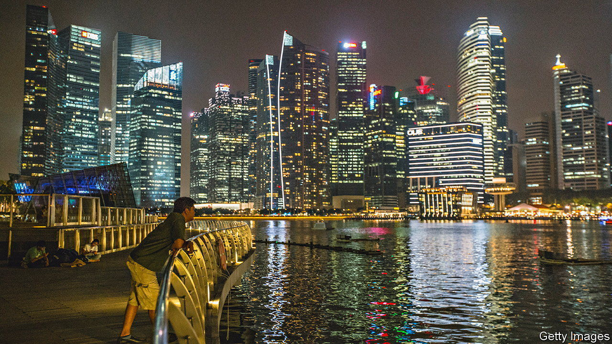
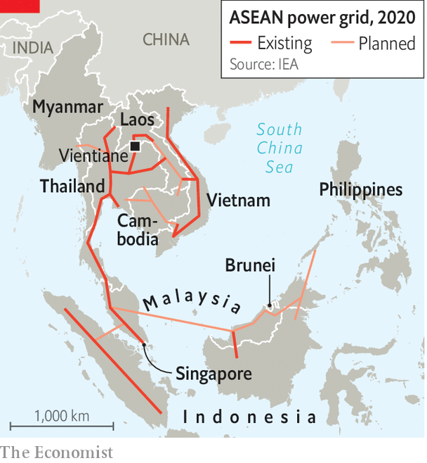

###### Grid locked

# Can South-East Asian countries learn to share power? 

##### Why a super-grid connecting the region remains a long way off 

 

> Sep 1st 2022 

It takes just three hours to fly to Singapore from Vientiane, the capital of Laos. To transmit electricity between them, however, has taken eight years. In June and July both countries undertook an experiment in energy exchange. Electricity from hydropower plants in Laos, which brands itself “the battery of Asia”, buzzed through wires in Thailand and Malaysia to arrive in Singapore. The amount of power made available, 100mw, is less than 1% of what Singapore produces itself. Yet this trial, which was mooted in 2014, has been hailed for its symbolism: it marks the first time electricity has travelled across four South-East Asian countries.

 


Singapore calls the project a “pathfinder”—proof of concept, in other words—towards an old vision: a regional super-grid that allows all ten members of the Association of South-East Asian Nations (asean), a regional group, to trade electricity. Envisioned by asean a quarter of a century ago, the ambition has remained mostly on paper. Connections between neighbours are few (see map). Cross-border power sales are piddling. The International Energy Agency (iea), an intergovernmental forecaster, estimates that 65% of the region’s roughly 5.5gw in interconnector capacity links just two countries, Thailand and Laos. Brunei and the Philippines have no external links at all.

In Europe and North America, trading with neighbours has been crucial to reducing costs and pollution while boosting capacity. It has also helped those regions handle the vagaries of solar and wind power. Pooling power over a large area means that deficits in one place can be quickly compensated for by surpluses elsewhere. California, for example, draws solar power from less-populated desert states such as Nevada when demand surges. 

Yet asean governments tend to hoard power, usually by . Most member states boast generation capacity of over 30% more than peak demand. “Although people want to be friends, you can never fully trust your neighbour,” says Matthew Heling of afry, a consultancy. “Will they give you power when you want it?” Suspicion keeps costs and pollution higher than necessary. 

What has changed is the push for clean power. Singapore produces 95% of its energy from natural gas. Solar and wind farms take up a lot of space, which is in short supply in the tiny island-state. Singapore’s government reckons it would find it hard to generate more than 3% of its own power from solar. The country aims to be importing 4gw, or roughly a third of its projected requirement, of low-carbon power from neighbours by 2035.

If power-trading offers Singapore a way to get greener, it is for Laos a lifeline. An extravagant decade of dam-building has helped bring the battery of Asia to the . Its currency has tumbled by a third against the dollar so far this year. Exporting power was supposed to earn foreign exchange that could be put to use for domestic development. Instead Électricité du Laos (edl), the state-owned power company, is saddled with debt. Some 95% of its exports go to Thailand on unfavourable terms. A more diverse customer base will help boost its finances. “Anything that’s going to get them dollars is manna from heaven right now,” says an analyst. 

Doing this through asean’s patchwork of grids, though, is no easy task. Each one speaks a different language. They exist under different regulatory and commercial regimes. Singapore’s power markets are governed by commercial forces; Vietnam’s are centrally controlled. Thailand has high-efficiency power lines; Laos has leaky ones. The accomplishment of the Laos-Singapore trade, says Jennifer Tay of pwc, another consultancy, was to establish a lingua franca that permitted power to cross four states. This required ironing out problems of differences in voltage and frequency, and matters such as transit fees. 

A pan-asean super-grid is still a long way off, not least because the region’s governments remain inward-looking. Politicians gain prestige from power surpluses, not from technocratic grid initiatives. Ministers in both Malaysia and Indonesia have bristled at the notion of exporting green energy that they could use towards their own climate targets. Connecting grids is technical, observes Shi Xunpeng of the University of Technology Sydney. Sharing power is political. ■


