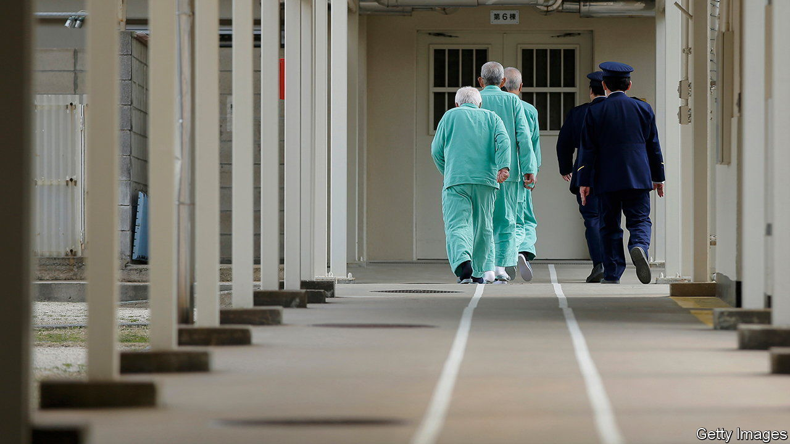

###### Decline and punishment

# Japan’s prisons are adapting to cope with ageing inmates 

##### The harsh traditional regimen is not good for dementia 

 

> Sep 1st 2022 

At fuchu prison, in western Tokyo, an octogenarian lobs coloured bean bags onto a table. Behind him, a silver-haired inmate sits hunched at a computer, doing arithmetic and responding to quiz questions like: “Is a dandelion a flower?” Others fold paper into pentagons. Repetition and practice help to “stimulate their minds”, says a watching officer.

Fuchu is one of a handful of prisons trying out rehabilitation programmes aimed at maintaining older inmates’ physical and mental health. The puzzles and games are designed to curb the development of dementia in their participants. Authorities are wary because Japan’s prisoners, like the rest of its population, are getting older. In June the government decided to amend the penal code, bringing programmes such as this to prisons across the country.

The ageing of Japan’s lawbreakers is reflected in the crime statistics. The number of offenders over the age of 65 has more than doubled over the past 20 years. Elderly criminals are now more likely than younger ones to reoffend and end up back in jail. The justice ministry reckons some 14% of inmates over the age of 60 have symptoms of dementia. 

Traditionally, Japan’s prisons have been highly punitive. Inmates atone for their crimes through forced labour. Talking is banned during much of the day; recreational activities such as reading are allowed only at allotted times. Inmates live “like robots”, says Hamai Koichi, a former justice-ministry official, now a criminologist at Ryukoku University in Kyoto.

That harsh monotony can accelerate cognitive decline. Some convicts see it looming in those around them. “Most of the inmates who are older than me keep saying the same thing over and over,” frets a 71-year-old at Tochigi prison, north of Tokyo. “I don’t want to become like them.”

Growing numbers of aged inmates had already pushed prisons to become a bit more considerate, informally at least. Older inmates struggle to keep up with tasks, so prisons reduced their workloads. Social workers and carers were brought in to supplement guards. Many prisons have put in handrails. Some serve puréed food for those with trouble chewing. “As prisons started to look more like nursing homes, government officials began questioning their approach,” says Mr Hamai.

The amendment to the penal code—the first since the law was passed in 1907—is meant to codify this shift to a more benevolent approach. Labour will no longer be mandatory. Prisons will offer educational programmes in an effort to help criminals rejoin society, thereby curbing recidivism. But the penal system lacks both the money and the manpower to implement more intensive rehabilitation programmes. Experts worry that inmates may not understand the purpose of activities, and that forcing them to participate against their will could be harmful. 

The government has avoided deeper reform. It has not considered relaxing sentencing guidelines in such a way as to limit elderly incarceration, or considered offering an amnesty to older inmates. Most crimes committed by older people in Japan are petty, such as theft and shoplifting. They are often driven by poverty and loneliness. But repeated misdemeanours can still land offenders behind bars for years. 

“It’s nice that they’re introducing rehabilitation programmes, but I can’t help thinking: why are these people even in prison?” says Yasuda Megumi of Kokugakuin University in Tokyo. She believes reinforcing the safety net would be more effective.

The tension is most acute when it comes to prisoners with dementia. Japanese law prohibits jailing people with psychological disorders, especially if they cannot understand why they are being punished. That rule is rarely followed. The numbers of prisoners with dementia is therefore likely to grow. Igarashi Hiroshi, the founder of Mother House, a non-profit organisation focused on rehabilitation of ex-convicts, puts it well: “There’s no use telling someone with dementia to regret their mistakes.” ■

