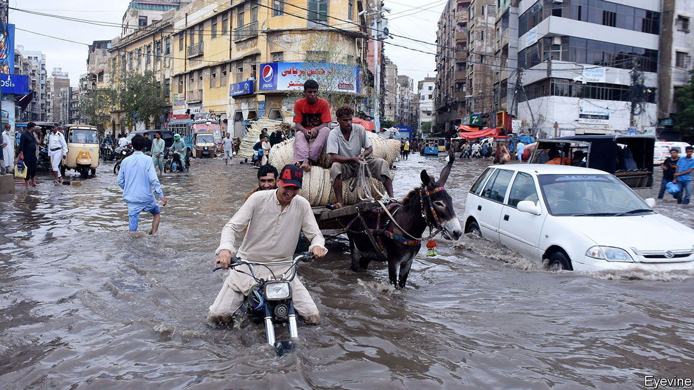
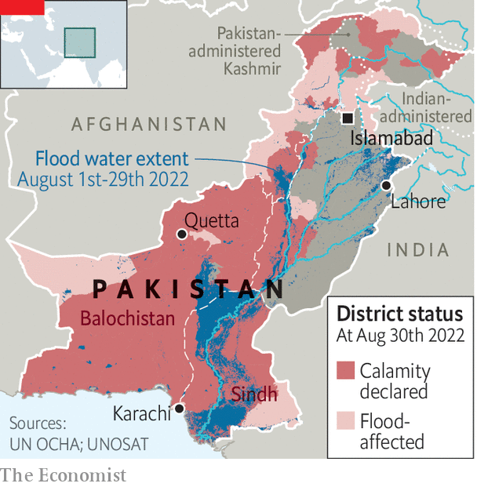

###### Under water

# Pakistan has been hit by its worst floods in recent memory 

##### It was already reeling from economic and political crises 

 

> Aug 30th 2022 

This year had already been cruel to Pakistan. The country has endured double-digit inflation for months, driven by soaring food and fuel prices. The value of its rupee  as foreign reserves have dwindled. The ousting of Imran Khan in April failed to restore longed-for political stability; followers of the former prime minister  to hound his successor. Now a terrible natural disaster has increased the pain.

For two months vast swathes of Pakistan have been inundated by its heaviest rainfall on record. Over 1,100 people have been killed, and early estimates put the costs at $10bn. On August 30th the climate minister said that one-third of the country was under water; the government declared 72 out of 160 districts to be disaster zones (see map). The past few days have brought more than 100 deaths and the destruction of thousands of houses, as flash floods in northern Pakistan washed buildings from the riverbanks. 

 


The volume of rainfall is staggering. Some 700mm (28 inches) was dumped onto the south-eastern province of Sindh, nearly six times the 30-year annual average. Balochistan, a vast, arid province which is normally left untouched by the monsoon, has received five times its annual average. The resultant flooding is the worst in decades. 

Massive floods in 2010 cost an estimated $10bn, mostly in rural areas. This time the cities were hit too. Transport links in and around Quetta, the capital of Balochistan, have been broken. The potholed roads of Karachi, a megacity in the south, have been all but washed away. Early estimates suggest 1m homes will have to be rebuilt.

City-dwellers tend to be less reluctant to leave their flooded homes than people living on the land. As a result, the death toll is currently lower than the 2,000 people who died in the floods in 2010. More rain is imminent, though. The economic fallout from the floods—which are estimated to have affected one in seven Pakistanis, or 33m people—will be immense. Inflation, which reached 25% in July, will rise further as food crops are wiped out. The hit to rural wealth and incomes will probably spread to the industrial sector. Carmakers have already predicted a collapse in sales. Waterlogged ground could ruin the next wheat season. The cotton crop, which is used to make many of Pakistan’s most valuable exports, has been devastated.

As biblical as this seems, there is probably worse to come. Projections for South Asia made by the un’s Intergovernmental Panel on Climate Change suggest that the frequency and intensity of precipitation will increase across the region as temperatures rise. The total amount of rain is set to increase too. This is happening alongside an ever-rising rate of drought. When rain falls on parched land the water tends to move over the hard ground rather than soaking into it. This leads to larger volumes of fast-moving flood water which cause more damage and kill more people. 

On August 29th the imf approved the release of $1.1bn to Pakistan, signalling the resumption of an existing bail-out programme and access to further lines of credit. Mr Khan blew up the imf programme while still in office in February, when he imposed fuel subsidies. The cash is needed urgently. Earlier in August Pakistan’s foreign-exchange reserves fell to $8bn, enough for just one month of imports. Yet abiding by the imf’s conditions while providing an effective flood response and negotiating the country’s fractious politics will be a fiendish task for the prime minister, .

The imf deal is predicated on “steadfast implementation” of a federal budget that prioritises cutting spending and borrowing. The fund has acknowledged that the flooding will mean some fiscal slippage. Yet it may not prove sufficiently flexible for Mr Sharif. His government has already made itself unpopular by raising electricity and fuel prices at the imf’s behest. Last week—speaking via video link from Qatar—Mr Sharif was forced to rescind a further increase in electricity prices after people took to the streets. 

With an election due by October 2023, the prime minister will be under pressure to loosen the purse strings in order to provide flood relief. Members of his own party have already denounced the imf deal; its leader (and Mr Sharif’s elder brother), Nawaz Sharif, is reportedly unhappy with it. Mr Khan will also no doubt pile in.

International donors have sprung into action. The un has appealed for $160m-worth of emergency aid. America has pledged $30m. And there are hints of help from unexpected quarters. Pakistan has banned trade with India since 2019 when Narendra Modi, India’s prime minister, scrapped the autonomous status of the Indian-administered portion of Kashmir. On August 29th Mr Sharif’s government suggested that it might relax the ban to bring in vegetables from India to help stabilise prices. Mr Modi’s subsequent public statement was conciliatory. That is good. Pakistanis need all the help they can get. ■


