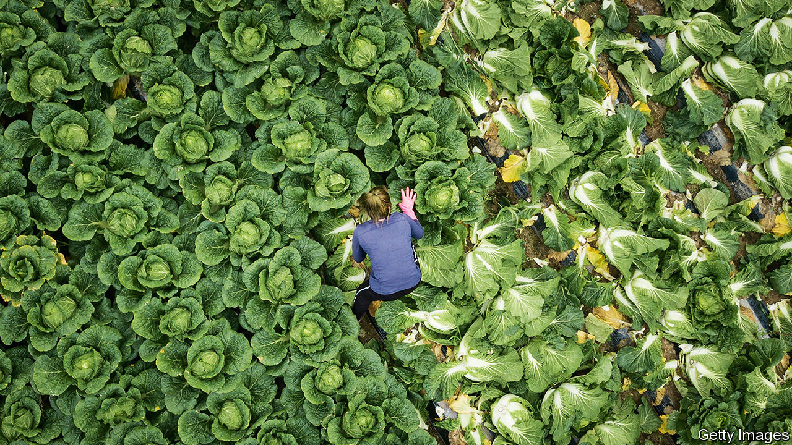

###### Daughters of the soil

# Young Koreans are moving to the countryside to farm 

##### The government is encouraging them, hoping for rural rejuvenation 

 

> Sep 1st 2022 

When kim ji-un lived in Seoul, she worried about finding a good job and a decent place to live. Now, she frets that drought may botch her crop of potatoes and corn. The 23-year-old and her sister started a farm last year in Nonsan, a city in South Chungcheong province. Her first harvest was a success; she was surprised that her black soyabeans did better than her strawberries.

Ms Kim is part of a phenomenon called , or returning to rural life. Coined a millennium ago, the term crops up during periods of economic hardship, when city-dwellers are forced to move back to their hometowns, often to farm. This time, in the wake of the pandemic, many new farmers such as Ms Kim have never lived in the countryside before. The government encourages them. It agitates over South Koreans’ tendency to flock to Seoul, the capital, and sees  as a way to revive dwindling rural areas. By planting young farmers in rural areas now, the government hopes to reap big rewards in future.

The plan is working. In 2021 nearly 380,000 people moved to the countryside, up 15% from 2015. Almost half of them (a record high) were younger than 40. The new generation cares less than earlier ones did about getting a job at one of South Korea’s prestigious , such as Hyundai or Samsung. Some do not want to become like their fathers “who do nothing but work”, says Chae Sang-heon, a professor at Yonam University in South Chuncheong province. Others take a dim view of their prospects, and say they “know they will never be a success like their father”.

Comfort with digital technology gives young farmers a leg up, says Cho Kyung-ik, the director of the Beginning Farmer’s Centre, the government-affiliated institution which educates those who wish to at its offices near Gangnam, a posh area of Seoul. They sell fresh produce on Instagram and Naver, South Korea’s largest search engine.

The centre also teaches techniques with which young Koreans tend to be less familiar—how to use a tractor or select the best crops. It arranges a trial period in the countryside during which aspiring farmers live and work under the tutelage of an old hand, learning what it means to do back-breaking labour from dawn to dusk. Mr Cho says the trial periods boost the chances of a successful transition.

The most important lesson on the syllabus is how to get on with the locals. Life is more communal in the countryside, and newcomers are expected to abandon their atomised urban ways; the neighbours’ doorways, not just your own, should be swept when you get the broom out. The villagers are also offered tips on how to act towards the newcomers, especially the young ones, through role-playing sessions. 

That part is not yet a total success. Ms Kim says her neighbours have a gruff streak. “The old people come in here and give me unwanted advice, or say that I will never be able to grow anything,” she says. Her black soyabeans beg to differ. She and the South Korean government will be hoping that her corn and potatoes put the argument to rest for good.

