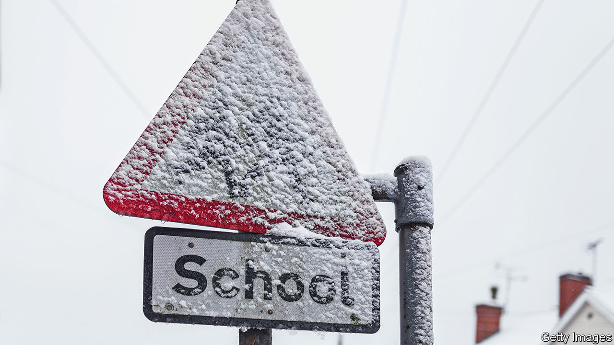

###### Inflation

# Britain’s school budgets are being squeezed by rising energy and wage bills 

##### Higher costs are all coming at once 

 

> Sep 1st 2022 

Vic goddard, the headmaster of Passmores Academy, opened his school to a television crew in 2011 for the documentary series “Educating Essex”. The first episode showed teenagers protesting that they felt cold as their uniform-violating hoodies were confiscated—a ploy that teachers easily saw through. Now rising costs mean that Mr Goddard is on the lookout for savings. When term starts this month, he will ask parents to make sure their child has a (uniform-compliant) jumper, to stave off any morning chills.

The government had intended schools to be fairly flush this year. Funding per-pupil in mainstream schools in the current financial year, starting in April, is 6.8% higher than in the previous year. Mr Goddard’s school is part of an academy trust, a group of state schools financially independent of local government, where budgets follow the academic year starting in September. (In 2020-21, Passmores Academy accounted for 62% of the trust’s spending.) In early spring, a budget for his trust that was £575,000 ($670,000) bigger than the previous year seemed manageable.

Then costs mounted. Early indications from the government were that teachers’ pay might rise by just 3%. But rising inflation and wages elsewhere pushed it to become more generous. On July 19th the government confirmed that experienced teachers would see a pay rise of 5%, and less experienced ones increases of up to 9%. Mr Goddard says that higher teachers’ wage increases have eaten up £414,000, on top of £196,000 for non-teaching staff.

Wages are the biggest drain on schools’ budgets. In the year before the pandemic energy bills represented just 1.4% of costs. But that share is rising quickly along with gas prices. Schools are in wildly different positions, depending on whether they managed to lock in their energy contracts earlier in the year. Micon Meltcafe, who runs a group of academies, reports unit prices doubling from October 1st. When trying to secure new supplies, she has been told that recent renewals have been priced at double even that. Although Passmores Academy secured its energy price in July, it expects bills to be £122,000 higher.

Add in other pressures, including from surging food prices (annual inflation was 12.8% in July) and higher pension contributions, and the bigger budget of £575,000 compares with £1.06m of extra costs. A recent report from the Institute for Fiscal Studies, a think-tank, found that although for the financial year starting in April 2022 schools should still see real-terms budget increases, during the one starting a year later they will suffer cuts.

Figures from the Department for Education suggest that by September 2021, 97% of academy trusts boasted balanced budgets or surpluses. Among schools maintained by local authorities in the financial year ending in April 2021, 92% were in surplus or balance, up from 88% the year before. (The improvement was partly because of the pandemic.) But a survey from August of head teachers from Teacher Tapp, a polling company, found that 59% said that their budget would not cover next year’s costs. A further 29% weren’t sure.

Notice periods mean that it is too late for redundancies this term. Mr Goddard will cut back on new staff appointments (other than ones that compromise pupil safety), new textbooks and school trips, and dip into financial reserves. And “next year we’ll be screwed.” ■

