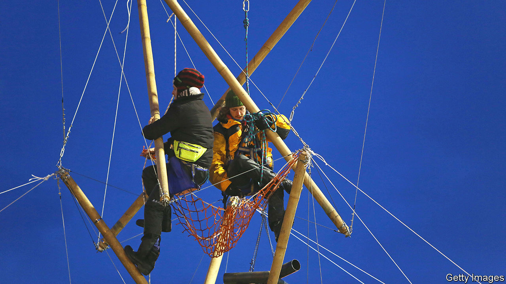

###### Environmental protests

# Britons are extremely good at paralysing infrastructure projects 

##### If only they applied such creativity to building them 

 

> Sep 1st 2022 

Glueing yourself to a motorway is a good way to protest, explains a facilitator for Extinction Rebellion, an environmental group, during an online training session. So is locking onto a building or climbing a structure of bamboo poles. All are time-consuming to deal with safely. “It keeps us there, longer, in the public eye,” the facilitator says.

Extinction Rebellion became well-known in April 2019, when thousands of demonstrators blocked bridges and roads. The group hopes to repeat that performance with a three-day demonstration in central London starting on September 10th. But its techniques, and those of other environmental activists, are changing. 

Using lots of bodies to block roads has become more difficult. The covid-19 pandemic curtailed large protests, and Extinction Rebellion’s following may have diminished, says Graeme Hayes of Aston University—though he adds that the upcoming demonstration could reverse that. Smaller groups, such as Insulate Britain, have shown the disruptive potential of “glueing-on” and tunnelling under construction projects. 

The goal of all such tactics is to agitate the public, which will then (in theory) nudge politicians to pursue ambitious policies. Extinction Rebellion’s initial protests may have drawn people’s attention to climate change. But more drastic actions might be too irritating. More than a third of Britons say policing of public demonstrations is not strict enough. A new bill would criminalise locking on or obstructing major transport works, or even carrying equipment to do such things.

Environmental protests certainly make building and running infrastructure harder. In July authorities closed part of the m25 motorway for six hours to remove protesters from the gantries. John Groves, the chief security and resilience officer for the hs2 railway, told lawmakers in June that protesters had cost the project £126m ($147m) in delays, mostly by tunnelling under the route. Extinction Rebellion promises showy tactics to cap off the London protest. New joiners should leave promptly, the group says, unless they fancy being arrested.


