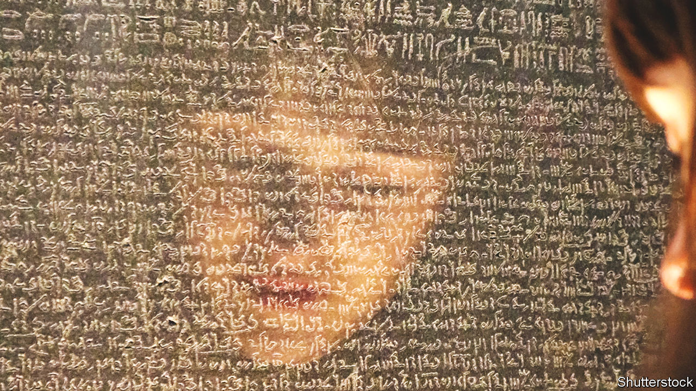

###### Hard as stone

# Egyptians want Britain to return the Rosetta Stone 

##### The debate shows how complicated restitution can be 

 

> Sep 1st 2022 

The text is tedious to the point of being unreadable. Few pulses will quicken to its news that, in 196 bc, the king had “remitted two-thirds of the tax on byssus cloth”, or that wine taxes would be lower. But then rock stars have rarely needed perfect prose to win popularity, and the Rosetta Stone—arguably the oldest and most famous rock star in the world—is no different. The British Museum’s most visited object stands, spotlit, behind thick glass, crowds four-deep and thickets of upheld smartphones.

Now Egypt wants it back. Next month Zahi Hawass, an archaeologist and former Egyptian minister of antiquities, who has called for the stone to be returned before, will send a petition to the British Museum (bm). The stone, whose inscriptions of the same decree in three scripts made possible the deciphering of hieroglyphics, is “the icon of Egyptian identity” he says. “And its home should be Egypt, not England.” 

Restitution is in the air. In 2017 President Emmanuel Macron called for the “temporary or permanent returns of African heritage to Africa”. On August 7th the Horniman Museum in London said it would return 12 looted Benin bronzes to Nigeria. Such debates feel particularly inevitable in the bm. Turn your back on the Rosetta Stone, stride forward 50 paces and back 250 years, and you find yourself in Room 18, in front of the Parthenon Marbles. Those statues were chiselled from the building in Athens by Lord Elgin in 1801. As if to remind the world that ancient Greece perfected combative oratory as well as dazzling statuary, they instantly became the subject of bitter debate.

“Dull is the eye”, wrote Lord Byron, “that will not weep” at what Elgin had done. By contrast, the poet John Keats saw the marbles in London and felt “Like a sick eagle looking at the sky”, which appears to have been a compliment. But Byron’s sentiments appear to have caught on. A poll last November found that most Britons thought the sculptures belonged in Greece. Even the bm seems to be bending: George Osborne, head of the bm trustees, has said there is “a deal to be done”. 

The problem does not lie wholly with foot-dragging museums. It is also that history is complicated. In the sixth century Gregory of Tours opened his history with the unarguable observation that: “Many things keep happening, some of them good, some of them bad.” Things, good and bad, have kept happening. As a result, the threads of time become tangled into knots of Gordian intractability.

Modern restitutions can be performed fairly easily, thanks to the 1970 unesco convention on cultural property (and with a dash of irony, given that unesco’s temple logo is modelled on the Parthenon). For anything taken before it came into force, things can get tricky. When the Horniman agreed to return looted Benin bronzes to Nigeria, one American civil-rights group objected. Since some people in what is now Nigeria had benefited from slavery, the group reasoned, the country would “be unjustly enriched” by getting them back. 

Few objects show the complexity of the past better than the Rosetta Stone. Those who argue that it is an Egyptian object oversimplify. The stone was made to mark the coronation of a Greek-Macedonian king, Ptolemy V, whose ancestor was a Macedonian Greek who conquered Egypt with Alexander the Great.

There is “no way of mapping the Ptolemies onto modern Egyptian identity unproblematically”, says Tim Whitmarsh, professor of Greek culture at Cambridge University. Not quite Greek, not quite Egyptian, the Ptolemies ruled Egypt for centuries. They adopted some Egyptian customs (such as sibling marriage) and kept many Greek ones (such as issuing tedious edicts about tax on stones). They may have intermarried with locals, but until Cleopatra VII, none learnt Egyptian. 

For Mr Hawass, this is unimportant. “They ruled Egypt for 300 years,” he says. “Anything they…made became Egyptian.” But a similar argument is used to justify the opposite conclusion in the Elgin debate. The Ottomans who (according to the bm) permitted Elgin to remove the marbles had only been in Athens for three centuries, argue campaigners. They were not Greek, and therefore had no right to give them away. 

The Rosetta Stone is even more complicated than that. As Neil MacGregor, the former director of the bm, has pointed out, it contains not three scripts but four. Printed on one side of the stone is the unedifying phrase: “captured in egypt by the british army.” When the British defeated Napoleon, the Rosetta Stone was awarded in a treaty as spoils.

In London, the stone became a sensation and the subject of scholarly attention. Its deciphering was begun by the English scholar Thomas Young and achieved by the French Jean-François Champollion. Egyptian hieroglyphic history could now be read. The Rosetta Stone was not brought to the museum because it was so important: it is so important because it was brought to the museum. The temples made many such stones; three exact copies of the Rosetta Stone still exist. 

To Mr Hawass, this is irrelevant: the object is Egyptian and must go back. Others demur: it is international, and must stay. It is a mark of how complicated such debates are that a third case could, just about, be made: that the stone is Greek, and should go back there. Perhaps the bm could throw it in as a job lot with the Elgin Marbles. ■

