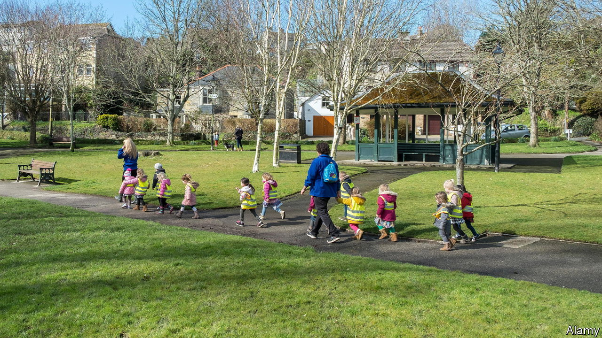

###### Odd man out

# One of Britain’s most important professions lacks men 

##### Nudging more into child care might blunt sharp staff shortages 

 

> Sep 1st 2022 

Hasan ostad-saffari has a way with children. After leaving school, he drifted unthinkingly into a job at his mother’s nursery. Colleagues began calling him the “Pied Piper” because of the giggling swarms that followed him around. In the two decades since then he has done every kind of nursery job, and now manages one in east London. He has grown used to being the only man in his workplace, and to surprised looks from parents. He says people assume he is “either gay or strange”.

Men make up only about 3% of the staff in England’s pre-schools, nurseries and playgroups. Few professions are so drastically skewed. The proportion has not budged for decades, even as gender balances in most other jobs have shifted. The share of female firefighters has inched up from 1.7% in 2002 to 7.5%; female police officers now make up one-third of the ranks. That leaves England lagging well behind European countries such as France, the Netherlands and Norway, where the share of nursery workers who are male is twice to four times as high.

The absence of male workers in nurseries could be retarding social progress, if it helps to reinforce the view that child care should fall overwhelmingly to women. More practically, driving up applications from men would soften a sharp crisis in recruitment. Some 80% of nurseries surveyed last year by the Early Years Alliance, an industry group, said they were struggling to hire staff of either sex. About half reported they had limited the number of places they offer as a result. In July the government proposed loosening rules that limit how many children a nursery worker can look after at one time.

Nursery leaders are complacent, reckons Jeremy Davies of the Fatherhood Institute, a think-tank. Most say they would like more male workers. But he says few make use even of basic devices permitted under equalities law, such as noting on job adverts that applications from men would be “particularly welcome”. Many managers have grown convinced that salaries are too low to attract them. But plenty of men do jobs that pay little and are boring and low-status to boot, such as stacking shelves.

Research published in 2020 by Mr Davies’s institute and Lancaster University found that men who work in nurseries tend to leave the industry sooner than women. Responsibilities are sometimes still doled out on the basis that “men are a bit rubbish at this stuff”, he says. Bosses do not always do a good job of reassuring nervous parents, who worry that stiff vetting procedures are not enough to keep out monsters. Even keen staff sometimes try to leave jobs “that the whole world is telling them they shouldn’t be in”.

In 2017 the government said that having more male staff would create “positive role models for boys”. That was the first time in a decade it had shown any interest in the issue, says Jo Warin at Lancaster University. But in the end it found only about £30,000 (now $35,000) for efforts to recruit more guys. All this reflects how little the sector is valued, says David Wright, a former nursery owner who once advised the government. Stacks of evidence show that good support in the early years helps children succeed later on. But he says politicians still view pre-school not as “proper teaching”, but as “care”.

Men and boys might respond well to recruitment campaigns, if efforts were made to mount them. A growing fad for outdoorsy nurseries based on Nordic models is creating workplaces that men seem to feel less embarrassed to join. During the pandemic many men spent more time playing with their own children; changes wrought by the crisis are prompting lots of people to consider new careers. Mr Ostad-Saffari says his job is a blessing. His charges keep him cheerful, he explains, “whatever is going on in the world”. ■

