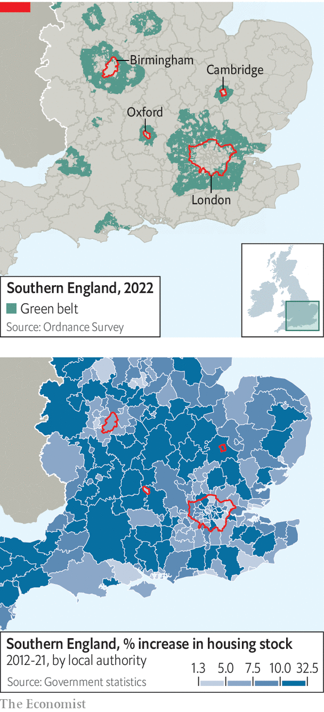

###### Construction and red tape

# Why Britain cannot build enough of anything 

##### The problem is bad rules, not bad people 

 

> Sep 1st 2022 

Duncan sandys, a Conservative minister in the 1950s and 1960s, has two reasons to be remembered. The first is that he was the “headless man” being fellated by the Duchess of Argyll in a Polaroid photo, which emerged in divorce proceedings so vicious that they were turned into a bbc One drama earlier this year. 

The second reason is less salacious. In 1955 Sandys issued a circular that fundamentally changed Britain. It implored local councils to forbid building on the edge of cities in order “a) to check the further growth of a large built-up area; b) to prevent neighbouring towns from merging into one another; or c) to preserve the special character of a town”. The authorities had tried to restrict urban growth since the reign of Elizabeth I. Now they could. 

Today all four nations of the United Kingdom have green belts. About 13% of England is so designated, including the surroundings of every major city. The girdle that encloses London is three times the size of the capital. A stroll through it takes in scrubland, pony paddocks and petrol stations. In “The Blunders of our Governments”, a book by Anthony King and Ivor Crewe, the policy is held up as a rare example of legislation achieving exactly what was intended. 

The green belts do their jobs well, pushing development into the rural areas between them (see maps). Indeed, most parts of the planning system work as intended. Councillors retain democratic control over the planning system. Environmental watchdogs enforce their mandates fiercely. Stringent rules protect bats, squirrels and rare fungi. Courts ensure that procedures are followed to the letter. But the system as a whole is a failure. Britain cannot build. 

 


In total, about 10% of gdp is spent on building, compared with a g7 average of 12%. England has 434 dwellings per 1,000 people, whereas France has 590, according to the oecd, a club of mostly rich countries. There is little slack in the market. In France, about 8% of dwellings are vacant at any one time. In England, the rate is barely 1%. Britain also struggles to build reservoirs and (despite boasts from successive prime ministers) nuclear power stations. With almost 500,000 people, Leeds is the largest city in Europe without a mass transit system. What has gone wrong? 

The problem starts with the Town and Country Planning Act, which nationalised the right to build on land. Where once owners could do almost as they pleased, after its passage in 1947, local councils controlled what was built where. They have never relinquished that power. The planning system has more in common with an old eastern European command economy than a functioning market, argues Anthony Breach of Centre for Cities, a think-tank. “We do not have a planning system, we have a rationing system,” he says. 

Even when councils approve development, other outfits can stop it. Natural England was created in 2006 with the aim of protecting flora and fauna. After a European Court of Justice ruling in 2018, it was tasked with ensuring “nutrient neutrality”, meaning any development could not increase phosphate or nitrate pollution in rivers. Natural England came up with a blunt solution: building could not go ahead unless developers could prove it would not lead to an increase in nutrient levels, a stipulation that few could provide. 

The result was a near total freeze on house-building. Local politicians and developers, who had spent years in painful negotiations, were caught out. In total, about 14% of England’s land faced extra restrictions. One industry group argues that 120,000 houses were affected, or 40% of Britain’s annual housing target. Liz Truss, the likely next prime minister, has promised to scrap the requirement, but details are scant. 

Newts present as many problems as nutrients. Anyone who harms a great crested newt while building can be jailed for up to six months. Bats are a nightmare for anyone renovating or developing (enterprising nimbys sometimes install bat boxes in order to attract them to a potential site). Protected under law, it is a crime to harm a bat or destroy its roost. A full report, which involves ecologists scouring a property with bat-hunting microphones plugged into iPhones, can cost £5,000 ($5,800). 

If a roost must be destroyed, a like-for-like replacement must be installed. hs2, a railway line, was forced to build a £40m bat tunnel to stop the creatures being squished; its route is lined with bat-houses, which are large enough for humans. For developers, the rules are an expensive annoyance. For bats, however, the legislation has been a success. Numbers of the common pipistrelle have almost doubled since records began in 1999.

Some schemes do not survive contact with environmental objections. A planned nuclear power station in north Wales was rejected by the planning inspectorate in 2019 partly on the ground that it might affect a local population of terns. Inspectors ruled that “it cannot be demonstrated beyond reasonable scientific doubt that the tern colony would not abandon Cemlyn Bay”. That the terns had existed next to a previous nuclear power station was little defence. Inspectors also worried about the effect construction would have on the dominance of the Welsh language. 

Even small housing estates now require reams of impact assessments and consultations. A planning application used to involve a single thick folder, says Paul Smith, the managing director of Strategic Land Group, which helps customers win planning permission. Now it is a thicket of pdfs, often running to thousands of pages. 

For a development of 350 houses in Staffordshire, a developer had to provide a statement of community involvement, a topographical survey, an archaeological report, an ecology appraisal, a newt survey, a bat survey, a barn owl survey, a geotechnical investigation to determine if the ground was contaminated, a landscape and visual impact assessment, a tree survey, a development framework plan, a transport statement, a design and access statement, a noise assessment, an air quality assessment, a flood risk assessment, a health impact assessment and an education impacts report. These are individually justifiable, yet collectively intolerable. 

See you in court

Make an error, however, and a legal challenge will follow. Anyone affected by a decision and able to afford a judicial review can challenge a planning decision. For a group of motivated, well-off nimbys, whipping together £20,000 for a review is easy enough. In Bethnal Green, in east London, a mulberry tree blocked the conversion of a Victorian hospital into 291 flats. Dame Judi Dench, an actor, was roped in to support the tree, which was so frail it required support from a post haphazardly nailed onto one of its branches. 

After a campaign, the mulberry was in 2018 designated a veteran tree, which gives it special legal rights. (The number of signatories to save the tree matched the then population of Bethnal Green.) Although the developer had proposed moving the plant, a judge ruled that the council had not properly considered the danger that it might not survive: “A policy was misinterpreted; a material consideration was ignored.” The site sits derelict today. 

Councils behave rationally when it comes to development. They levy no income tax or sales tax, and cannot even fund all their operations from property taxes, known as council tax. In all, local government imposes taxes worth less than 2% of gdp, according to the oecd. So more development does not equal much more money for better services. But it does equal more complaints. Councillors often enjoy majorities of just a few dozen votes. A well-organised campaign can replace an entire council, as happened in Uttlesford, in Essex. The result is that local councils are “a bottleneck on national economic growth”, argues a joint paper by the Centre for Cities and the Resolution Foundation. 

The government in Westminster can usually override local objections. “When the state decides to act, it has unlimited power,” says Andrew Adonis, a Labour peer, who oversaw the introduction of hs2. Projects such as hybrid bills allow the government to bypass the planning system, turning Parliament into a kind of planning committee. The process is so arduous that sitting on the committee is often a form of punishment from the whips who enforce party discipline. But the benefit is that courts do not challenge primary legislation. Judicial review claims bounced off hs2 like stones off a tank. 

Even when the government acts, it is often cautious. A plan to turn a quarry in Kent into a settlement of 15,000 homes was one of the most ambitious schemes, when announced by George Osborne, the then-chancellor, in 2014. Yet it is around a seventh of the size of Milton Keynes, a maligned but highly successful new town begun in the 1960s. 

Larger schemes, such as a push for a million homes stretching between Oxford and Cambridge, with a new railway and motorway linking them, have been ditched due to local opposition. “We were a bit out of puff,” admits a cabinet minister. Greg Smith, a Tory mp, had already put up with hs2 slicing through his constituency, and it seemed unfair to subject him to more building. In Britain, pork barrel politics works in reverse, with mps keen to keep things out of their constituencies. 

As a result, Britain’s most productive region is shackled. Burgeoning life-sciences firms fight for scarce lab and office space while world-class researchers live in cramped, expensive homes. The average house price in Oxford, £474,000, is about 12 times average incomes. Given the opposition of local councils and local mps to housebuilding, though, it can hardly be said to be against voters’ will. 

Britain is rare in that the Treasury functions as both a finance ministry, keeping a close eye on spending, and an economic ministry, investing for the future. Thriftiness tends to trump investment. “[The Treasury] can add up but they can’t multiply” as Diane Coyle, an economist, puts it. It shackles big infrastructure projects, balking at upfront costs even if there are large returns later on. 

The result is false economies. hs2, a £100bn project to connect London to Birmingham and then Manchester, Sheffield and Leeds, was intended mostly to add capacity to Britain’s crowded railways, not (despite the name) to speed journeys up. The government recently cut the eastern leg of the scheme to save money. That it was the most beneficial part of the scheme—the eastern leg to Leeds and Sheffield had a benefit-to-cost ratio of nearly 5.6:1, compared with 2.6:1 on the western leg between London, Birmingham and Manchester—was overlooked. Joseph Bazalgette, the Victorian responsible for London’s sewer system, is said to have argued that: “We’re only going to do this once and there’s always the unforeseen”. Now, the opposite principle applies. 

Political capital is less fungible than the financial kind. When it comes to building things in Britain, there is usually no alternative scheme ready to go. If a big project is scrapped, the political capital spent on forcing through its approval cannot be instantly reallocated. The slow process of winning support at a local and national level must start anew. In the meantime, nothing is built. 

And Westminster can be capricious. In 2022, after years of argument, Transport for London won permission to build 351 flats on land it owned at Cockfosters Underground station. Grant Shapps, the transport secretary, blocked the development because it removed too many car parking spaces. The Leeds Supertram Act was passed in 1993. Three decades later, Leeds possesses no tram, super or not, as a series of governments refused to fund the project. In 2016 the government rejected a proposal for a trolleybus, in part because it did not think the route would reduce inequality within the city. 

Scepticism among nimbys is often justified. Post-war town planners botched city centres, bulldozing through objections. Birmingham’s Victorian centre was carved up to make way for ring roads that still throttle the city. London narrowly avoided a similar fate. New developments, such as Nine Elms, manage to be expensive while looking cheap. Outside big cities, development is often limited to boxy housing estates, which are notorious for poor building quality. A Welsh property surveyor has amassed 560,000 followers on TikTok by angrily taking viewers through snags in newbuilds. (“Check out what this absolute melt has done with this hinge,” he almost screams in one video. “That is absolutely ridiculous.”)

In Oxfordshire a group of residents have spent almost a quarter of a century fighting attempts to build a reservoir. The Environment Agency and a public inquiry sided with the residents over Thames Water. The objectors are shrewd, motivated and well-versed in water regulation. The chairman of the Group Against Reservoir Development (gard) is a retired nuclear scientist; his predecessor was a brigadier. But after a summer of drought, in which Thames Water had to implement a hosepipe ban, the victory rings a little hollow. 

Efforts are being made to convert the unbelievers. New planning legislation offers residents the chance to propose their own development and, in effect, approve it themselves via street votes. The government is trying to improve design standards, hoping that beautiful buildings will attract less opposition. Those who put up with infrastructure, whether wind turbines or a reservoir, may benefit from free energy or water bills under one scheme floated by ministers. 

Officials are also toying with a net-zero trump card. Projects deemed crucial to making Britain emissions neutral by 2050 would be able to ride roughshod over many obstacles. At the moment policy aimed at protecting the environment hinders projects that should help the climate. The government protects flora and fauna because voters want it; circumventing such rules can only be done in the name of the environment, runs the logic. 

Building is binary, however. If something is built, those who oppose it will be unhappy; if it is scrapped they will be delighted. There is little incentive to meet halfway, or to accept a payoff. “This is not some sort of poker game where we demand huge compensation,” said Derek Stork, who chairs the reservoir-killing gard. Britain cannot build. But that is just the way voters want it. ■

