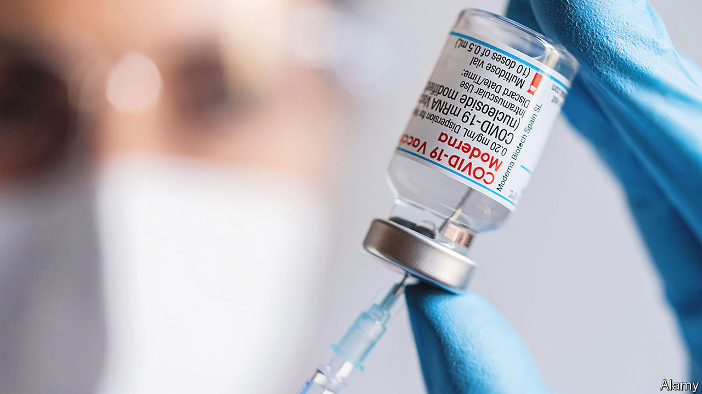

###### Throwing a jab

# A dispute over covid-vaccine technology ends up in court 

##### Moderna takes on Pfizer and BioNTech 

 

> Sep 1st 2022 

The companies behind two of America’s most widely used covid-19 vaccines are at loggerheads. Despite promising publicly not to enforce covid-19-related patents until the pandemic was over, Moderna, an American drugmaker, filed claims on August 26th against Pfizer, another American firm, and BioNTech, its German partner, in American and German courts. The dispute is over elements of the messenger rna (mrna) technology used by the firms to make their jabs. CureVac, another German pharmaceutical firm, also began legal action against BioNTech in July. The floodgates have opened for intellectual-property squabbles between vaccine-makers.

Covid-19 jabs will soon be commercialised in America when the government ceases to be the main buyer and sales switch to the private sector, making claims about ownership of patents more pressing. Despite whispers about patent infringement circulating since the pandemic began, jab-makers had held off litigating, concerned about their public image during a health crisis. The potential losses now outweigh reputational risks. Last year Moderna’s revenues from its vaccine hit $18bn, while Pfizer raked in more than double that. 

Moderna claims that Pfizer and BioNTech copied a patented chemical modification that prevents disruptive immune reactions, as well as the lipid shells used to get the mrna to cells, in their jab. BioNTech says its work is original, and it will vigorously defend against all allegations of patent infringement. The case is likely to be long, and complex. mrna has been decades in the making and covid vaccines based on the technology could only be developed so rapidly because of the fundamental work of many scientists. This collaborative approach makes it impossible to pinpoint a single inventor. 

Adding further complication, other scientists lay claim to the modification at issue. Moderna is being sued by Arbutus, a Canadian drug firm, over its lipid shells. Along with CureVac, small biotechnology companies including Allele and Alnylam, both from America, are suing Moderna and Pfizer over other parts of its vaccine technology. There are bound to be more lawsuits forthcoming.

Moderna has gone to court because it has the most to lose. The company’s future hinges on medicines based on mrna technology which could one day be used to treat diseases like cancers and hiv. But it is treading carefully. It has not sought an injunction, so regardless of the outcome, the Pfizer-BioNTech vaccine will stay on sale. The case could, however, set a precedent for how much of this sort of collaboratively developed technology is patentable.

Investors seem unperturbed. Shares of Moderna, Pfizer and BioNTech have barely moved since the lawsuit was announced. Demand for the vaccines is slowing and investors recognise that lengthy patent disputes are commonplace in the pharmaceutical industry. Around the world people are starting to tramp back to the office in numbers. For a notoriously litigious industry, it is also back to business-as-usual.■


