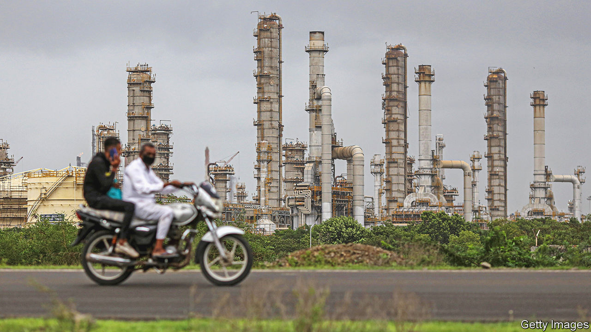
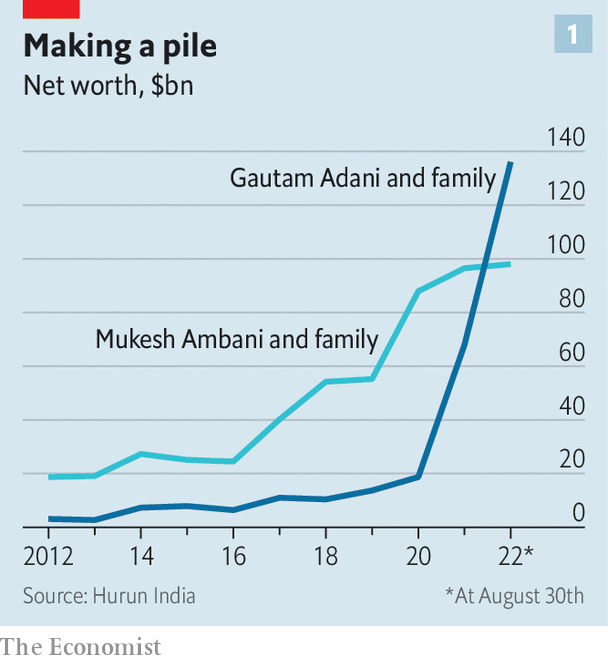
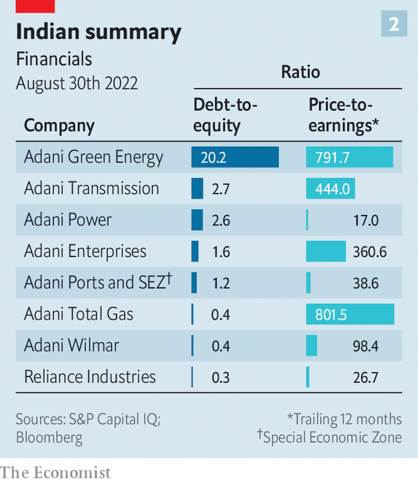

###### The AA economy

# Adani v Ambani: the battle of the tycoons 

##### The commanding heights of India’s economy are up for grabs 

 

> Sep 1st 2022 

From the pier at Mundra, the biggest private port in India, it is possible, on a clear day, to spot the world’s largest oil refinery, 50km south across the Gulf of Kutch. In the early 1990s both sites in the state of Gujarat were malarial swamps and farmland. Today they are monuments to India’s economic promise—and to the tycoons who built them.  and , both billionaires, have in recent years become the best-known faces of Indian business. To supporters, they are patriotic nation-builders, using their sway and resources to further India’s economic progress. To critics they are only in it for themselves. Their motivation seems to lie somewhere in between.

The duo’s rising influence over  is undisputed. Many observers now talk of the “aa economy”. That is an exaggeration, but the combined revenues of the companies controlled by Messrs Adani and Ambani are equivalent to 4% of India’s gdp. They are also responsible for 25% of the capital spending of listed non-financial firms at a time when overall investment has been subdued. “Never have we walked away from investing in India, never have we slowed our investments,” asserted Mr Adani at the annual meeting of his group on July 26th. Not to be outdone, Mr Ambani, at his own annual meeting on August 29th, pledged to double the size of Reliance, the conglomerate that he runs, adding “patriotism inspires and energises everything we do.”

They play such an important part in India’s economic development because they have succeeded where others in the country have all too often failed, by creating businesses that are both large and fast-growing. Under Mr Ambani’s stewardship Reliance, founded by his father, Dhirubhai, has gone from dealing in petrochemicals and refining to encompass retail, telecoms and renewable energy.

Mr Adani’s operation is more speculative and generates modest cashflows but he has progressed in a decade from a small office in Mumbai to an empire of ports, airports and energy utilities spread across seven public companies and various private ventures. The two men’s publicly listed companies are worth a combined $452bn, up from a collective valuation of $112bn four years ago. 

 


Both have amassed considerable wealth along the way. Over the past four years their personal fortunes have swelled four-fold, according to Hurun India, a research firm, from $65bn to $237bn combined (see chart 1). Mr Adani is now reckoned to be the world’s third-richest man behind Elon Musk and Jeff Bezos. 

Much can be attributed to the fact that their vast ambitions fit with those of India’s prime minister, Narendra Modi, for the country’s economic development. The government still oversees hundreds of state-controlled companies but confidence has long since disappeared in their ability to spur growth. Instead, for the economy’s commanding heights, heavy industry and infrastructure, the government’s hopes increasingly rest on a handful of private firms which appear able to handle India’s debilitating red tape and erratic allocation of projects. Both men have so far been able to navigate the country’s treacherous judicial and political currents. 

Yet there are strong arguments that they are not merely favoured industrialists collecting rents. Their desire to invest appears to have little regard for profits. Reliance hasn’t generated a return on capital in excess of 10% in a decade. Only two of Mr Adani’s listed companies do better and both are ventures with foreign firms: Adani Wilmar, a food processor co-owned with a Singaporean firm (which returns 15%), and a natural-gas distribution business held jointly with Total, a French energy giant (which returns 19%).

That urge to invest is bringing the firms into closer competition. Perhaps that is unsurprising. Reliance and the Adani Group share many characteristics. The founders of each were born in the north-western state of Gujarat, as was Mr Modi, whose own ascent was tied to the state’s impressive record of economic growth during his time as chief minister. Both firms have grown largely by building dominant positions in existing industries then moving into related areas. Thus they have become interwoven with, and vital to, India’s economy—and Mr Modi’s vision.

In Reliance’s case, trading of textiles was followed by the production of textiles, then the manufacture of the polymers used in textiles and finally the production of the petrochemicals used to make those polymers. Refining, energy and petrochemical businesses accounted for 91% of revenues and 99% of profits as recently 2017. Since then Reliance has undergone a transformation. Jio, the firm’s telecoms arm, signed up its first customer in 2016 and now has 421m subscribers using its mobile network. That in turn is being used to create other new businesses such as providing access to computing at central hubs through the network.

A retail division includes 2,500 grocers and 8,700 electronics stores. Its 4,000 fashion outlets, in combination with an online operation, sold 430m garments in the past year. Dozens of big international retail companies in clothing, food and toys, hamstrung by India’s crippling regulations, have entered the country through joint ventures with Reliance. Those that have chosen to compete independently, notably Amazon and Walmart, are perpetually hamstrung by murky policies. A large media organisation includes three news networks, film production and a sizeable online financial portal. 

Mr Adani began trading in diamonds in the 1980s. Metals and grains followed until he won the government concession to develop Mundra port. Begun in 1998, it now has a rail link and freight airport, as well as facilities allowing for shipments of petroleum, natural gas, aviation fuel, dry cargo and containers. In terms of traffic, the port ranks 26th globally. Mr Adani’s intention is for it to be the world’s largest by 2030. He has also acquired a dozen other smaller ports, and now controls 24% of the country’s capacity as well as 43% of container traffic and 50% of port revenues. Such expansion fits neatly with the government’s objectives for India to become an exporting powerhouse.

Other businesses often dovetail with existing operations. Adani-controlled entities import over a third of the country’s coal and transmit 22% of its electricity, much of it generated using coal but a growing amount from a network of solar farms. Its expanding warehouse operations hold 30% of the country’s grain. Seven airports, acquired in 2019, handle a quarter of India’s passenger traffic and a third of air freight. A vast empty field in an area known as Navi Mumbai is intended, within two years, to be the location of the city’s second airport. The other was one of those bought by the Adani group. Among other Adani ventures are 13 large road-construction projects in nine states and the acquisition of a controlling interest in Israel’s Haifa port, a potential stepping stone to trade across the Mediterranean. Last year, after a decade-long struggle, a combined mine, railway and port was completed in Australia, and coal is slowly starting to be exported to India.

Inevitably, the frenetic activities of these two business groups had to collide. In August , a broadcaster, a move that follows the purchase of a 49% stake in Quintillion Business Media, another firm. Each of these entities . Both Mr Adani and Mr Ambani have announced plans to spend upwards of $70bn on energy projects encompassing batteries, hydrogen and solar power. To knit his expanding empire together, Mr Adani in August became a surprise bidder at the government’s auction of 5g bandwidth, a possible prelude to competing with Reliance in telecoms. Among Mr Adani’s industrial projects at Mundra is a refinery which will give Mr Ambani’s operations close by some competition.

 


That sort of competition “could lead to some imprudent financial decisions from both sides”, warned CreditSights, a research firm, hoping one of the men might listen. As is often the case with Indian industrial giants, there is already cause for concern. A consequence of Mr Adani’s frenetic expansion is that his operations are “deeply overleveraged” says CreditSights (see chart 2). Yet the rivalry between the two may turn out to be transitory. Mr Adani, a 60-year-old, has become an elevated presence in India’s business firmament; Mr Ambani has withdrawn.

Many suspect Mr Ambani, five years older than Mr Adani, is unwell (a rumour the company has denied). Reliance’s annual meeting was held online, despite many such meetings now taking place in person as pandemic precautions have relaxed. Perhaps sensing the questions this raised, Mr Ambani noted that he had attended all 45 of Reliance’s annual meetings, the first held when the firm occupied one room with two tables and a shared phone. But the role played by Mr Ambani’s three children at the occasion has been widely interpreted as a succession plan unfolding.

That leaves the possibility that even as the prominence of the aa economy grows, its days under the current leadership could be numbered. Given India’s needs, there would seem to be abundant space in the country for the efforts of both men. Finding two new bosses more suited to this environment might be impossible.■


