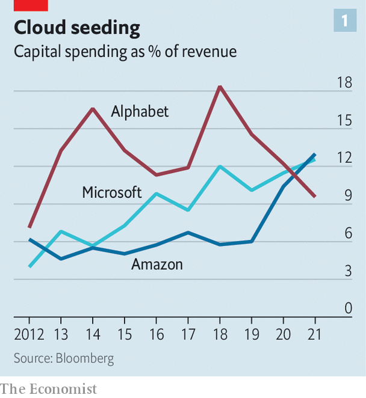
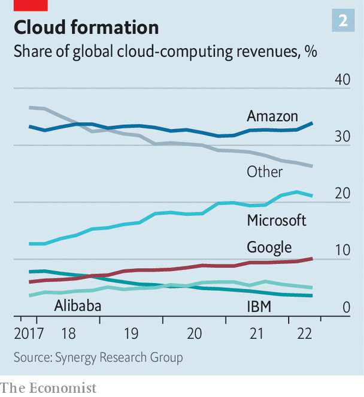

###### Margin brawl

# The cloud computing giants are vying to protect fat profits 

##### Amazon, Google and Microsoft are offering higher-end, stickier services 

 

> Aug 29th 2022 

When chief executives ring the closing bell at the Nasdaq stock exchange in New York, it is usually because their firm has just gone public. When Adam Selipsky did so on June 27th, he was celebrating a tie-up with the bourse. He is the boss of  (aws)the tech giant’s  arm, and the deal is part of the exchange’s shift of its stockmarkets to aws’s cloud. Tailored features include data transfer with minimal delay, which should please high-frequency traders. Nasdaq’s customers will be able to use aws’s advanced analytics tools, such as machine learning (ml), through the stock exchange’s platform.

The deal, first announced last November, came weeks after Alphabet, Google’s parent company, unveiled a similar tie-up between gcp, its cloud offering, and cme, one of the world’s biggest derivatives exchanges. A day before that deal was struck Microsoft Azure announced the rollout of its financial-services cloud. Clients include Morgan Stanley and hsbc, two banks. Not-so-big tech is wading in, too: ibm and Oracle also offer financial clouds.

 


. Alphabet, Amazon and Microsoft have together invested almost $120bn in the past 12 months, most of it in data centres and the servers that power them. Amazon and Microsoft have seen their capital expenditure as a share of revenue rise by almost five percentage points in the past five years to 13% (see chart 1). Customers, increasingly irked by sky-high bills, are opting for more than one cloud service for fear of lock-in. “It’s not a winner-take-all market,” says an executive at a big cloud provider. Tech giants are battling to gain the upper hand. 

All this should be putting pressure on stratospheric profits. aws accounts for three-quarters of Amazon’s operating income. Before this year’s tech-stock slump some analysts reckoned it could become a $1trn firm if spun out. Microsoft’s Azure is thought to be just as profitable. Google, by contrast, is taking a hit as it tries to gain market share. It racked up $3.3bn in cloud-related operating losses over the past 12 months, around 1% of Alphabet’s revenue. 

For now there is little sign of a margin squeeze. On July 28th aws reported an operating margin of 29%, four times that of Amazon’s retail business. Azure’s margins, which Microsoft does not reveal, are believed to be steady, too. Google’s cloud segment cut its operating losses from 16% of revenue in the previous quarter to 14%.

A combination of a fast-growing industry, hardware improvements and barriers to switching providers explains why margins have been elevated. But some of these factors are transient. The cloud giants are therefore preparing for a squeeze by trying to sell higher-margin software and by making their services even stickier. The result could be a vast cloud market offering a range of new capabilities to customers.

 


Cloud computing, still in its early days, is growing rapidly. aws created the industry in 2006 as a way to make money from its excess storage capacity by offering to host other companies’ data. gcp joined the fray two years later, followed by Azure in 2010. Partly because it moved first, aws has 34% of the cloud-infrastructure market, still the largest share (see chart 2), according to data from Synergy Research Group. But Azure and gcp have made gains.

This year global sales from the entire industry are forecast to surpass $495bn, according to Gartner, a research firm. That includes an ecosystem of firms selling services on top of or related to the cloud, such as Okta, a maker of authentication software, and Mongodb, a database firm. It could grow to more than $1trn by 2030. Today only 30% of enterprise workloads—applications, software programs or work that would have been run on a local server—have been shifted to the cloud.

Revenues of the big three “hyperscalers” are still growing at a decent clip. Last quarter aws’s sales grew by 33% compared with the same quarter a year ago. Azure and gcp managed 40% and 36% respectively. Amazon and Google both have a backlog of multi-year contracts that are yet to be reported as sales of $100bn and $50bn respectively. (Microsoft does not publish this number.) Such growth has meant less pressure on margins. 

The firms have also managed to cut the costs of hardware by making better use of old machines. Servers need to be upgraded less frequently than first thought, making clouds cheaper to run. The three tech giants have announced extensions to their average server lifetime from three to four years. On July 28th Microsoft went one better and said that it was extending it to six years, saving the firm about $4bn in 2023. aws is still running some of the servers it bought in 2006.

Taking chip design in-house has cut the costs of hardware by winning back margin from chip suppliers. aws’s Graviton chips, designed by a team it acquired in 2015, lead the market. Google offers Tensor Processing Units, designed to boost ml capabilities, among other silicon. Microsoft is said to be trying to develop custom chips, too. In January it poached one of Apple’s top chip designers. Even as costs have fallen, prices have not followed suit, keeping margins high.

Margins are also protected by the fact that few companies have moved workloads from cloud to cloud. David Linthicum of Deloitte, a consultancy, says firms like to have the ability to switch but have rarely done so. One reason is that the benefit may be small, while costs can be prohibitive. Hyperscalers charge “egress” fees for moving data out of their cloud.

Another barrier to switching has been that cloud providers tend to cater to different markets. aws started as a service for developers and many of its clients are tech startups. Microsoft, by contrast, is more focused on large organisations. It uses its long-established enterprise-software business to cross-sell Azure. Like aws, gcp’s customers are more often tech startups, partly because of its reputation for use of advanced technologies, though it also bundles cloud services with its advertising and productivity offerings for big customers.

The worry now for cloud providers, however, is that the factors that supported margins are starting to give way. The hyperscalers are increasingly hunting on each others’ turf. aws and gcp are hiring ever bigger sales teams to help target large businesses. Microsoft is trying to increase its appeal to techies. It offers free Azure services to startups, including some provided by Github, a system for tracking changes in software code, which Microsoft acquired in 2018.

Egress fees may be falling, too. aws cut some in December. Big customers are said to be able to negotiate discounts, sometimes forcing the tech giants to waive them completely. Costs may start to climb as the limits on extending server life are reached. And, crucially, growth will slow as the industry matures. One executive says that he expects competition to push margins down in the medium term. He also thinks that there is room for more competitors further up the “tech stack”. 

Faced with the prospect of dwindling margins, the hyperscalers are trying to move up the tech stack themselves. One promising area is building software that runs on top of their servers for specific industries. Selling software is more profitable than selling hardware, because costs are lower and scaling easier. And software can be stickier too: it is easier for a hospital to change its data-storage providers than the providers of its health-records database. The trend is showing up in hiring, say executive recruiters. Amazon, Microsoft and Google have been busy hiring bosses from various industries with the aim of selling cloud services back to the sorts of business they came from.

The cloud providers offer software for a range of organisations, from gaming firms and government to finance, as the aws-Nasdaq deal demonstrates. They are buying their way into a health-care cloud, too. In 2021 Microsoft announced the acquisition of Nuance, a health-care cloud provider, for $20bn. In June aws invested in Oben Health and PeerCapsule, two health startups. The same month Oracle closed a $28bn deal to buy Cerner, which develops electronic health-record software.

Another draw is high-end analytics, using techniques such as artificial intelligence (ai) and ml. Microsoft offers 26 such services, Amazon 25 and Google 12. Customers can analyse video images, convert speech to text and receive recommendations for improving their code. Google and Microsoft have invested heavily in quantum computing. The idea is to sell something that is difficult to replace, making switching harder. “The ai and ml offerings are all unique. They are done in radically different ways,” notes Mark Moerdler of Bernstein, a broker.

The shift towards software may not necessarily prove a huge success for cloud providers. Regulators are unlikely to look kindly at big tech’s attempts to dominate cloud-based it services. And plenty of firms, such as Databricks and Snowflake, already sell cloud-based software. Customers will probably balk at being locked into a tech giant’s software services, much as they do with storage services.

Even so, the push shows where the cloud industry could go. Firms first adopted cloud computing to gain flexibility and to cut spending on data centres. Now advanced analytics that sit on top of the cloud could offer customers new capabilities. Grocery stores use ai and video cameras to know when to restock shelves; Cirque du Soleil uses similar technology to analyse the emotional reactions of its audience when performers undertake death-defying stunts. Such new ml capabilities, delivered by the cloud at lower prices and combined with more data, greatly expand the upper bound of the cloud-computing market, notes Keith Weiss of Morgan Stanley. 

These are the types of things that Satya Nadella, the boss of Microsoft, is referring to when he says that it’s share of gdp could double in a decade. If true, then dominance of the cloud market is worth fighting for. And the war is only just getting started.■


