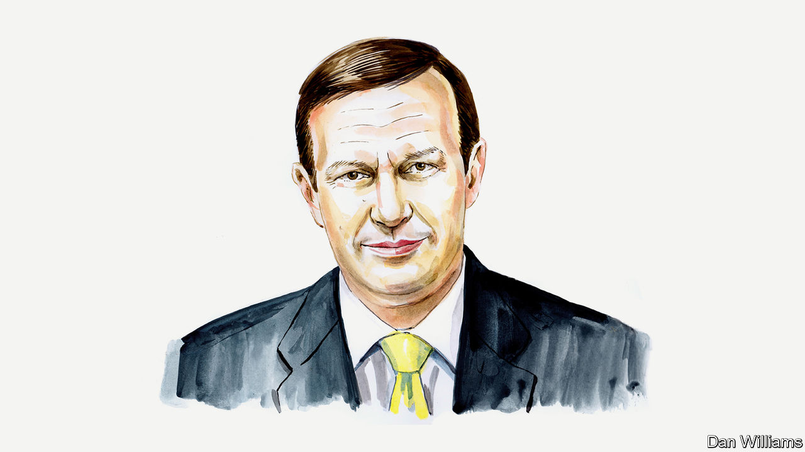

###### Taiwan

# Now China has changed its policy towards Taiwan, America should too: Senator Chris Murphy 

##### America’s priorities should be securing Taiwan and decreasing the likelihood of armed conflict 

 

> Sep 1st 2022 

“THOSE WHO play with fire will perish by it.” Xi Jinping’s threat to Joe Biden in July was a warning against Nancy Pelosi’s visit to Taiwan. And after her departure from the island, China fired ballistic missiles and took other dangerous actions in the waters surrounding the island. Twenty-two Chinese aircraft crossed the median line dividing the Taiwan Strait. Ships from the Chinese navy ran drills that mimicked a blockade of Taiwan—no small threat for an island which imports over 60% of its food and 98% of its energy. 

For the past four decades, Republican and Democratic American presidents have maintained the policy of “strategic ambiguity” toward the defence of Taiwan, maintaining the capacity and military capabilities to defend the island against attack by China without explicitly committing America to doing so. And the policy has been a success, preserving peace for those four decades. Strategic ambiguity forces China to consider that invading its island neighbour could set off a war with America, while simultaneously communicating support to the democratic people of Taiwan that without an explicit guarantee of American military assistance, Taipei should be careful about taking its own provocative steps to revise a stable status quo. Our policy has also kept our most important security allies across the world, especially in Europe, together on Taiwan strategy.

Today this delicate peace is under greater threat than ever before as sabre-rattling from China grows louder and the reality of an invasion creeps closer. In 1995 China’s defence budget was about twice the size of Taiwan’s. Today it is 20 times larger. Over the past two decades, China has implemented the largest military buildup of any country in the world. This buildup is not just to strengthen President Xi’s nationalist  at home, but to enable China to exercise influence as a rising global power—and China is now eagerly and regularly flexing its military muscles on Taiwan’s doorstep.

But perhaps more salient in the short term than these exercises are the non-military ways in which China is seeking to undermine Taiwan. Every single day, Taiwan’s governing institutions and financial bodies are barraged with cyber-attacks. For example, a hacking group affiliated with the Chinese government recently carried out a months-long attack against 80% of Taiwan’s financial sector. These attacks are designed to test and demonstrate China’s capacity to crash Taiwan’s economy, gather intelligence and take down telecommunications so as to critically weaken Taiwan’s ability to defend itself. And China’s propaganda campaign in Taiwan is relentless, constantly seeking to alter the political balance of power in favour of China’s interests.

China also wants to isolate Taiwan diplomatically, economically and culturally. Since the election of President Tsai Ing-wen in 2016 China has severed communication with Taiwan and restricted tourism to the island. Unsatisfied by restricting bilateral ties with Taiwan, China cut off bilateral trade with Lithuania after a Taiwanese representative office opened in the Baltic country. China also intimidated global airlines and hotels to list Taiwan as a Chinese province. And it even pressured Hollywood to edit out images of Taiwanese military patches from scenes in “Top Gun: Maverick”. For nearly a decade from 2008 until 2016, China and Taiwan had tacitly agreed not to compete for official diplomatic recognition by other countries. Now Beijing has abandoned this conciliatory policy, and regularly pressures Taipei’s diplomatic allies to instead embrace the “One China” framework and withdraw their recognition of Taiwan. It now seems clear that China wants to strong-arm the rest of the world into isolating Taiwan by pretending that it does not exist.

Given the calculated change in China’s policy toward Taiwan, this cannot be a moment for America’s policy to become sclerotic. It’s clear that our policy needs to evolve in response to an increasingly aggressive adversary. The question is how our policy should change. Some in Congress and on the Washington think-tank circuit have taken this moment to argue that American policy should abandon strategic ambiguity in favour of “strategic clarity” by functionally recognising Taiwan and extending an explicit security guarantee to the island, declaring that America will defend it with American troops. But of course, it is not necessary to do a complete reversal of decades of Taiwan policy to still make a serious pivot that appropriately responds to China’s aggression.

The question we should be asking is a simple one: what policy changes will make Taiwan more secure, and decrease the likelihood of armed conflict with China? Some of the proposals floated by the “strategic clarity” proponents— diplomatic recognition of Taiwan’s independence, officially declaring Taiwan a Major Non-NATO Ally, telegraphing the expected American military response to hostile acts by Chinese forces, or formally announcing the potential diplomatic, economic and military consequences we would impose on China in advance of an invasion—fail to clear that bar. They do little practically to aid Taiwan’s defence, and instead mostly just fan the flames of Chinese nationalism. It’s important to remember that today, Taiwan is not ready to defend itself adequately against invasion. The Taiwanese need time, and it does not make sense to take steps that might expedite an invasion.

So what changes in our policy would accrue to the benefit of Taiwan’s security? First, we certainly should mobilise and expedite more arms deliveries to Taiwan. Congress can authorise Taiwan, long a buyer of American weapons, to receive military assistance grants to increase its purchasing power. Specifically, we should authorise the large sale of weapons such as Javelins, Stingers, sea mines and portable Harpoon missiles that are difficult for the People’s Liberation Army to target.

Second, Congress can grant the president new authority to mete out crushing sanctions against Chinese decision-makers should they move against Taiwan. I would argue that in granting these authorities, it is critical to give the president flexibility in how and when to impose sanctions. Obviously our China policy is complicated, and a president needs discretion to know when and how sanctions will benefit our overall policy towards the country.

Third, through assistance programs, we should double down on our investments overseas to counter Chinese influence campaigns designed to undermine Taiwan’s democracy or coerce allies like Lithuania from working with Taiwan. We should deepen our trade ties with Taiwan to help lessen its dependence on China and more fully integrate its supply chains with ours. Educational and military exchanges should be ramped up to increase people-to-people ties and to continue building capacity and professionalism in Taiwan’s armed forces—while further reinforcing our shared values of civilian control of these forces and respect for human rights. 

Fourth, we should push for Taiwan’s representation in international bodies and multilateral institutions, countering China’s attempts to isolate the island diplomatically.

China has changed its approach to Taiwan and American policy must evolve as a result. But in an environment where the stakes are high and risks of miscalculation even higher, we have to make changes carefully and thoughtfully—serving both American values and American security interests, making democratic Taiwan safer and avoiding a catastrophic war with China.■

_______________


