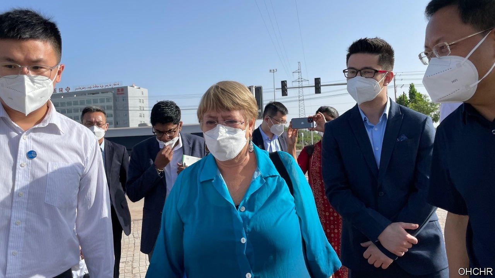

###### Took you long enough

# A long-awaited UN report condemns China’s actions in Xinjiang 

##### But the delay raises questions about China’s influence on the body 

 

> Sep 1st 2022 

One of china’s favourite propaganda tools is the group tour. In the region of Xinjiang, for example, foreign dignitaries are often guided around by officials, as handpicked locals praise the Communist Party for improving their lives. When the un’s human-rights chief, Michelle Bachelet, was  in May, Chinese state media crowed that she had seen the “real Xinjiang”. Never mind the overwhelming evidence that more than a million Uyghurs and other ethnic minorities in the region have suffered a  and forced indoctrination in recent years. 

The saving grace of Ms Bachelet’s trip, thought activists, was that it would precipitate the release of a report from her office detailing China’s abuses in Xinjiang. The assessment, three years in the making, was ready in December. But her office held it back, reportedly under pressure from China, which wanted it delayed at least until after the Winter Olympics in Beijing in February. It was then announced that the report would be released after Ms Bachelet’s visit to Xinjiang—and after China had a chance to review it and comment (as is normal). Months passed. 

At last, on August 31st, in the final hours of Ms Bachelet’s term, the report was published. It is refreshingly straightforward. Relying on China’s own documents, as well as dozens of interviews with victims, the report concludes that China’s actions “may constitute international crimes, in particular crimes against humanity”. It criticises China’s nebulous “anti-terrorism law system”, under which Uyghurs and other minorities were detained for such innocuous acts as downloading WhatsApp or contacting family abroad. Appalling accounts of abuse, including rape and torture, at the detention centres in Xinjiang were affirmed. Forced sterilisation, coerced labour, unreasonable surveillance and the destruction of religious and cultural heritage are just some of China’s other offences, according to the report. 

In a 131-page response, China justified some of its actions on security grounds and said the report was “based on disinformation and lies”. Last year China’s foreign minister, Wang Yi, called Xinjiang a “shining example” of human-rights progress.

Activists are mostly pleased with the report. They had worried that Ms Bachelet, under Chinese pressure, would withhold it or water it down. Her actions over the past several months were hardly reassuring. At the end of her visit to Xinjiang she spoke in Chinese-government euphemisms, framing re-education camps in the region as a response to terrorism and calling them “vocational educational training centres”. (Later she said she was citing, not endorsing, that term.) When answering questions from Chinese state media, she criticised racism and rights violations in America. That, too, is a favourite tactic of China’s government: pointing out America’s flaws in order to distract attention from its own.

China has long tried to redefine human rights as being about security and development, not individual freedoms. It also paints them as subjective. Mr Wang has said that “countries must promote and protect human rights in light of their national realities and the needs of their people.” China wants to make the un’s human-rights system “all about governments having dialogues with each other rather than the actual pursuit of investigations and accountability,” says Sophie Richardson of Human Rights Watch, a pressure group.

A coalition of Uyghur groups has recommended ways to build on the report. It says the un Human Rights Council, in session this month, should establish a commission of inquiry and that businesses should disengage from companies that support China’s actions in Xinjiang. Governments, it says, should stop deporting Uyghurs and other minorities back to China. Ms Bachelet’s office waited “far too long” to deliver its report, says Rushan Abbas, a Uyghur activist. Efforts to hold China accountable must catch up. ■

