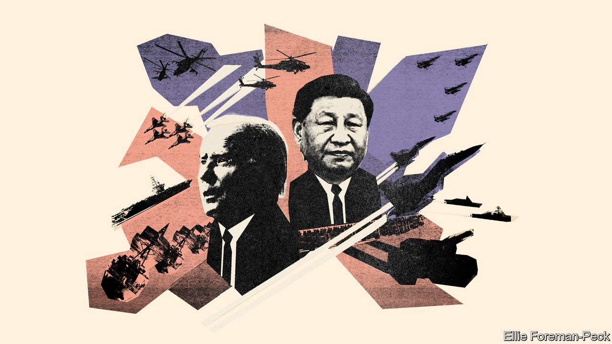

###### War jitters

# A weak China may be more warlike than a strong one 

##### A new book warns America of the peril of “peak China” and conflict over Taiwan 

 

> Sep 1st 2022 

When will America and China face the greatest danger of war? Around 2049, when Communist leaders promise a “great rejuvenation of the Chinese nation” and a “world-class military”; or 2035, when they aim to “basically complete the modernisation of national defence and the armed forces”; or 2027, when, according to American military chiefs, China seeks to have the wherewithal to invade Taiwan? 

A new book by two American geostrategists argues that the acute peril is now. In “Danger Zone: the Coming Conflict with China”, Hal Brands of Johns Hopkins University and Michael Beckley of Tufts University argue that the world’s giants are engaged in a decade-long sprint, not a “hundred-year marathon”, as the title of another book puts it. China is about to have “a hard fall” or may already be in decline, they argue. This makes it more dangerous, not less. It could soon try to seize Taiwan, while it is still able to do so.

The authors thus flip the “Thucydides trap” popularised by another professor, Graham Allison, who argued that China and America were destined for war in the same way as a rising Athens and a fearful Sparta came to blows in antiquity. Messrs Brands and Beckley argue instead that the Athens of Thucydides was not an upstart, but a risen power fighting to avert decline. Imperial Japan’s fear of economic strangulation, leading to its surprise attack on Pearl Harbour in 1941, is an example of such a “peaking power trap”.

Both elements of the thesis—that China is peaking and that war is imminent—are contested by other analysts. Yet it captures something of the zeitgeist in Washington. Experts debate whether China’s slowdown means it has hit the “middle-income trap” (in which poor countries struggle to grow more than moderately rich). They also fret about growing hostility between America and China, and  around Taiwan. 

The analysis of China’s intentions matters because it affects American policy. “Is China just a drunk in a bar, or is it Tony Soprano giving you the evil eye while he sips his whiskey?” asks Jude Blanchette of the Centre for Strategic and International Studies, a think-tank. “If we think China is a near-term threat, then we throw everything at deterring it militarily and we forget about competing over the global order.” 

Many experts have come a cropper predicting China’s collapse. Still, Messrs Brands and Beckley argue that its stellar growth resulted from several factors that are now reversing. A demographic boom is turning to bust. Market reforms are yielding to a re-centralisation of the economy, the cowing of innovative tech firms and a struggle to control debt. A “smarter autocracy” with slightly looser political controls has reverted to the more oppressive form, creating a techno-surveillance state. And instead of embracing China’s rise, rich countries have started to constrain trade. Some economists, such as Thomas Orlik, argue that China’s rulers have enough resources, regulatory levers and experience to avert a systemic crisis. A new edition of his book on China’s economy, “The Bubble That Never Pops”, is about to be published. 

In a commentary for , a journal, Oriana Skylar Mastro of Stanford University and Derek Scissors of the American Enterprise Institute, a think-tank, argue that the hard fall is unlikely. China’s relative decline, if it happens, is likely to be gradual. Its military power will keep growing. It will want to seize Taiwan, but need not lash out. Rising or peaking, China is liable to be more aggressive, they think. But America should avoid “short-term solutions that undermine its ability to compete in the long term”.

President Joe Biden regards China as the greatest threat to America’s primacy, but for now seems to treat it principally as an economic and political challenge. His defence-budget request for the coming fiscal year implies the military threat will be most acute only in the 2030s. It seeks a below-inflation increase, and invests heavily in research and development for future weapons. The size of America’s fleet, already smaller than China’s, is set to shrink before it expands again in the next decade. Meanwhile, the aukus agreement to provide Australia with nuclear-powered submarines will probably not deliver the first boat before 2040.

Prominent military figures, though, are alarmed. Admiral Philip Davidson, the former head of America’s Indo-Pacific Command, argues: “The threat is manifest in this decade, and certainly in the next four or five years. From the bottom of the sea to space, we’re seeing the Chinese becoming better.” His successor, Admiral John Aquilino, says China wants to finish modernising its armed forces by 2027. The timeline is shrinking, he told the Senate in March. 

The Indo-Pacific Command’s list of unfunded priorities runs to $1.5bn. The largest sums would boost its ability to protect (or attack) satellites; buy more long-range anti-ship missiles; and enable “campaigning”, which involves networks to share information with allies and facilities to test new warfighting concepts. Congress is likely to accept much of this. House and Senate committees have recommended authorising, respectively, $37bn and $45bn more than the $802bn defence budget requested by the administration. 

For Bonnie Glaser of the German Marshall Fund, another think-tank, any conflict is likely to be caused by political change more than a shifting power balance. Even if China’s forces were unprepared, Mr Xi would not hesitate to go to war if he felt Taiwan was moving towards independence, thereby humiliating the Communist Party. That said, she thinks he would live for some time with the current status quo that keeps Taiwan in a twilight zone—de facto autonomous, but not recognised as independent by major powers—if he felt the island was not slipping away. “I don’t think that the party is going to fall if Xi Jinping doesn’t achieve reunification with Taiwan,” she says.

The political calendar could thus produce the next crisis. The Communist Party congress in mid-October, at which Mr Xi is expected to gain a third term, may reveal more about his intentions towards Taiwan. A series of summits in Asia this autumn may hint at how far China and Russia will make common cause.

In America the bipartisan Taiwan Policy Act, under debate in Congress, would include such China-poking measures as declaring Taiwan to be “a major non-nato ally” and upgrading its envoy to ambassador-like status. In midterm elections in November, Democrats may lose one or both houses of Congress to more hawkish Republicans; similarly, the White House could switch in 2024. Taiwan holds a presidential election the same year. Might a new Taiwanese president then push for independence, and gain recognition from America? Such a prospect, argues Ms Glaser, could be a real trigger for war. ■

