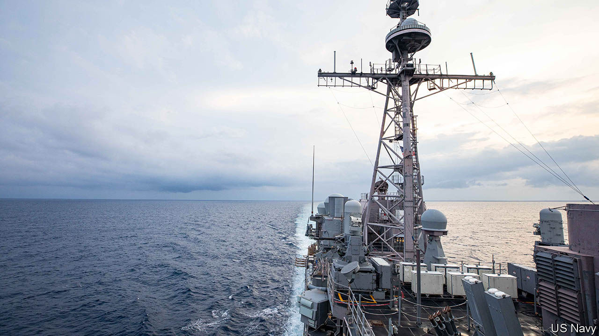
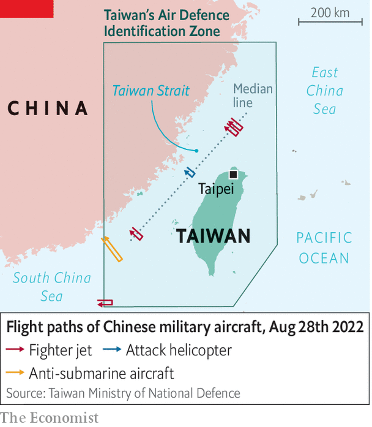

###### Just passing by

# American warships go through the Taiwan Strait 

##### The signalling suggests that neither America nor China wants a war 

 

> Sep 1st 2022 

They were not the first American warships to sail through the Taiwan Strait in defiance of Chinese warnings. Nor were they the biggest to navigate the waters between mainland China and the self-governing island of Taiwan. But when the  and the , two guided-missile cruisers, made the transit on August 28th, the potential for sudden escalation was perhaps greater than at any point in the past 25 years.

It was the first such operation since China staged big military exercises around Taiwan after a visit there by Nancy Pelosi, the speaker of America’s House of Representatives, in early August. China, which claims Taiwan, called her visit a dangerous provocation and warned that America “must pay the price”. During its drills, China’s military aircraft and ships crossed the strait’s median line—long a de facto maritime border—and its warplanes have continued to do so regularly since, raising fears that they are trying to dominate the waterway and, potentially, block transits by American and allied warships.

 


In the end, though, the transit appears to have proceeded much like many others. America’s Seventh Fleet said the two ships made a “routine” passage through waters “where high-sea freedoms of navigation and overflight apply in accordance with international law”. The Chinese armed forces’ Eastern Theatre Command said it tracked the American ships throughout, keeping all their movements “under control”. Taiwan’s defence ministry said it detected eight Chinese ships in the area that day and 23 aircraft, seven of which—including fighter jets and an attack helicopter—crossed the median line (see map).

The signalling suggests both sides are anxious to avoid direct military confrontation. America wanted to resume transits relatively quickly to maintain its credibility, but avoided doing so immediately after Ms Pelosi’s visit. The choice of ships similarly signified muscularity but not escalation: America usually sends one or two ships on such transits, but has not sent two cruisers—among its most capable vessels—in at least four years, according to Collin Koh of the S. Rajaratnam School of International Studies in Singapore. The last time America sent an aircraft-carrier through was in 1995, after China fired missiles into waters around Taiwan. 

America also appears to have tempered its statements to avoid describing the strait as “international waters”. The ships passed through a corridor “beyond the territorial sea of any coastal state,” the Seventh Fleet said. Chinese officials have said recently that they do not see the strait as international waters. Some experts agree, noting that “international waters” is not a legal term, and both sides theoretically have some maritime rights in the entire strait. 

China’s response, meanwhile, indicates that it wants to keep tensions under control ahead of a five-yearly Communist Party congress, which starts on October 16th and is expected to grant Xi Jinping a third term as party leader. At the same time, China’s military behaviour suggests it is trying to impose costs for Ms Pelosi’s visit on Taiwan, rather than America. 

Chinese forces continued to cross the median line on August 29th and 30th. Unidentified civilian drones have been buzzing Taiwan’s outlying islands. On September 1st Taiwan’s defence ministry said that it had, for the first time, shot one down. The Taiwan Strait may still be open to American warships, but the drama there is far from over. ■

