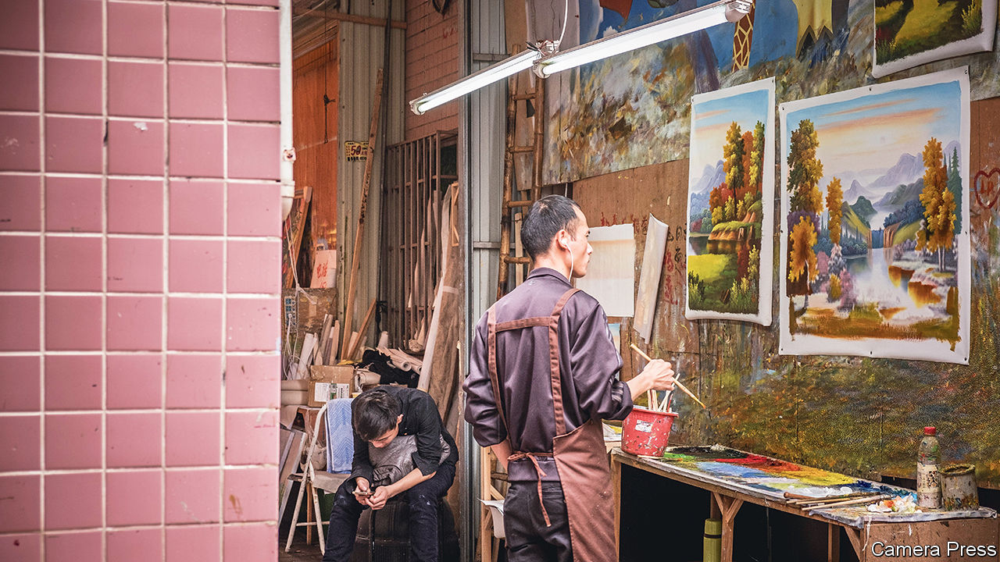

###### An art factory in decline

# The artists of Dafen can paint like Van Gogh 

##### But few people in China think they are masters 

 

> Sep 1st 2022 

The village of Dafen was once thought to produce the most oil paintings in the world. Heralded by the press as the “world’s art factory”, visitors marvelled at its many workshops, in which painters churned out mock masterpieces by Van Gogh, Rembrandt and Warhol. Their customers spanned the globe and included retailers, hotels and tourists. But the village, part of the southern city of Shenzhen, was always seen more as a production line than a place of culture. Today the future of Dafen may depend on whether it is able to earn the respect of China’s art world.

Things started to change for Dafen in 2008, when the global financial crisis cut into overseas orders. With more demand coming from inside China, artists began painting different subjects. New customers preferred Chinese styles, says a painter in Dafen. He learned the art of , which involves depicting natural landscapes. In some ways Dafen reflected the broader economy. China long pursued an export-led growth strategy, but as exports started to decline as a share of gdp, domestic consumption played a larger role in driving growth.

China is the world’s second-largest art market. But it is not clear where Dafen fits in. Li Jinghu, an artist from nearby Dongguan, often visits the village hoping to discover new talent. But he is disappointed by the lack of creativity. “The village has nothing to do with art,” says Mr Li. “It is just one of thousands of production workshops in China.” Locals say the demand for their paintings has declined during the pandemic. Many of the workshops have closed. “Most people would probably be surprised Dafen is still around,” says Lisa Movius, a writer in Shanghai who covers art. 

Some worry that Dafen may not survive much longer. Officials promote it as a creative hub. Many locals would like that to be true. “We’ve had several decades of copying,” says the painter from Dafen. “We should let it go.” But Dafen’s customers struggle to see it as more than a factory. A recent visitor to a shop in the village recoiled at the 1,000 yuan ($145) asked for an original painting. If demand does not improve, many of the painters will simply move on. Mr Li warns that in two years Dafen may cease to exist. 

