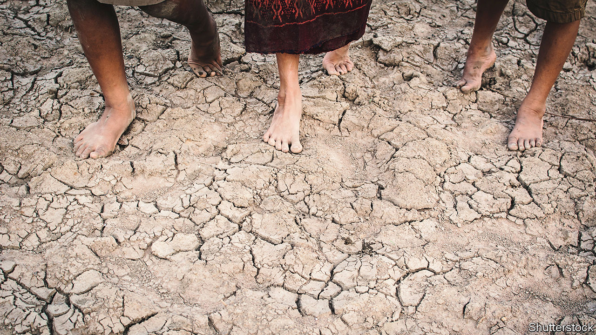

###### Flight for life

# Climate change may lead to staggering levels of migration 

##### Gaia Vince and Anatol Lieven ask how the world might cope 

 

> Sep 1st 2022 

By Gaia Vince. 

By Anatol Lieven. 

Suppose the global temperature were to rise by four degrees Celsius above its pre-industrial average. This is a very gloomy scenario: it implies a world of vast deserts, devastating wildfires and colossal floods. But it is not impossible. Gaia Vince, a science writer, asks how many people might be forced to migrate by such a catastrophe, and what the other consequences might be. It is an important question, and she explains the stakes eloquently.

The most striking pages of “Nomad Century” are the maps. Ms Vince shows the areas that would be uninhabitable in a 4°C-warmer world. A wide strip around the equator, home to some 3.5bn people, becomes lethally hot. Most places south of Britain and north of Patagonia become so grim that few would want to live there. Billions of people, Ms Vince predicts, would move to cooler climes such as Canada, northern Europe and Russia. New Zealand would become a high-rise megalopolis. 

Naturally, Ms Vince favours policies that would curb carbon emissions and thus prevent the world from heating up so calamitously. To the extent that this fails, however, people will have to adapt by moving. How many will need to do so will depend on how much the Earth actually warms, but the book’s central point is plainly true. In a hotter climate, people would be much better off living in places that are currently cold. 

Ms Vince writes vividly about the engineering feats that might allow people to cope. Large emptied-out swathes of north Africa could be used to generate solar and wind power. Much of the world’s food would be grown in Greenland and Siberia. High-rise northern cities could be erected to allow a global population of 10bn to live in reasonable comfort and with greater energy efficiency. 

However, her economic and political analysis is cursory and unconvincing. She starts by observing, correctly, that migration tends to make the world richer, especially when people move from poor and badly governed countries to wealthy, well-run ones. Canada, northern Europe and New Zealand are exceptionally well-run, and people who move there from Africa or South Asia have prospered mightily and integrated well in the past. Future migrants will certainly boost the gdp of the places they move to. And although a huge influx of foreigners will no doubt upset nationalists and racists, that problem can be overcome, Ms Vince reckons. “We will need to shed some of our tribal identities to embrace a pan-species identity.”

If only it were that simple. Ms Vince glosses over two crucial points. First, the economic benefits of migration, though immense, accrue mostly to the migrants, rather than the native-born voters who decide whether to admit them. Letting in foreign doctors and engineers has obvious benefits for the locals; countless poor, ill-educated migrants are a different matter.

The parable of the oranges

If they are allowed to work, as Ms Vince rightly argues they should be, they will be able to support themselves. But if hundreds of millions can claim benefits as locals do, they will bankrupt rich-country welfare states; and if they are denied such help, they may become a visible underclass, as is the case in Gulf states today. That would be a more humane outcome than letting them die of heatstroke in their home countries, but it is hard to imagine a Canadian politician winning office by promising to make Canada more like Dubai. 

Second, humanity is a long way from embracing a pan-species identity. Nationalism and culture matter. Some rich countries, such as Australia and the United States, have done a good (though far from perfect) job of integrating people from a wide variety of cultures into their societies. Others, such as Sweden and Japan, have not. Some, such as Hungary, have angrily refused to try. 

This patchy record has been achieved in an era when migrant flows have been a tiny fraction of what Ms Vince envisages. Today, perhaps 3.5% of people live outside their country of birth. In a four-degree world a vastly larger throng would head for a smaller number of destinations. The voters of northern Europe could be swiftly and dramatically outnumbered in their homelands by people from Africa, the Middle East and other culturally distant places with illiberal traditions. Given the political crisis sparked by the arrival in 2015 of 1m Syrian refugees—a mere 0.2% of the European Union’s population—it is hard to see those voters consenting to this. Ms Vince suggests creating a global body with powers over nation states, which could decide who settles where. National governments will not agree to that.

Anatol Lieven, another British writer, made a different case in 2020 in “Climate Change and the Nation State”. Whatever cosmopolitan idealists might wish, nationalism is not going away, he insisted. Mass movements of climate refugees could spark violence “on a genocidal scale”.

To avoid this, he suggested harnessing the power of the nation state to fight climate change. Nationalism is “perhaps the only force (other than direct personal concern for children and grandchildren) that can overcome one of the greatest obstacles to serious action; namely, that it requires sacrifices by present generations on behalf of future generations.” Politically, appeals to save “our nation” are more effective than calls to save the wider world, and they work in dictatorships as well as democracies, Mr Lieven argued. 

The deputy governor of a Siberian region once told him that he welcomed climate change because it would allow oranges to be grown in Siberia. Mr Lieven pointed out that Siberians would probably have to share those oranges with tens of millions of newly arrived Uzbeks, Afghans and Chinese people. “His mouth opened and stayed that way for a while. ‘Oh,’ he said. ‘I didn’t think of that’.”

Climate migration will and should occur. But if it is sudden, massive and panicked, destination countries will surround themselves with barbed wire. The way to keep it gradual and orderly is to stop the world overheating in the first place. ■


