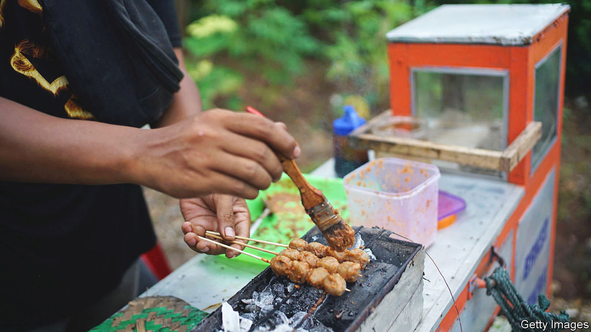

###### World in a dish

# Indonesian food is delicious but little-known 

##### The reasons involve politics, economics and prejudice 

 

> Sep 1st 2022 

Awang kitchen, a modest restaurant on a charmless stretch of Queens Boulevard, will feel familiar to anyone who has spent time in an Indonesian city. The floor is linoleum, the service is graceful and unobtrusive and the food is as good as any offered by a neighbourhood restaurant in Jakarta. There it would be unremarkable, yet in Queens—the most ethnically and linguistically diverse urban area in the world—it stands out, simply by serving food from the world’s fourth-most-populous country.

Indonesian food is underappreciated in much of the world. Precisely how many Indonesian restaurants exist in America is unclear, but there are probably fewer than 100. London, the equal of New York as an international food city, also has a paucity of Indonesian eateries. The explanation for the shortage offers valuable lessons in politics, economics and prejudice.

The gap between the renown and deliciousness of Indonesian cuisine may be the world’s greatest. Diverse in ingredients and sophisticated in technique, it blends chilli heat, citrus sourness, sweetness from unrefined sugar and salty funk from dried shrimp, all enhanced by countless native herbs and spices (Europeans battled for centuries over the Spice Islands, as Indonesia’s remote Maluku province was once known). Highlights include , a sort of reverse stew in which beef or chicken is first braised and then, as the liquid evaporates, fried in the remaining fat; countless varieties of , or soup; and grilled chicken or fish served with , a condiment based on pounded chillies.

These dishes are not unknown everywhere in the West. The Netherlands abounds in Indonesian restaurants for the same reason South Asian cuisine thrives in Britain and north African in France: colonial ties. You can also eat great Indonesian food in Singapore, which suggests another reason cuisines cross borders—borders cross cuisines, and the peoples and cultures that make them. The size of diaspora communities is a factor. There are over ten times as many Chinese-Americans as Indonesian-Americans, and (not surprisingly) far more Chinese restaurants.

That, in turn, suggests some good news. Since the fall of Suharto, a dictator who ruled for 31 years, in 1998, Indonesia has seen four peaceful transfers of power. Though its citizens are still poor by Western standards and its security forces sometimes brutal, it is growing richer and freer. The per-head emigration rate is relatively low. In no South-East Asian country do fewer adults express a wish to leave.

As for the cuisine itself, what makes it extraordinary also makes it a tough sell to Westerners used to paying low prices for most Asian food. The immense quantities of herbs, spices and chillies involved are expensive in Europe and America. Many diners who would happily shell out $30 for rip-off versions of  or  balk at spending anything like as much on beef  or  (Indonesian chicken soup, which requires large amounts of fresh turmeric, lime leaves and other herbs). Their loss. ■

