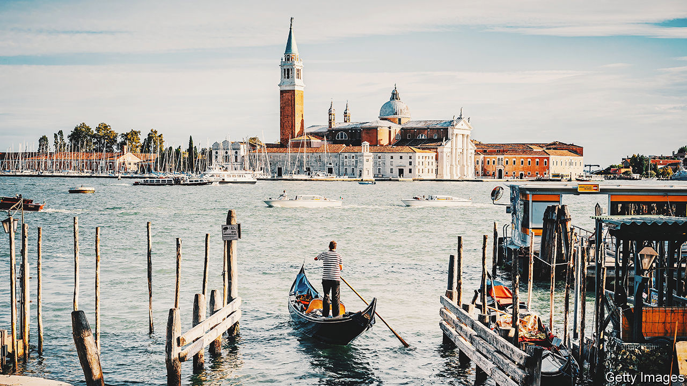

###### Back Story

# The summer holidays are over. But why go away at all? 

##### Because, for all their risks and contradictions, they make life and the world seem wider 

 

> Aug 31st 2022 

At the end of a tenebrous alley, where assassins may once have lurked, is an ornate 15th-century palace. You ascend a candlelit staircase and find a seat in the hall. Violetta is preparing for the soirée that opens “La Traviata”, an opera that had its premiere in Venice in 1853. At Musica a Palazzo it has only three musicians, as many singers, and you, the audience, doubling as party guests. To go with Verdi and the frescoes, at the interval you get a glass of prosecco in a salon overlooking the Grand Canal. 

Summer holidays are a miracle. Trips abroad require time off work, the privilege of disposable income, sophisticated travel infrastructure and international peace. The pandemic suspended them; climate-change levies may make them unaffordable. Even when you pull it off, the miracle is fragile—for, as you may recently have observed, holidays are fraught with risks and packed with contradictions. One is the explorer’s delusion, whereby people set out to discover what they already expect to find.

Venice, for instance, has been performing itself for visitors for centuries, laying on masked balls, gondolas and romantic opera. Bitterness can ensue when a destination fails to match the caricature of it in the tourist’s mind. Take the let-down Samuel Johnson recorded in “A Journey to the Western Islands of Scotland”, published in 1775. “We came thither too late to see what we expected,” he lamented, “a people of peculiar appearance, and a system of antiquated life.” It is a familiar complaint. You go in search of authenticity and the unspoilt—in other words, of your own preconceptions—and are obliged to order your  through an app.

If authenticity is elusive, so is comfort. Even if your aircraft cabin is plusher than other travellers’, it is rarely more congenial than your own home. On arrival you are bitten by mosquitoes and spend hours in queues. You get lost in narrow streets in a way that is funny until it isn’t, and catch a  heading in the wrong direction. Travel with children, and a meltdown looms if the museum-to- ratio gets out of whack. “Comfort must not be expected by folks that go apleasuring,” Byron wrote perceptively in 1809, while afflicted with diarrhoea in Lisbon.

Your inconvenience, though, is as nothing beside the suffering you read about in the guidebook. A quirk of European sightseeing is that jaunts taken for relaxation are also safaris of pain: reminders of the centuries of bloodshed and anguish that went into all the loggias and basilicas. The upshot is an awkward mix of sybaritic indulgence and fleeting compassion for the unfortunate dead. A tour of the ghetto and the torture chamber is washed down by an Aperol Spritz (a cocktail that, in a triumph of Instagram over taste, now seems to be drunk everywhere).

Memory and time are the main glitches in holidays. Neither can be outrun. A holiday is shaped by the yearnings that accumulate in the 50-odd other weeks of the year. This is why objectively trivial details—the furnishings in the hotel room where you spend hardly any time, the slightly bedraggled breakfast—can take on such outsize significance. The linen and the buffet will always struggle to live up to the hopes and frustrations invested in them. 

And, as in the rest of life, only more so, the clock is always ticking. Discount the several days it takes to swear off email at the start, and the shadow of return that falls over the final few, and you are left, like a pampered Sisyphus on top of a mountain, with only a fleeting interlude of serenity. In his book “The Art of Travel”, Alain de Botton reckoned that the spells in which everyday anxieties recede, and travellers are receptive to the wonders around them, rarely last more than ten minutes. 

Why, then, did you go on holiday in the first place? Not, surely, for the rictus-grin photos and the fridge magnet. With luck, alongside the sunburn, crowds and saw-you-coming prices, there were moments of harmony and revelation—a magically deserted piazza at dusk, a perfect family evening, a ride across the lagoon on which you felt like Sophia Loren—that made life and the world seem wider and more generous. As Mr de Botton notes, Wordsworth believed such “spots of time” can live in the memory and buck you up for years after the event. 

The poet was thinking of epiphanies in nature, but they can also arise on a sunlounger or on a plate. Or at the opera. For the finale of “La Traviata” you move into the palazzo’s bedroom. Her silhouette cast on the stuccoed walls, Violetta swoons and dies, exactly as she should.


