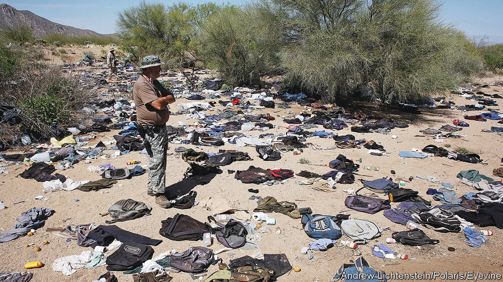

###### Tales of the border

# “Solito” offers a child’s-eye view of the perilous trek to America 

##### Javier Zamora chronicles the journey he made at nine from El Salvador to “La USA” 

 

> Sep 1st 2022 

By Javier Zamora. 

The loudest voices in America’s perennial immigration debate belong to politicians. These days Republicans howl about an “invasion” and point fingers at Democrats for doing too little to fix what they insist is a crisis. The flow of people is indeed vast: on the country’s southern border with Mexico, American patrols encountered migrants nearly 2m times from October 2021 to July this year, a record rate. Each migrant has an individual story of desperation and danger—but most of them remain unheard. 

“Solito” tells one of them. In it, Javier Zamora chronicles the journey he made as a child across three countries from El Salvador to “La usa”. Written in the present tense from the perspective of his nine-year-old self, it captures the impact of separation on the many who feel obliged to seek economic opportunities far from their homes and families. When he was small Mr Zamora’s parents moved to California illegally, leaving him to be brought up by relatives. In 1999, when he was nine, he was deemed old enough to make the trek to rejoin them. Along the way he becomes close to a mother and daughter and a young man; they pretend to be a family so as to stay together if they are apprehended.

This is a book about the risks people take to be reunited with loved ones, and how something resembling love can show up in subtle acts by almost-strangers. It is most gripping in its glimpse of the expansive and lucrative networks for human-trafficking into America. Migrants pay “coyotes” to serve as guides, who lead them north by bus and boat and on foot, supplying them with fake documents and careful instructions on how to blend in. “I’m only one pearl in a long pearl necklace,” explains the first of many coyotes entrusted with Mr Zamora’s life. 

People from farther south pretend to be Mexican, memorising new identities so that if they are caught by American border-patrol agents they get sent back only to Mexico, instead of all the way home. Some coyotes’ fees include two tries, lest the migrants be intercepted on the first go.

Like Mr Zamora’s odyssey, “Solito” has heart-palpitating moments, especially as it follows him on his progress by foot into Arizona. His survival feels precarious; injury, dehydration and capture are vivid and immediate threats. But the story has dull sections too. There is a jarring juxtaposition between the risk and frenzy it evokes, and prolonged descriptions of more mundane experiences, including the narrator’s struggles with using the loo (his mother left in the middle of potty-training him). 

The book might helpfully have been cut by a third. Adopting a child’s outlook, meanwhile, lends it a guileless authenticity, but also has a limitation. The technique conveys the narrator’s emotions and insecurities, but is less successful at penetrating the thoughts of other characters.

For its raw power and devastating detail, the best non-fiction book on this subject remains “Voices of the Border” by Tobin Hansen and María Engracia Robles Robles, which collects compelling oral histories recounted by migrants. All the same, for readers who want to look beneath the political grandstanding, and better understand the plight of those who undertake this perilous journey, “Solito” offers a credible and sensitive testimony of hardship and endurance. ■

