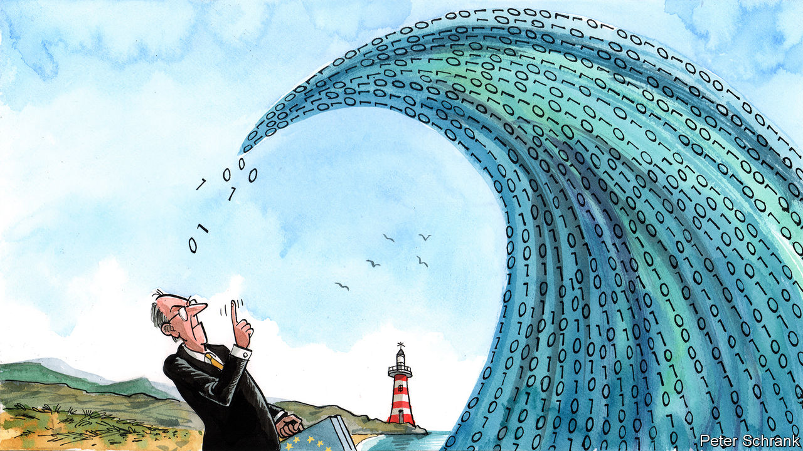

###### Charlemagne

# Is the EU overreaching with new digital regulations? 

##### It leads the world in making rules for big tech, but enforcing them is another matter 

 

> Sep 1st 2022 

A global satellite system that doubles as a universal translator. A pope who uses it to broadcast a message of peace in many different languages simultaneously in the hope of preventing the world from fragmenting. If critics paid any attention when “Vatican III” was published in 1985, they dismissed the novel by Thierry Breton, now the European Union’s commissioner for the internal market, as a literary vanity project typical of ambitious French leaders. Yet “Vatican III” seems prescient today. Although the European Commission, the eu’s executive branch, may not be building a virtual equivalent of the Tower of Babel, Mr Breton and other Eurocrats do want to spread their own digital gospel universally and cement the eu’s role as the world’s digital über-regulator.

The telecoms-cum-computer contraption in Mr Breton’s novel ultimately proves to be a success. Whether the same will be said about the eu’s evangelical digital rulemaking is another question. The eu may have passed, or at least drafted, the world’s most important digital laws. But now it faces the considerably more difficult task of enforcing them. As if to mark this new phase, the commission on September 1st opened an office in San Francisco—an embassy of sorts to work with Silicon Valley firms.

The eu did not seek the role of global digital regulator, but was sucked into it by a phenomenon called the “Brussels Effect”, after the title of a book by Anu Bradford of Columbia Law School, which makes the eu the world’s regulator by default. America is too politically paralysed to play this role; China disqualifies itself by its authoritarian bent. In Brussels, by contrast, the power of lobbyists is more limited and mandarins tend to know their dossiers; this often results in regulations on which other countries can build. As for global companies, they have no choice but to comply if they hope to sell into one of the biggest digital markets.

So far the symbol of the eu’s rulemaking power in tech has been the General Data Protection Regulation, or gdpr. This privacy law requires, among many other things, that individuals give explicit consent before their data can be processed. Enforceable since May 2018, it has taken the world by storm. Graham Greenleaf of the University of New South Wales says nearly 160 countries have adopted legislation “influenced substantially” by it. A pair of other laws, however, which the European Parliament passed in early July, are likely to rival it: the Digital Services Act and the Digital Markets Act, which will start entering into force next year. The dsa deals with such issues as hate speech, illegal goods and advertising. The dma defines a new category of dominant “gatekeeper” platforms mostly run by America’s tech titans—and prohibits them from engaging in practices deemed uncompetitive, such as giving preference to their own services or blocking their instant-messaging services from interoperating with rivals.

Yet the gdpr has already shown how difficult it is to make such digital rules stick. Enforcement has been slow, at least when measured in fines. Since 2018 penalties have amounted to nearly €1.7bn ($1.7bn) in about 1,200 cases, according to cms, a law firm. Although the cumulative fines meted out to the regulation’s main targets, America’s tech titans—Alphabet, Amazon, Apple, Meta and Microsoft—reached a hefty €1.3bn, this is less than a thousandth of what they collectively made in sales last year.

The main reason for this relative leniency is the way the eu has set up enforcement. Cases that cross borders are handled by the data-protection authority in the country in which a firm is based. This should make Ireland’s Data Protection Commission the eu’s most powerful privacy watchdog: all of big tech’s European headquarters bar Amazon’s are based in the Emerald Isle. Yet to the dismay of privacy advocates, the country has proved to be a bottleneck. It does not have enough resources and is unsure how aggressively it should go after firms which provide a lot of local jobs and tax revenues. To avoid the same regulatory logjam with the new dma and dsa, the commission has now given itself the role of enforcer. It has already started building what will amount to a new industry watchdog. It will eventually boast some 220 civil servants, contract workers and national experts. It will have its own financing, through a levy on the firms it regulates, and a bespoke software platform to keep track of cases.

“We are ready,” Mr Breton recently claimed in a blog post. Observers are not so sure. Even if the set-up functions as planned, its regulators have their work cut out. They will probably have only a dozen firms to oversee. But assuming that the big gatekeepers have to comply with all the dma’s 21 obligations, there will be just 0.7 staff for each obligation and gatekeeper firm, calculate Christophe Carugati and Catarina Martins of Bruegel, a think-tank based in Brussels. Such a ratio may be enough if the companies play ball. But in contrast to the gdpr, many of the dma’s obligations go to the core of their business models.

Then again...

If enforcement of the dma and dsa turns out to be too weak, Brussels could face growing competition from Britain and the Beltway. In the case of the gdpr, some countries have already started diverging from its path. Britain is working on a lighter-weight version. America’s often dysfunctional Congress may soon manage to pass a federal privacy law, the American Data Privacy and Protection Act, which improves on the gdpr. In its current form, it would hold bosses personally responsible for privacy violations.

All of which suggests that the premise of both Mr Breton’s book and the so-called Brussels Effect may be wrong. A central actor, however well placed, cannot unify the digital realm. Instead, a different assertion in Mr Breton’s novel may hold true: that digital technology will lead to fragmentation of the world into what he calls “logical continents”. For a detailed explanation of what might be done about that, interested readers may have to wait until he leaves Europe’s capital, giving him time to write another novel. ■


