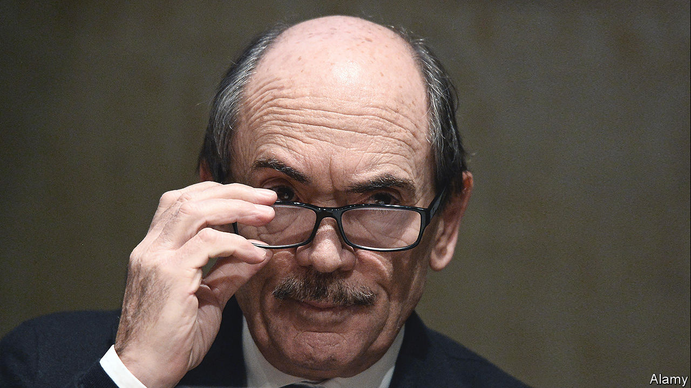
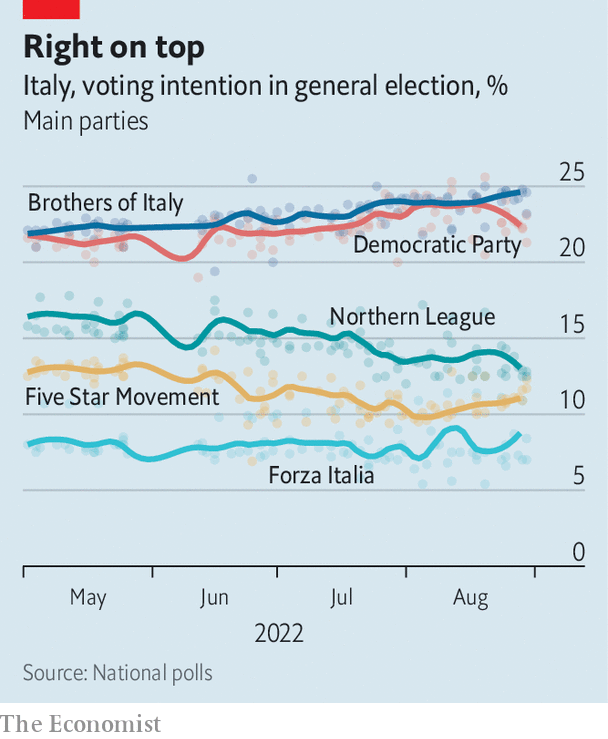

###### Taking the fight to the next level

# Italy’s election and the war against corruption 

##### A tough anti-mafia prosecutor looks set to join parliament 

 

> Sep 1st 2022 

Law-and-order candidates do not come to the hustings with greater credibility than Federico Cafiero de Raho. Until earlier this year the 69-year-old Neapolitan was Italy’s chief anti-mafia prosecutor. Yet Mr Cafiero de Raho is not running in the general election on September 25th for either of the hard-right parties that look set for government—the Brothers of Italy and the Northern League, whose leaders stridently, and daily, inveigh against criminality, but relentlessly link it to immigration. 

He is standing for the idiosyncratic Five Star Movement (m5s), heading its list of candidates for the Chamber of Deputies in two regions: Emilia-Romagna and Calabria, homeland of the ’Ndrangheta, the most globally pervasive of Italy’s four main organised-crime syndicates. (Italian law lets candidates stand in more than one constituency.) Another prominent former anti-mafia prosecutor, Roberto Scarpinato, is on the m5s’ slate for the Senate in Calabria and Sicily, birthplace of Cosa Nostra.

Disastrously amateurish at times, wracked by internal division and with less than a third of the support it enjoyed at the last election, the m5s nevertheless has an admirable record on organised crime. Its 2018-19 governing coalition with the League, in which the Five Stars were senior partners, introduced two laws that bolstered the fight against corruption and stiffened the penalties for political collaboration with organised criminals. More recently, the m5s has been at the forefront of efforts to prevent mafia trials, which are often immensely complex, from becoming subject to time limits.

 


The issues of corruption and the mafias have become entwined as never before as Cosa Nostra and the ’Ndrangheta in particular have become more sophisticated. “The mafiosi no longer rely on violence or intimidation to obtain political acquiescence,” notes the candidate, who says the Five Stars are the only party tackling the matter. “They have made such prodigious amounts of money from trafficking narcotics that they can buy it.” Vittoria Baldino, in second place behind Mr Cafiero de Raho on the Five Stars’ slate in Calabria, says the same is true of business. “The mafias have become more innovative. Their infiltration of the legitimate economy is a major obstacle to the development of Calabria and the entire country.”

The scion of a noble family, Mr Cafiero de Raho led for the prosecution in one of the biggest trials mounted against a cartel: the previously almost unknown Casalesi clan, an offshoot of the Neapolitan Camorra. It took 42 hearings just to read the charge sheet, and by the time the last appeal was heard in 2010, 12 years had passed. 

Mr Cafiero de Raho goes everywhere with a police escort these days. Will that not hamper his campaign? He says he will probably not hold rallies, but was hoping to meet voters in factories, social centres, voluntary associations and similar, smaller forums. The former anti-mafia chief is virtually assured of a seat, even if the m5s gets no more than the 10% that recent polls have given it. Once in parliament, he plans to use his experience and authority, built up over 43 years as a prosecutor, to press for further changes in the law. He already has plans for an amendment that would give protection to politicians and businesspeople who come under pressure from organised criminals. “I shall not be holding back,” he warns. ■

