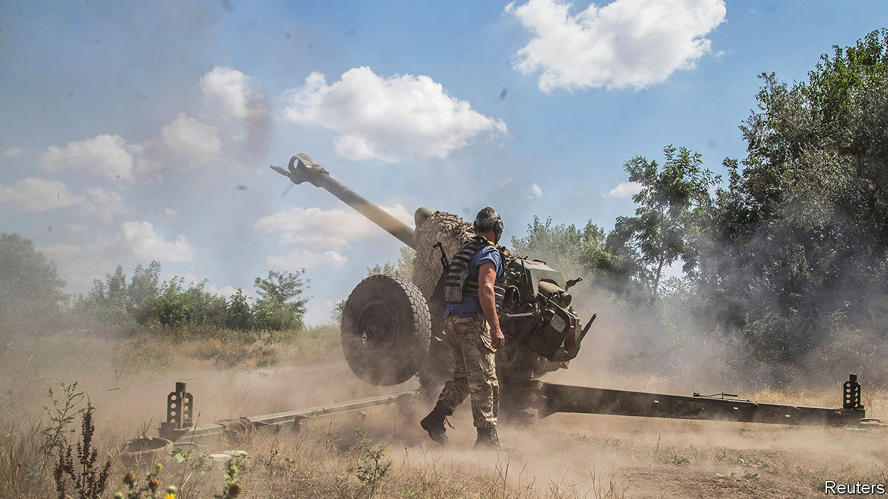
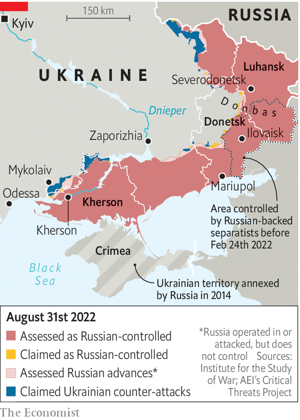

###### The game’s afoot

# Ukraine starts a push to recapture Kherson, a crucial Russian-occupied city 

##### A long-awaited counter-offensive has begun 

 

> Aug 29th 2022 

In august 2014 Ukraine’s army suffered one of the greatest reverses in the country’s independent history. Ukrainian soldiers found themselves besieged by Russian-backed forces in Ilovaisk, a town in eastern Donetsk province. As they tried to escape, at least 366 of them were killed in what many Ukrainians describe as a massacre. The historical resonance of that episode will certainly not have been lost on the Ukrainian generals who unleashed a  in southern Kherson province on August 29th, eight years later to the day.

 


The initial news of an attack came in the early afternoon, with reports that the first line of Russian defences north of Kherson city had been breached. One Ukrainian unit said it had pushed back pro-Russian troops north-east of Kherson city after supposedly elite Russian paratroopers in the second echelon, to the rear, failed to support them and fled. A spokesman for Ukraine’s southern command confirmed only that the army had begun “offensive actions in several directions in the south”. The deputy head of the neighbouring Odessa military district, however, was more explicit. “The battle for Kherson [city] has begun,” he wrote.

 A source in Ukrainian military intelligence described the breakthrough to  in less excitable terms. It was, he said, merely the prelude to a larger operation. It had been made possible by an under-reported offensive in the east of the country on the border between Donetsk and Luhansk provinces, which had taken six villages and successfully diverted Russian aviation and air-defence resources. On the night of August 28th Ukraine turned its attention back to the south, striking key bridges, ammunition dumps and Russian command points. That meant that when Ukrainian artillery and aircraft then attacked the front lines, the Russian side was unable to call on support or co-ordination. “When we stormed them,” said the intelligence official, “they ran.”

The source said that Ukrainian forces would still need to penetrate a second line of defence, manned by tougher mechanised units, in order to reach the banks of the Dnieper river north-east of Kherson city. The current Ukrainian ground attacks appear to be aimed at driving a wedge through the estimated 20,000-25,000 Russian troops who are thought to be deployed on the river’s west bank.

If the northern grouping could be trapped in a pocket—a cluster of forces isolated from supplies and other units—then 10,000-12,000 Russians would have little obvious chance to retreat. In an evening address on August 29th Volodymyr Zelensky, Ukraine’s president, said the Russian soldiers had a simple choice: “​​If they want to survive, it is time…to flee.” 

A former senior Ukrainian official said the immediate aim of the operation was not to attack Russian forces in Kherson city directly, but to weaken Russian positions around it in the hope of forcing them to withdraw without a destructive urban battle. “If we just take Kherson,” he said, “they will shell us and the city from the other side of the river.” The former official predicted that the offensive would continue without hurry or excessive risk-taking.

Western officials agreed that the attacks were “shaping” operations—military parlance for preliminary attacks intended to soften up enemy defences before an offensive. What is notable, though, is that they did not just involve strikes on rear areas, like ammunition depots and headquarters. The Ukrainian military source confirmed that it was the first time that American-supplied himars missiles had been used in a tactical battlefield situation, striking infantry and other front-line positions. That suggests that Ukraine is confident of receiving a fresh supply of ammunition from its partners.

The coming days are crucial. Ukraine’s front-line troops will be vulnerable as Russia tries to contain the advance. This is presumably one reason why Ukrainian officials have imposed a news blackout. On August 30th Russia’s defence ministry claimed the Ukrainian side had already lost 1,200 men in the push. A Ukrainian forward-reconnaissance officer fighting in northern Kherson province acknowledged that the fighting was “tough” with real losses, but “nowhere near that order”. On August 31st British military intelligence said that Ukraine had “pushed the front line back some distance in places”.

If Ukraine were able to recapture Kherson city, it would reshape the military geography of southern Ukraine, blocking Russia’s overland path to Black Sea ports like Odessa and potentially threatening supply lines out of occupied Crimea. The first phase of this war ended with Russia’s ignominious retreat from Kyiv and northern Ukraine at the beginning of April. The second culminated with Russia’s capture of the city of Severodonetsk in Luhansk province in late June. The front lines have barely moved in the two months since. If indeed Ukraine has found a chink in Russia’s armour, it could mark the beginning of the war’s third chapter. ■


