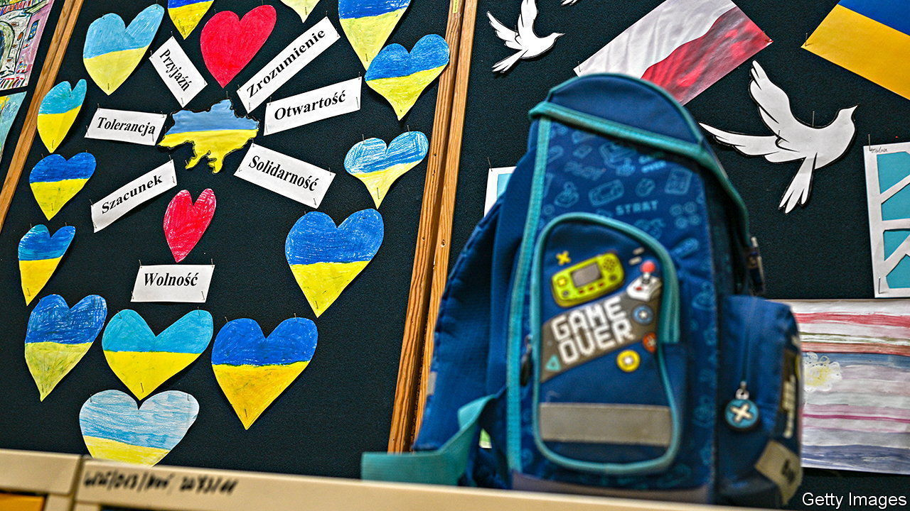
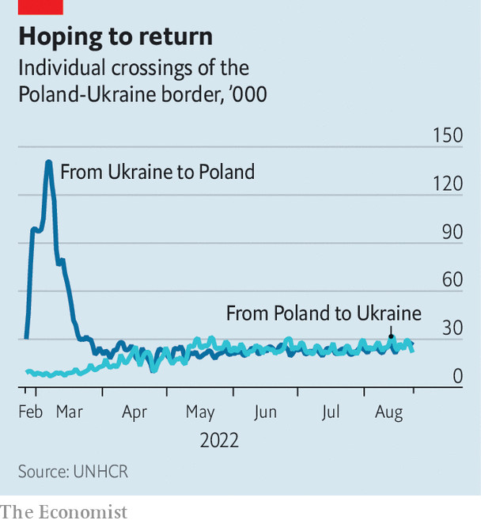
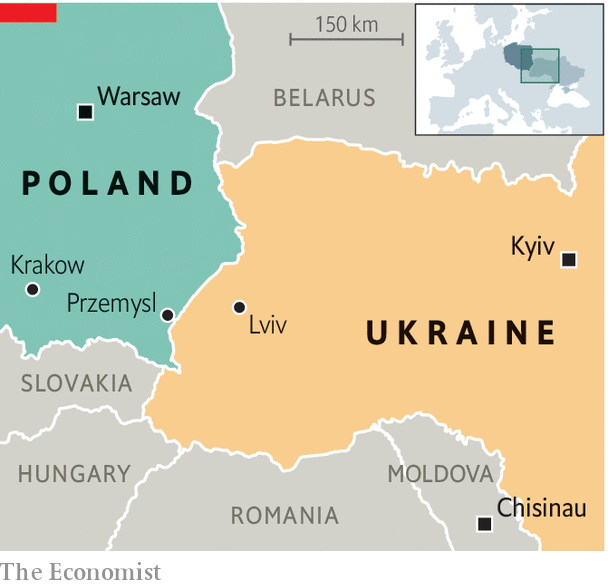

###### Here to stay?

# Ukrainian refugees are making Poland multicultural again 

##### But as the war drags on, a generous welcome grows strained 

 

> Sep 1st 2022 

For refugees, putting down roots can feel like a betrayal. Many Ukrainians who fled to Poland after Russia invaded their country hesitated to place their children in Polish schools, hoping to return home soon. But Liliya Lysyk enrolled her 15-year-old daughter Yeva immediately after arriving in March in the border city of Przemysl. Yeva has learned Polish and likes her school, apart from one awkward moment. “My history teacher said Lviv [the biggest city in western Ukraine] should have been a Polish city,” says Yeva. “He is a good teacher, but we agreed to disagree.”

 


Yeva’s classroom dispute hints at the problems that are arising as it becomes clear that many refugees have come permanently. No one is sure how many there are; estimates run from about 2m to 3.5m. Poland has been very generous, granting Ukrainians the right to work, to attend school and to receive social benefits. Most Poles see Ukraine as a brother nation with a similar language and culture. A recent poll showed 84% favour letting refugees in.

But as the war drags on, strains are emerging. Poland’s schools, hospitals and housing market are struggling to accommodate the refugees. Other issues run deeper. Although Poles and Ukrainians are friends now, for centuries they were bitter rivals. In 1943 Ukrainian nationalists massacred 100,000 Poles. After the war both Poland and the Soviet Union (which included Ukraine) expelled each other’s citizens. Today’s refugees are determined to remain Ukrainian, but modern Poland is ethnically homogeneous and unused to large minorities. Now that is changing.

Poland’s education system is bearing the brunt. Some 180,000 Ukrainian children were in Polish schools as of late June. (The rest study remotely at schools in Ukraine.) As parents get used to the idea of staying longer, far more are expected to enroll in Polish schools in September. With children making up over 40% of Ukrainian refugees, the numbers could be huge.

Yeva is lucky: at her school 30% of the classes are taught in Ukrainian. This curriculum, a partnership between the Polish and Ukrainian education ministries, has expanded to hundreds of schools. But it can absorb only a fraction of new arrivals. Meanwhile Ukraine’s government would rather not too many Ukrainian children enter Polish schools, for fear their parents will not return to rebuild the country.

 


Language is only one barrier. Literature classes deal overwhelmingly with Polish writers. History classes concentrate on Poland’s struggles with Russia, Germany and Austria-Hungary, which carved it up in the 18th and 20th centuries. “Our teaching is very focused on the state,” says Aleksandr Pawlicki, a history teacher at Warsaw University’s education school. Ukraine, a nation that long lacked a formal state, gets “lost between Poland and Russia”. 

Mixed-up history

Nationalism in both Poles and Ukrainians emerged among intermingled peoples, so one country’s heroes are often the other’s villains. Many Ukrainians trace their history to the Cossack hetmanate, an association of fiercely independent warrior-farmers in what is now eastern Ukraine and southern Russia. Most celebrate Bogdan Khmelnitsky, a Cossack leader who led uprisings against Russia and Poland in the 17th century. Poles tend to consider Khmelnitsky a brute, recalling his Cossacks’ massacres of Poles and Jews. The template was established by “With Fire and Sword”, a 19th-century novel set during the uprising that pits a savage Cossack against a refined Polish nobleman for a princess’s love.

The countries’ 20th-century history is just as fraught. After the first world war Poland got back its independence along with much of what is now Ukraine, including Lviv. But Ukraine was brutally absorbed into the Soviet Union. Some later Ukrainian nationalists, including the best-known, Stepan Bandera, are generally seen as fascists. In 1943, as the Red Army rolled back the Nazis, his Organisation of Ukrainian Nationalists launched an ethnic-cleansing campaign to secure what is now western Ukraine in any postwar settlement. Some 100,000 Poles were murdered.

Ukraine has never properly acknowledged the massacres, and since its independence in 1991 many Ukrainians have grown up revering Bandera. This has little influence on Ukrainian politics, where far-right groups are marginal. But it creates problems for mixed classes of Polish and Ukrainian students. “I try to teach the debate,” says Jacek Staniszewski, a teacher.

Most refugees are less worried about history than about jobs. Poland’s robust labour market helps: the unemployment rate is just 2.5%. The shortage of workers has grown more acute as many Ukrainian men who worked in Poland before the war have gone home to fight. Yet by June, just 185,000 Ukrainians had taken up formal employment using a new streamlined permit system. Over 90% of the refugees are women and children, and childcare for working mothers is in short supply. Only about 5% say they speak good Polish, according to a report by Poland’s central bank, consigning many to jobs for which they are overqualified. Ukrainian mothers can draw child benefits, but these provide only 500 zlotys ($106) a month per child. In July Poland cut back its stipends for those hosting refugees. Hosts are growing increasingly weary, says Agnieszka Kosowicz of Forum Migracyjne, a Polish ngo.

One risk, says Pawel Kaczmarczyk, head of migration studies at Warsaw University, is &#34;compassion fatigue&#34;. He bemoans the government’s failure to communicate a coherent integration strategy or to publicly promote the positive economic effects of Ukrainian immigration. A deeper issue is whether Poland can adapt to being a multi-ethnic society again, as it was for centuries before the second world war. A report by WiseEuropa, a think-tank in Warsaw, calls for a “governmental programme of multicultural management”. Poland’s current government is known for its vociferous nationalism. It has welcomed Ukrainians wholeheartedly, but embracing multiculturalism may be a stretch. ■


