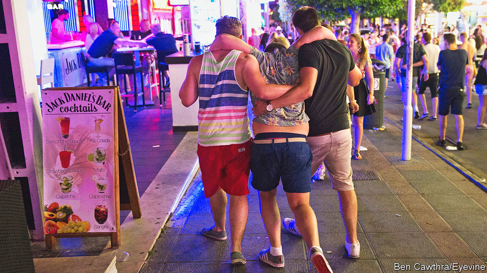

###### Scrubbing up

# What can clean up Magaluf? 

##### The Spanish island of Majorca would like to swap hooligans for hippies 

 

> Sep 1st 2022 

Summer flights to Majorca often crackle with the sound of beer cans being opened. Visitors to the sunny Spanish island commonly plan to drink until they drop. But Majorca’s authorities, and many of its residents, grow ever more tired of (drunken tourism), the kind that leaves beaches strewn with rubbish and pavements splattered with vomit. Over the years they have brewed endless plans to clean things up.

The most recent new rules dictate that all-inclusive resorts in the noisiest swathes of the island may provide guests with no more than six drinks a day—three of them at lunchtime, and a maximum of three at night. Revellers in the affected zones, which include Magaluf, Majorca’s grimmest party town, have had to say  to organised pub crawls and happy-hour drinks deals. Bacchants can still snap up bevvies at supermarkets, but stores are no longer entitled to sell alcohol after 9:30pm. Businesses which break the rules risk fines of up to €600,000 ($613,000).

These draconian regulations in fact came into effect in 2020, but until now have largely flown under the radar because of quieter-than-normal tourist seasons resulting from the pandemic. How far they are reckoned to have irked tourists this year is therefore an important test. Many locals, at least, seem relieved. It is “about time”, says one.

Yet attracting a mellower type of tourist will require much more than just prohibitions. Last year Magaluf, famous for its cavernous nightclubs, launched an annual literary festival. Irvine Welsh, author of “Trainspotting”, showed up. This season the city is promoting a weekend “hippy market” (akin to a car-boot sale, but for bohemians). This looks a lot like an effort to replicate similar bazaars on the somewhat more fashionable island of Ibiza, which attract thousands of free spirits every year.

Majorca has long thirsted for a better class of layabout. When it opened in 1903 the Gran Hotel, a modernist mansion in the heart of Palma, the capital, promised rich loafers comforts unattainable anywhere else on the island. It closed decades ago. Perhaps the latest projects will do a more lasting job of getting Majorca’s seediest spots smartened up. 

