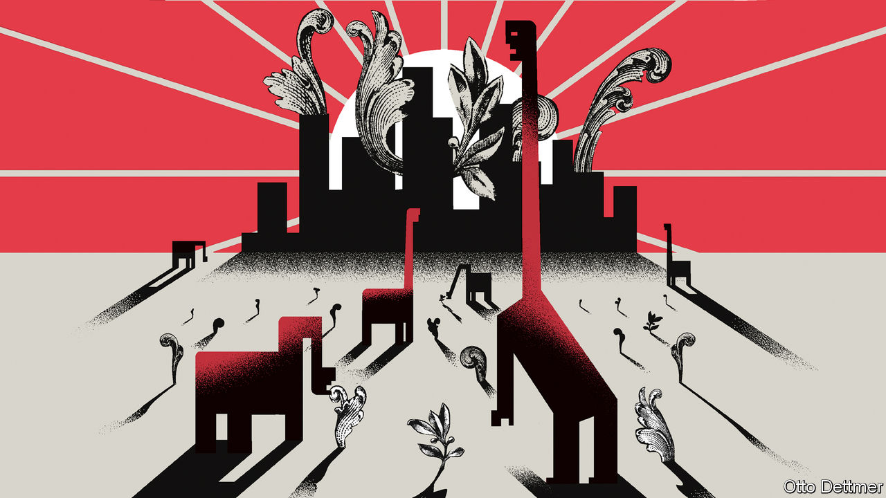

###### Free exchange

# Central bankers worry that a new era of high inflation is beginning 

##### There are three reasons to believe that may be the case 

 

> Aug 30th 2022 

In august 2020 Jerome Powell, the chairman of the Federal Reserve, described a shift in the central bank’s policy framework. “The economy is always evolving,” he noted. “Our revised statement reflects our appreciation…that a robust job market can be sustained without causing an unwelcome increase in inflation.” It was a pivot informed by a long period in which prices as often rose by less than the Fed preferred as by more. 

Two years on, the Fed faces very different circumstances: rock-bottom unemployment, strong wage growth and rates of inflation far above the central bank’s target. On August 26th, at an annual jamboree for central bankers in Jackson Hole, Wyoming, Mr Powell sang a different tune. “Without price stability, the economy does not work for anyone,” he declared, and added that the Fed was prepared to impose economic pain to get inflation back to target. Just how much might be required remains anyone’s guess. But the economists and policymakers gathered under the Teton mountains repeatedly voiced a serious concern: that the global forces which in recent decades helped to keep inflation low and stable may be weakening—or reversing. 

To misquote Milton Friedman, inflation is often and mostly a monetary phenomenon. Central banks have many tools to constrain spending across an economy, and thus to prevent demand from outstripping supply in a manner that fuels inflation. But they do their work against an evolving economic backdrop, which may make taming price pressures easier at some times than at others. From the 1980s onwards inflation in the rich world generally fell and became less volatile. The phenomenon is commonly attributed to better monetary policy, but also to benign global conditions relative to those which confronted central banks in the 1960s and 1970s—namely, spend-happy governments and energy shocks—when economies were battered by falling productivity growth. The world may now “be on the cusp of historic change”, as Agustín Carstens, of the Bank for International Settlements, a club for central banks, put it at Jackson Hole. 

Worriers see a few reasons why inflation may stay high. Government spending and borrowing patterns seem to have changed, for one. Across rich and emerging economies, public-debt loads have soared over the past two decades. As debt burdens rise, markets may begin to fear that central banks will eventually have to help finance governments’ obligations, say by creating new money to buy bonds. That could erode central-bank credibility and raise the public’s expectations of future inflation. 

The fiscal firepower deployed during the covid-19 pandemic may also reflect governments’ greater openness to using stimulus to fight recession, which could likewise cause markets to expect more spending and inflation. Work presented at the conference by Francesco Bianchi of Johns Hopkins University and Leonardo Melosi of the Federal Reserve Bank of Chicago suggests that American inflation stood roughly four percentage points higher than it otherwise would have been, thanks to the “fiscal inflation” associated with the $1.9trn stimulus package passed in 2021. 

Workers are scarcer, too. Population growth in the rich world has slowed dramatically owing to demographic change and lower immigration. In some economies, like America, the pandemic was associated with a further drop in labour-force participation. From the 1990s to the 2010s, global labour supply expanded rapidly as populous economies like China and India became better integrated into the world economy. But that experience cannot be repeated, and ageing is beginning to hit labour supply in parts of the emerging world, as well. Workers may thus enjoy more bargaining power in the future, spurring wage growth and make life harder for inflation-fighting central banks. 

Then there are slow-burning changes to the structure of the global economy. Both emerging and advanced economies engaged in a wave of liberalising reform from the mid-1980s to the mid-2000s. Tariffs fell, while labour and product markets grew more limber. These reforms contributed to a surge in global trade, large-scale shifts in global production and falling costs across a range of industries. Reform may have bolstered productivity growth, too, which ticked up in advanced economies at the turn of the millennium and in emerging economies in the 2000s. But the pace of reform fell and productivity growth ebbed after the global financial crisis of 2007-09, while trade came under sustained pressure from trade wars, the pandemic and geopolitical tensions. Globalisation served as a “gigantic shock absorber”, from the 1980s into the 2010s, noted Isabel Schnabel of the European Central Bank, such that shifts in demand or supply were easily met through corresponding adjustments to production, rather than wild swings in prices. Now that flexibility is at risk. 

Nowhere to run

For the attending central bankers, this was bracing stuff. But it need not be apocalyptic. Some trends could make a new macroeconomic era a little easier to bear. Demographic change may cut both ways, as Gita Gopinath of the imf remarked. Though workers in ageing economies may be scarce, they will also save more, helping mitigate inflationary pressures. And as those at the symposium discussed, changes spurred by the pandemic may yet yield a productivity dividend. 

Most crucially, there is less intellectual confusion today than there was in the 1970s. As Mr Powell noted, central bankers once needed convincing that they could and should bear responsibility for the level of inflation—a situation that allowed high inflation to rage for more than a decade. Today, by contrast, the Fed’s “responsibility to deliver price stability is unconditional”. Central bankers are beginning to accept that their task may be harder for years to come. That awareness could itself prevent a new era of shocks and volatility from being truly disastrous. ■


