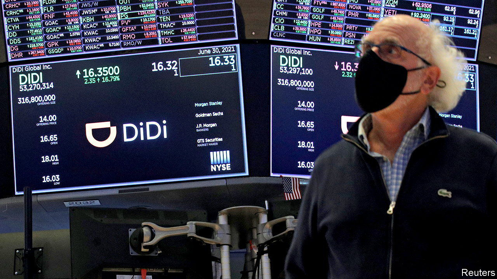

###### Financial recoupling

# China and America’s long-awaited audit deal may yet fail 

##### But it at least suggests Beijing still sees some value in links with America 

 

> Sep 1st 2022 

At some point in September a team of American inspectors will touch down on Chinese soil in the hope of doing something miraculous: freely inspecting the internal auditing paperwork of Chinese firms listed on American exchanges. The agreement to do so, announced on August 26th, has been a decade in the making, and could prevent the delisting of some $940bn in Chinese shares that trade in New York. Success, however, is still far from guaranteed. 

Since 2011 the Public Company Accounting Oversight Board (pcaob), an auditing governance body, has demanded that accounting firms auditing New York-listed Chinese companies open the companies’ books for inspection. These reviews were made all the more urgent by repeated instances of fraud by Chinese firms. Yet the Chinese government had pushed back, at times declaring such paperwork “state secrets” and threatening criminal charges against anyone who reveals them.

A law passed in America in 2020, the Holding Foreign Companies Accountable Act, gave auditors three years to comply before their Chinese clients were forcibly delisted. When in March the Securities and Exchange Commission, America’s market watchdog, published a list of firms slated for delisting, it caused the sharpest fall in American-traded Chinese stocks in more than a decade. In mid-August fears of impending financial turmoil grew when five Chinese state-owned companies voluntarily delisted from American exchanges. 

For their part, regulators in Beijing had sent a cold message to investors in America. A crackdown on Didi Global, a Chinese ride-hailing firm, just days after it listed in New York implied that the Chinese government cared little about the reputation of companies listed on foreign markets. 

All this means the deal between the pcaob and the China Securities Regulatory Commission (csrc) comes as a welcome surprise. It seems to show that leaders in Beijing still see some value in financial links with America—defying predictions of an imminent financial decoupling between the world’s two largest economies. 

Signing the deal may have been the easy part, however. Lawyers working on cross-border regulatory arrangements note that carrying it out will be fraught with risks. The statements released by the pcaob and the csrc are contradictory in places. The Americans note that they will not need to go through Chinese authorities to access documents. There can be “no loopholes and no exceptions”, their statement says. The Chinese say all arrangements will be done through the csrc. A single disagreement on access could end up derailing the entire deal.

Given the Chinese government’s sensitivity around data, the inspections could be awkward. The pcaob can examine documents not just from the current year, but from a few years back. While the most recent audit documents may have been prepared without the data disclosures that China considers a national-security risk, documents requested from previous years may still contain sensitive information, notes Travis Lundy of Smartkarma, a research firm.

That might help explain why, even though the deal has been signed, the market is so far pricing in only a 50% chance of eventual success, according to analysts at Goldman Sachs, a bank. Agreements between China and America have a poor record when it comes to implementation. Analysts at Bernstein, a broker, reminded investors of another high-profile pact meant to patch up relations: “Remember the Trump phase one trade deal?” That agreement failed miserably. ■


