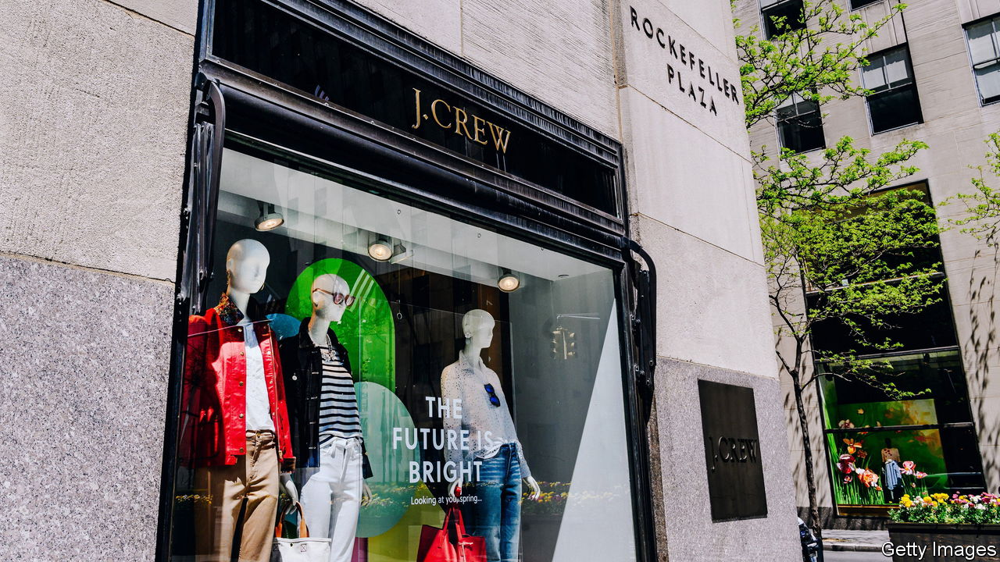
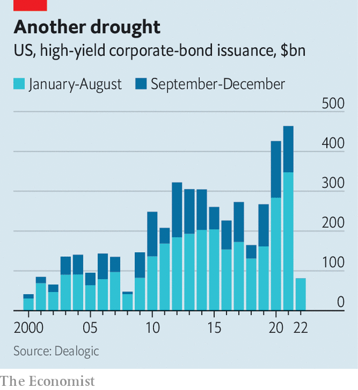

###### Ready to rumble

# Distressed-debt investors are preparing to pounce 

##### Unlike in the global financial crisis of 2007-09, they will not have things all their own way 

 

> Sep 1st 2022 

Hedge funds are used to being the star players in corporate America’s most aggressive sport: financial distress. They search for value in the liabilities of troubled firms, often hoping to participate in the restructuring of a company’s balance-sheet. And after a decade of unpleasantly benign financial conditions, excitement in the industry is building. A toxic cocktail of rising interest rates, slowing growth and high inflation is already creating pockets of distress. High-yield debt issuance has dried up (see chart), and it is increasingly difficult for companies to refinance their liabilities or raise fresh funds. In July the amount of distressed debt, which includes bonds yielding more than ten percentage points over Treasuries and loans trading at heavy discounts, surpassed $240bn, nearly three times as much as at the start of May.

 


Distressed-debt investors have waited a long time for conditions like these. Their approach was born in the aftermath of the 1980s leveraged-finance boom, but came of age during the global financial crisis of 2007-09, when the face value of distressed and defaulted debt reached $3.6trn (Lehman Brothers, a former investment bank, contributed more than $600bn of that). Since 2011, funds have raised around $500bn in anticipation of more distress, but have had few opportunities to spend it. A decade of low interest rates made borrowing easy and distress rare. Even the covid-19 pandemic turned out to be a false dawn, since the door to liquidity was held open by massive central-bank stimulus.

Although clouds are now gathering in credit markets, distressed-debt investors will not have things all their own way. Instead they will have to adjust to a new balance of power between lenders and borrowers. Lending to risky companies in the past decade has been not only vast, but loose. Maintenance covenants, financial commitments which lenders can use as a “stick” to force a restructuring, have all but disappeared. Combined with low interest payments, their absence means it will take longer for lenders to get companies to join them at the negotiating table. That is if distressed-debt investors can purchase debt in the first place. Today it is common for leveraged-loan documentation to include blacklists to prevent specialist funds from buying in.

Once at the table, an emboldened opponent awaits. One trend in particular has sent the secretive, tight-knit world of distressed-debt investing into a spin: aggressive “priming” transactions, which involve subordinating secured lenders. In one variation, the borrowing company transfers collateral backing its existing loans to a subsidiary free from creditors’ rights. This allows the company to re-use the collateral to raise new debt, in effect shoving the original lenders down the pecking order if it comes to divvying up assets. After shifting around its valuable intellectual property in this fashion, J.Crew, the preppy American clothing brand, became a verb. Since then, the creditors of companies including Revlon, a beauty brand, Golden Nugget, a chain of hotels and casinos, and Travelport, a tourism firm, have all been said to be “J.Crewed”.

Another new tactic involves a company working with a group of its creditors, encouraging them to engage in what is ominously referred to as “creditor-on-creditor violence”. In one type of “uptier” transaction, a company persuades a majority of its creditors to amend loan documentation to allow it to incur more senior debt. Lenders who consent are generously rewarded, often by participating in this new raise, watching the priority (and value) of their rival lenders’ debt decline. In other words, borrowing companies pay Peter by allowing him to take money from Paul.

In March a court in New York concluded that one manoeuvre, undertaken in 2020 by Serta Simmons Bedding, a mattress manufacturer, may have breached the firm’s credit agreement. Legal challenges to similar transactions are rumbling on, and loans increasingly include tighter wording to prevent these deals. But while uptier transactions (and other similar moves) are disputed, they are a long way from vanquished.

Distressed-debt investors should not be surprised by these new challenges. For the story of the past decade’s cheap leverage is also that of private equity, which spent $850bn on leveraged buy-outs in 2021 alone. A recent study by Vincent Buccola at the University of Pennsylvania explains the rise of hardball tactics in this light. According to his analysis, 18 of the 19 priming transactions undertaken to date have involved a private-equity sponsor. Private-equity executives, with personal fortunes at stake and an Olympic capacity for legal gymnastics, are proving considerably more adversarial than the sleepy corporate-management teams of old.

Thus Wall Street’s most sophisticated operators increasingly shape the tactics of both lender and borrower, providing a vivid illustration of the triumph of finance over the real economy. After a decade of loose lending and buy-outs, increased corporate distress is now almost inevitable. The erosion of creditors’ protections will leave distressed-debt investors waiting longer to capitalise on this chaos. When they do reach the boardroom, expect some gladiatorial clashes. ■


